---
hide:
  - toc
---

# Access CRC on UPMC Devices Using Azure Virtual Desktop (AVD)

UPMC devices use Global Protect for the VPN to the UPMC network and does not permit connection to PittNet. To access
CRC, you will need to use the HSIT-AVD instance that is provisioned by the Health Sciences IT group. Please submit a 
[**help ticket**](https://services.pitt.edu/TDClient/33/Portal/Requests/TicketRequests/NewForm?ID=yXkHi62rHa8_&RequestorType=Service),
stating that you are working from a UPMC device and need access to CRC. Once we confirm that you have access to HSIT-AVD,
follow the instructions below to connect to CRC.

The Remote Desktop app should already be installed on your UPMC device. Click on the Start Menu --> All apps
and scroll down to Remote Desktop to launch the application:
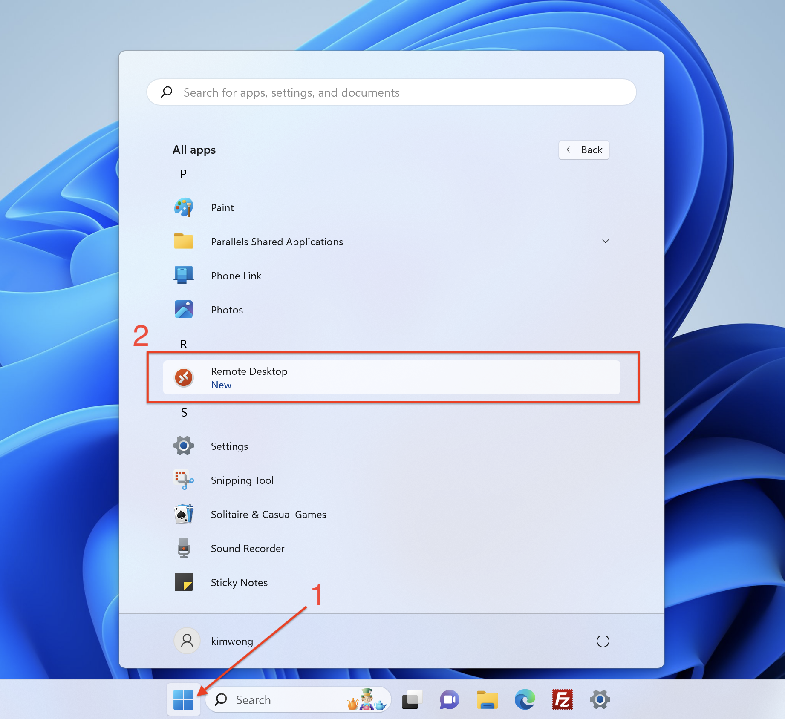

Use the resulting panel to add a Workspace:

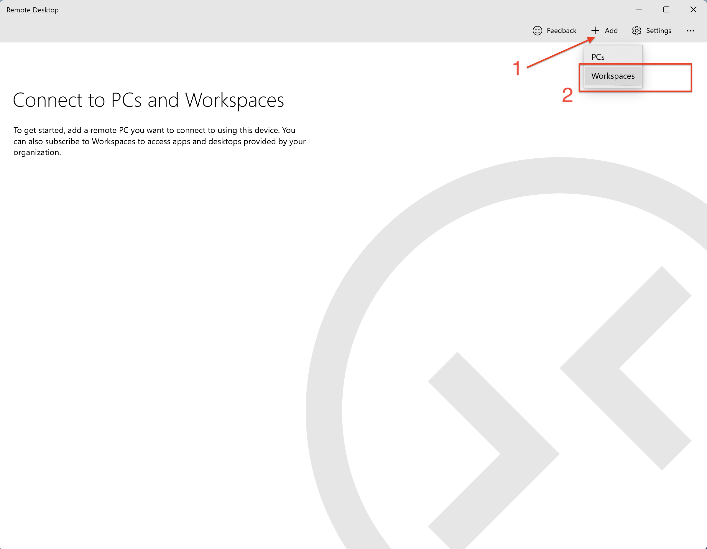

The Remote Desktop will use your Pitt email address to discover the AVDs that you have access authorization. Click
on Subscribe:

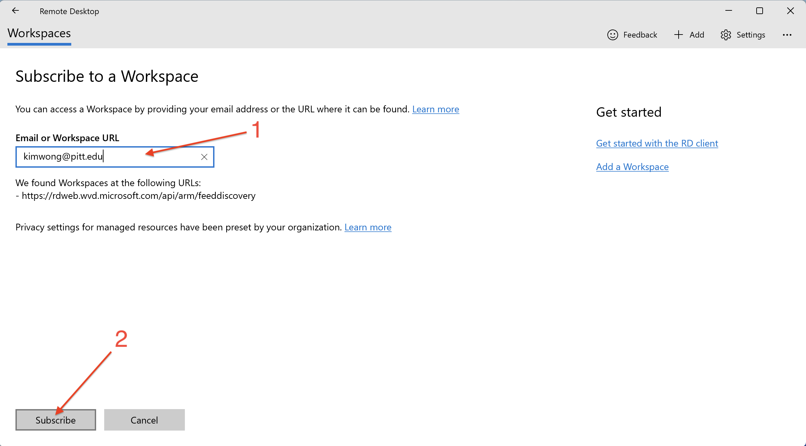

Next, you will go through the authentication process:

| Authenticate via Pitt Passport| |
| ----------- | ------------------------------------ |
| **1**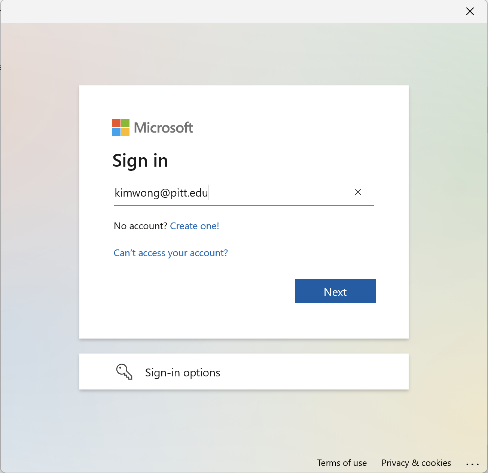 | **2**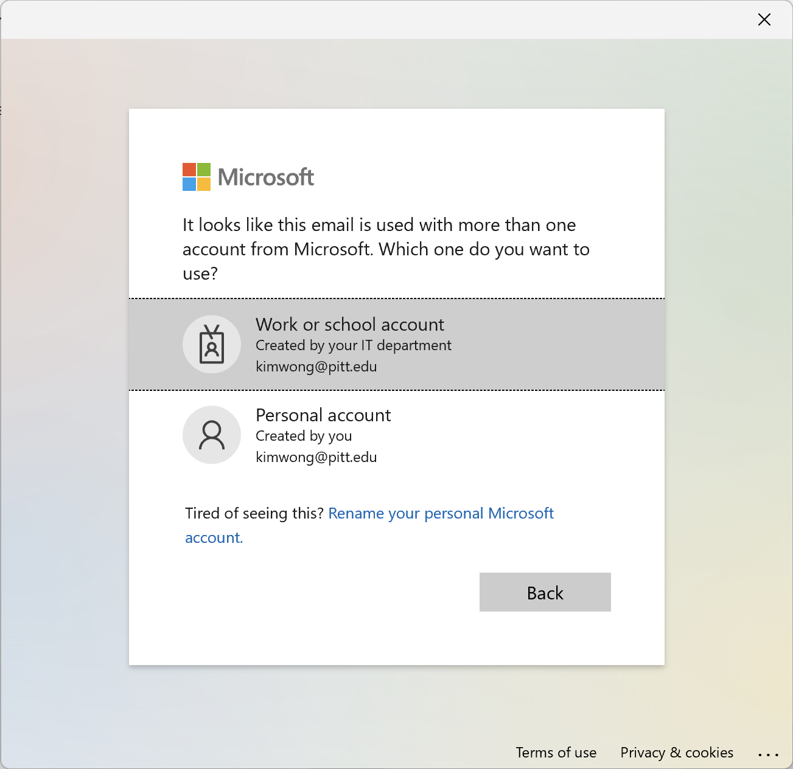 |
| **3**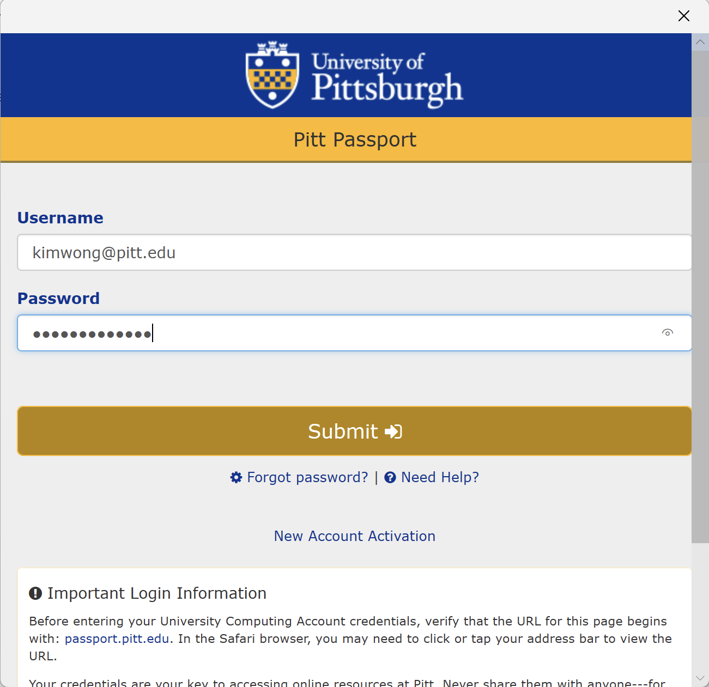 | **4**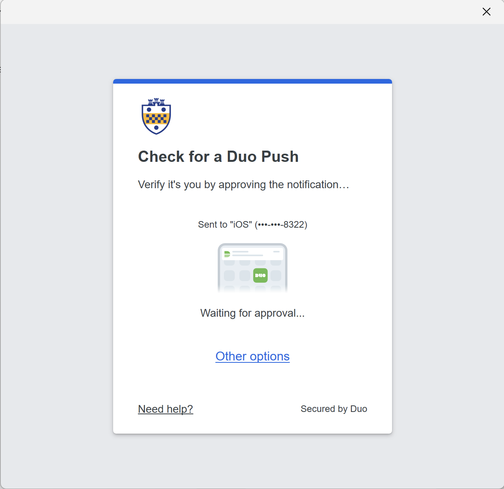 |
| **5**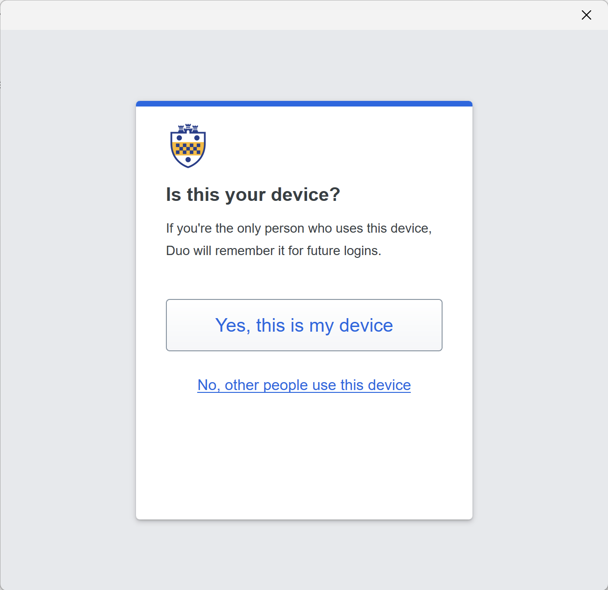 |                                                         |

After successful authentication, you will see all your authorized Workspaces. If you do not see HSIT-AVD, please 
submit a [**help ticket**](https://services.pitt.edu/TDClient/33/Portal/Requests/TicketRequests/NewForm?ID=yXkHi62rHa8_&RequestorType=Service)
to request access.

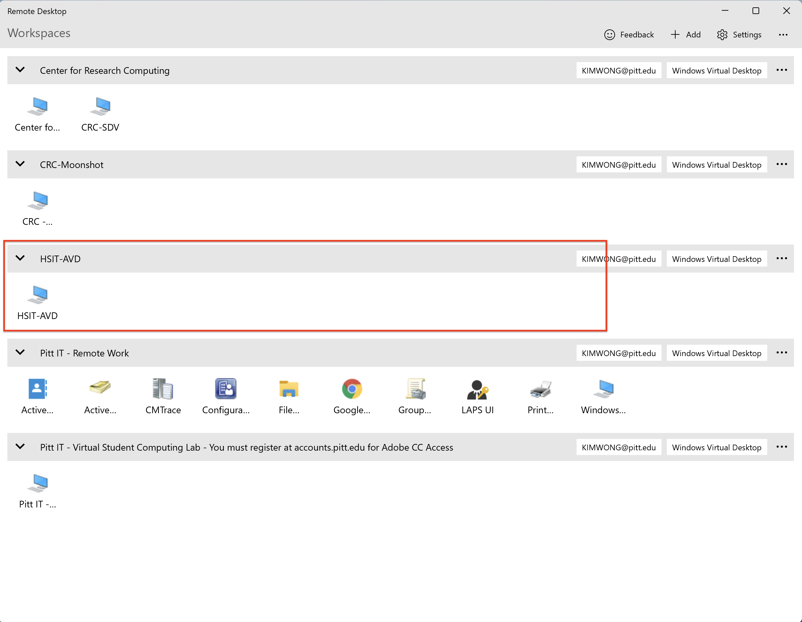

Double clicking on the HSIT-AVD icon will take you to the log in page:

| Logging in to AVD| |
| ----------- | ------------------------------------ |
| **1**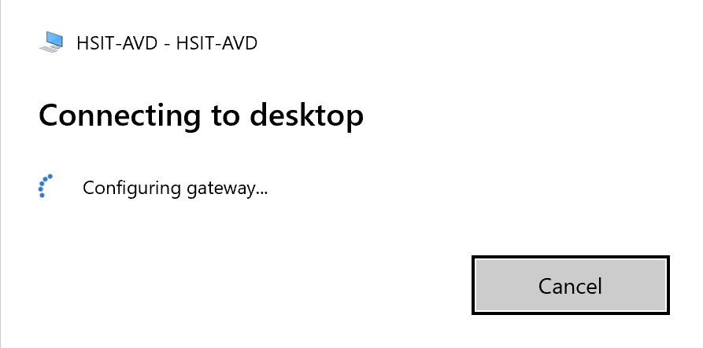 | **2**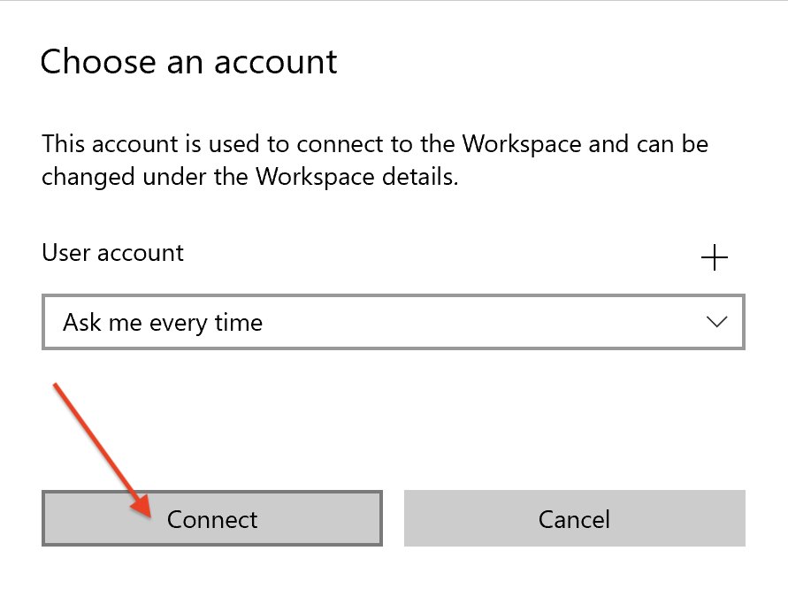 |
| **3**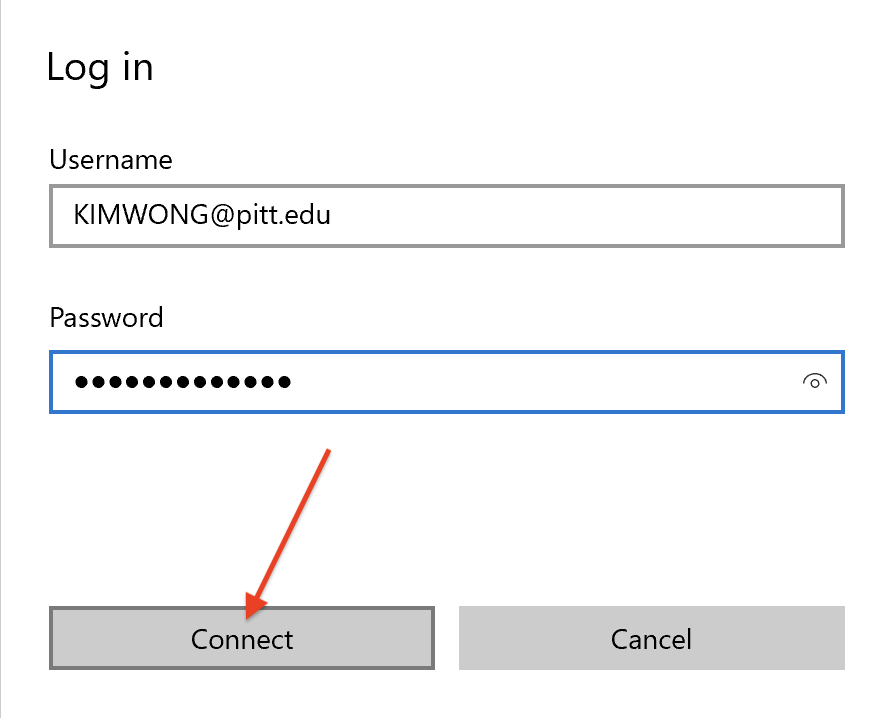 |                                                         |

Once logged in, you will see the remote desktop, from which you can launch other apps to access CRC directly. 
[**Section 3**](./access_avd.md#3-various-methods-connecting-to-crc) of the general AVD manual provides several example access methods.

To shutdown your AVD session when you are done with work, click on the Start Menu --> Sign out.

