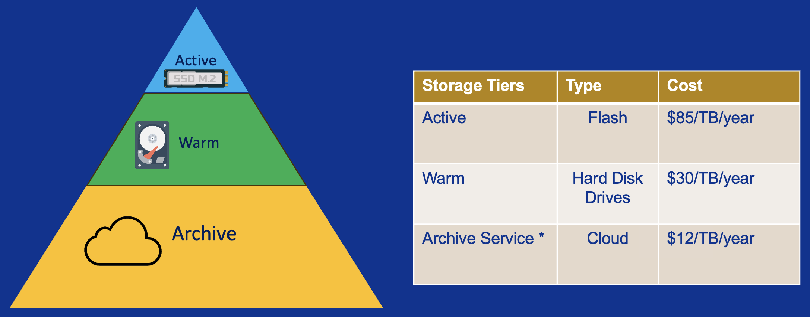

# Storage Tiers

CRCD provides several storage tiers spanning the research data lifecycle — from
fast flash for active computation to low-cost archive for cold data. Each tier
trades performance for cost, so most groups keep data across more than one.

This page covers what each tier is for, how much you get, and what more costs. For
the operational detail — full paths, permissions, snapshots, and checking your
usage with `crc-quota` — see [File Systems](../data-management/file-systems.md).

## Project storage tiers

Project storage is allocated per research group (Principal Investigator). PIs and
their group members can create subfolders and stage data for compute jobs. The
lifecycle framing in the graphic above maps onto the CRCD tiers as follows:

| Tier | Lifecycle | File system | Media | Free allocation | Additional capacity |
| ---- | --------- | ----------- | ----- | --------------- | ------------------- |
| Performance | Active | `/vast` | All-flash | 1 TB per PI | $85 / TB / year |
| Standard | Warm | `/ix`, `/ix1` | Hard disk | 5 TB per PI | $30 / TB / year |
| Archive&nbsp;* | Archive | Cloud | Cloud | — | $12 / TB / year |

The performance tier (`/vast`) is all-flash storage delivering high-throughput,
low-latency access over NFS. It is best for I/O-intensive and AI workloads that
read and write to the filesystem heavily. Each PI receives 1 TB at no cost.

The standard tier (`/ix`, `/ix1`) is enterprise hard-disk storage for persistent,
"warm" project data and for compute jobs with lower I/O demands. Each PI receives
5 TB at no cost, making it the default home for most project data.

The archive tier is low-cost cloud storage for cold data you need to retain but
rarely touch.

!!! warning "Confirm the archive tier before publishing"
    The archive service shown in the graphic (cloud, $12/TB/year) does **not**
    currently appear on the CRCD
    [Data Storage](https://www.crcd.pitt.edu/overview-crc-services/data-storage) or
    [Service Request Forms](https://www.crcd.pitt.edu/service-request-forms) pages,
    and the meaning of the asterisk (`*`) isn't defined in either source. Confirm
    the tier's availability, request path, and any caveats with the CRCD team
    before this page goes live, and add the request link once it's known.

## Home directories (`/ihome`)

Separate from project storage, every user gets a personal home directory at
`/ihome/<primary group>/$USER`, created with your account. It is your default login
location and holds configuration files, logs, and user-level environments.

The allocation is 75 GB per user at no cost, and it **cannot be increased** — keep
large datasets and heavy job I/O in project storage rather than home.

## Requesting storage

A [One-time Startup Allocation](../getting-started/getting-started-step1-account.md)
provisions 5 TB of Standard (`/ix`) and 1 TB of Performance (`/vast`) storage at no
cost, alongside your compute allocation. If storage wasn't set up with your account,
[submit a help ticket](https://services.pitt.edu/TDClient/33/Portal/Requests/TicketRequests/NewForm?ID=yXkHi62rHa8_&RequestorType=Service).

To go beyond the free allocation, request additional capacity through the
[Increase Data Storage](https://services.pitt.edu/TDClient/33/Portal/Requests/TicketRequests/NewForm?ID=D8BjnEQtuz0_&RequestorType=Service)
form:

| Request | Beyond | Cost |
| ------- | ------ | ---- |
| Standard storage | initial 5 TB | $30 / TB / year |
| Performance storage | initial 1 TB | $85 / TB / year |

Storage is billed annually per terabyte and is separate from the compute
[Service Units](../slurm/service-units.md) your jobs consume. The full list of
options is on the CRCD
[Service Request Forms](https://www.crcd.pitt.edu/service-request-forms) page.

!!! warning "No protected data without approval"
    CRCD storage is **not** approved for HIPAA-protected health information (PHI),
    personally identifiable information (PII), or other data under protected
    controls without explicit approval. If you may be working with protected data,
    contact the CRCD team first — identifiable PHI belongs in the
    [Secure Research Environment (SRE)](../getting-started/access_sre.md), not the
    tiers above.

## Related

-   :material-harddisk:{ .lg .middle } __Paths, quotas & snapshots__

    ---

    Full filesystem paths, per-tier quotas, snapshots, and checking usage with `crc-quota`.

    [:octicons-arrow-right-24: File Systems](../data-management/file-systems.md)

-   :material-swap-horizontal:{ .lg .middle } __Move data in and out__

    ---

    Transfer files with Globus, `rsync`/`scp`, SFTP clients, and cloud tools.

    [:octicons-arrow-right-24: File Transfer Methods](../data-management/file-transfer-methods/index.md)

-   :material-server:{ .lg .middle } __The compute clusters__

    ---

    The clusters this storage feeds, and which one fits your work.

    [:octicons-arrow-right-24: Our Clusters](index.md)

