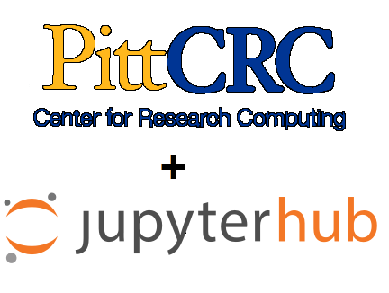
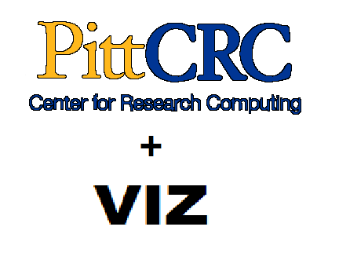
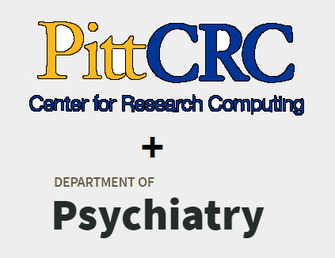
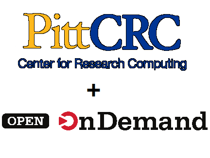

# Welcome to the CRCD User Manual

This section of the [University of Pittsburgh Center for Research Computing and Data](https://crc.pitt.edu/)  
website is dedicated to helping you better utilize our services.

Please use the left side drop-down menus to find pages under the main sections, 
or utilize the search bar functionality at the top of the page for navigating across the site. 

The right side table of contents can be used as an overview of the subsections of a page.

Below you will find brief summaries of each main section:
## General Polices
This section provides articles on general policies that apply when using the cluster.

## Web Portals
| JupyterHub                                                               | VIZ                                                               | Psych                                                                   | Ondemand                                                                             |
|--------------------------------------------------------------------------|-------------------------------------------------------------------|-------------------------------------------------------------------------|--------------------------------------------------------------------------------------|
|  |  |  |  |
| [Jupyterhub Documentation](web-portals/jupyter-hub.md)                   | [VIZ Documentation](web-portals/viz.md)                           | [Psych Documentation](web-portals/psych.md)                             | [OnDemand Documentation](web-portals/open-ondemand.md)                               |
    
## The Slurm Workload Manager
See these pages for instructions on how to interact with Slurm via batch and interactive jobs.

## Data Management
These pages detail our filesystem configuration as well as the various methods you can use to 
move and share files. 

## Applications
Search through our list of software we make available on the cluster via the module system, and find
details about the various applications we've built to more easily extract information from Slurm.
This section also includes more in-depth pages on setting up python environments and working with 
licensed software.

## Genomics Support
These pages include walk-through tutorials for setting up advanced genomics workflows on the HTC cluster.
