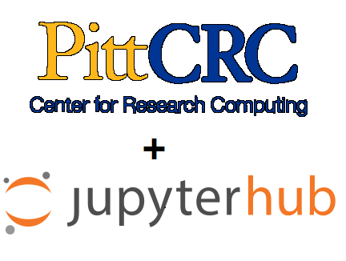

# CRCD Technical Documentation

The [University of Pittsburgh Center for Research Computing and Data (CRCD)](https://crc.pitt.edu/) provides high-performance computing, data storage, and research support services to the University of Pittsburgh research community.

## Top Documentation Pages

* [Getting Started at CRCD](getting-started.md) - Information for new and existing CRCD users
* [Getting Help](help/index.md) - How to get support
* [Job Scheduling Policy](policies/job-scheduling-policy.md) - Compute job charge factors, run limits, submit limits
* [Running Jobs](jobs/index.md) - Slurm commands, job script basics, submitting jobs
* [Connecting to CRCD](connect/index.md) - SSH, Open OnDemand, JupyterHub, and more
* [Managing Data](data-management/index.md) - File systems, transfers, and data management
* [Working with Software](applications/index.md) - Modules, Python, R, containers, and licensed software
* [Globus](data-management/file-transfer-methods/globus.md) - High-performance data transfers

## Computing Resources

| Cluster | Description |
|---------|-------------|
| [SMP](hardware_profiles/smp.md) | Shared memory single-node workloads |
| [MPI](hardware_profiles/mpi.md) | Multi-node distributed computing with MPI |
| [GPU](hardware_profiles/gpu.md) | Machine learning, AI, and GPU-accelerated workloads |
| [HTC](hardware_profiles/htc.md) | Health sciences and genomics workflows |

## Web Portals

| JupyterHub | VIZ | Psych | OnDemand |
|------------|-----|-------|----------|
|  |  |  |  |
| [Documentation](web-portals/jupyter-hub.md) | [Documentation](web-portals/viz.md) | [Documentation](web-portals/psych.md) | [Documentation](web-portals/open-ondemand.md) |

## Other CRCD Web Pages

* [CRCD Home Page](https://crc.pitt.edu) - News and information
* [Help Portal](https://services.pitt.edu/TDClient/33/Portal/Requests/ServiceDet?ID=1511) - Open support tickets
* [JupyterHub](https://hub.crc.pitt.edu) - Interactive notebooks
* [Open OnDemand](https://ondemand.htc.crc.pitt.edu) - Web-based cluster access

!!! tip
    New to CRCD? Start with the [Getting Started](getting-started.md) guide for a step-by-step introduction to our systems and services.

!!! info "CRCD welcomes your contributions"
    This documentation is hosted on [GitHub](https://github.com/pitt-crc/user-manual) and your
    [contributions](https://github.com/pitt-crc/user-manual/blob/main/README.md) are welcome!
