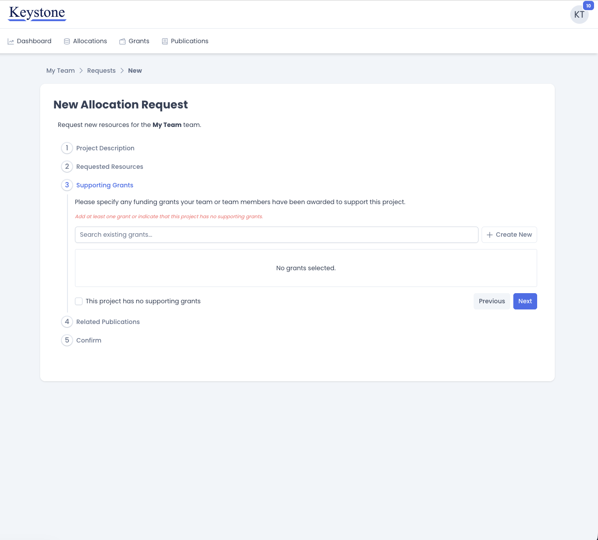

# Requesting Resources

The CRCD uses the Keystone platform for managing access to HPC resources. 
Keystone allows users submit allocation requests for their research teams and 
track the status of those requests. All CRCD users have access to the Keystone
interface, however only team owners and administrators have permission to
modify team details and submit resource requests. 

!!! note "Before you begin"

    Keystone is only accessible by existing CRCD users who are connected to the
    [Pitt VPN](https://services.pitt.edu/TDClient/33/Portal/KB/ArticleDet?ID=311).

    If you do not already have a CRCD account, you can request one from the CRCD help desk.

## Step 1: Log In

Navigate to [keystone.crcd.pitt.edu](https://keystone.crcd.pitt.edu) and sign in with your
Pitt username and password. 

## Step 2: Select Your Team

After logging in, Keystone will present you wil a list of all teams where you are a member
along with your role in each team.
To submit a new resource request, select the team for which you want to submit a request.

!!! info "Changing teams later"

    Most tasks in Keystone are handled at the team level.
    Users should take care to select the proper team when submitting new allocation requests.
    You can navigate back to this page at any time to select a different team.

## Step 3: Open the Allocations Page

After selecting a team you will be navigated to the team dashboard.
This page displays a high level team summary, including the current team members and the
team's active service units.

From the dashboard, click **Allocations** in the navigation bar to see the team's current allocation requests.

This Allocations page lists every request the team has submitted, along with its status and activation date.
Users can click any row to open the full details of that request.

The summary cards above the table show how many service units the team currently has active,
how many are tied up in pending requests, and how many requests have been approved.

!!! tip "Service units"

    Resources are requested in service units, or SUs. See the
    [Service Units](../slurm/service-units.md) page for an explanation of how SUs are calculated
    and consumed on each cluster.

## Step 4: Start a New Request

Click **Create New** in the upper right of the Allocations page. 
This opens the **New Allocation Request** wizard.
Complete each step in the wizard and click **Next** to advance, or **Previous**
to go back and revise an earlier step. Nothing is submitted until you reach the final step.

In the first step, give your request a short, descriptive title, then describe the project in the text editor
below it. The description is what a CRCD administrator reads when deciding on your request, so be
specific. A request that explains where its numbers came from is reviewed much more quickly
than one that does not. A good description covers three things:

- **The research problem** you are addressing.
- **How you will use CRCD resources** — which software, which computational methods.
- **How you arrived at the resource estimate** — test runs, benchmarks, or scaling from prior
  work.

Specify which clusters you need and how many service units you need on each. Click
**Add Resource** to add a row, choose a cluster from the dropdown, and enter the number of
service units. A short description of each cluster's intended workload appears beside your
selection.

Add a separate row for every cluster your project needs. Use the delete icon at the end of a
row to remove it.

!!! tip "Choosing a cluster"

    If you are unsure which cluster suits your workload, the
    [Hardware Profiles](../hardware_profiles/index.md) section describes the architecture and
    intended use of each one.

### 4.3 Supporting Grants

List the funding that supports this project. CRCD uses these records to report on the research
its infrastructure enables, which in turn justifies continued investment in that
infrastructure — so this step matters even though it is quick.

Start typing in **Search existing grants** to see the grants already recorded for your team, and
click one to attach it to the request.

Selected grants appear in the box below the search field. You can attach more than one.

#### Creating a New Grant Record

If the grant supporting this project is not yet on file, you do not need to leave the form to
add it. Click **Create New** to open the **New Grant** dialog.

Complete the fields and click **Submit**. Title, agency, total amount, and start date are
required; grant number, PI(s), end date, and description are optional but worth filling in.

The new grant is saved to your team's permanent CRCD records and attached to the request at the
same time. It will be available to select directly the next time you submit a request, and it
will appear under the **Grants** tab in the navigation bar.

!!! note "Projects without grant funding"

    If no grant supports this project, tick **This project has no supporting grants** to
    continue. You must either attach at least one grant or check this box.

### 4.4 Related Publications

<!-- TODO: screenshot needed -->

This step works the same way as Supporting Grants, for publications instead of funding. Search
your team's existing publication records and select any that relate to this project, or click
**Create New** to add a publication that is not yet on file.

<!-- TODO: screenshot needed -->

As with grants, a publication created here is saved to your team's CRCD records and attached to
the request in one action, and becomes available under the **Publications** tab.

If the project has no associated publications yet — which is common for new work — tick the
checkbox indicating so and continue.

!!! tip "Acknowledging CRCD"

    Publications that made use of CRCD resources should acknowledge them. See
    [Citing CRCD](../acknowledge-crc.md) for the language to use.

### 4.5 Confirm and Submit

The final step summarizes everything you have entered: the title and description, the
requested resources, and the grants and publications you attached.

Review it carefully. Use **Previous** to step back and correct anything that looks wrong. When
you are satisfied, click **Submit**.

## After You Submit

Submitting takes you to the request's details page, where the request is assigned a number and
given a status of **Pending**.

The page records who submitted the request, which team it belongs to, when it was submitted,
and the resources requested on each cluster. The **Awarded SUs** and **Final Usage** columns
stay empty until the request has been reviewed. Your project description, supporting grants,
and related publications are all shown below.

A CRCD administrator will review your request, and you will receive a notification once the
review is complete. If the request is approved, the details page will show the service units
awarded on each cluster along with the allocation's activation and expiration dates.

You can return to this page at any time from the **Allocations** tab. Use the comment box at the
bottom of the details page to ask a question or add information while the request is under
review.

!!! question "Need help?"

    <!-- TODO: confirm the correct help desk link/address -->
    If you have questions about a request or about Keystone itself, contact the CRCD help desk.

*[CRCD]: Center for Research Computing and Data
*[SU]: Service Unit
*[SUs]: Service Units
*[HPC]: High Performance Computing
*[PI]: Principal Investigator
*[VPN]: Virtual Private Network
