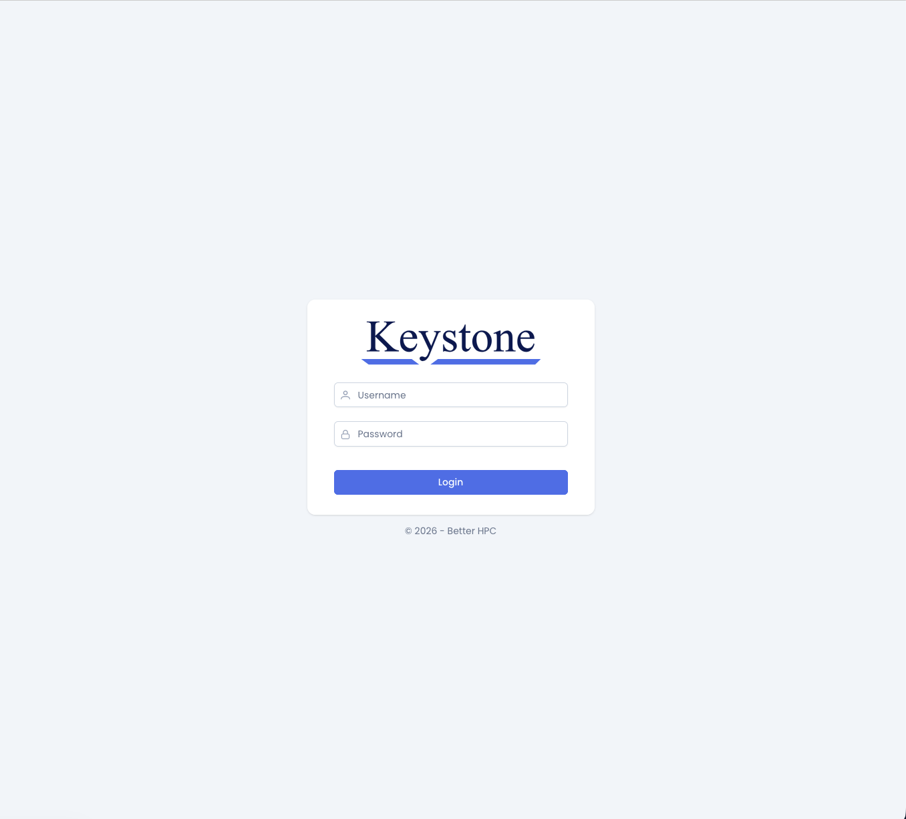
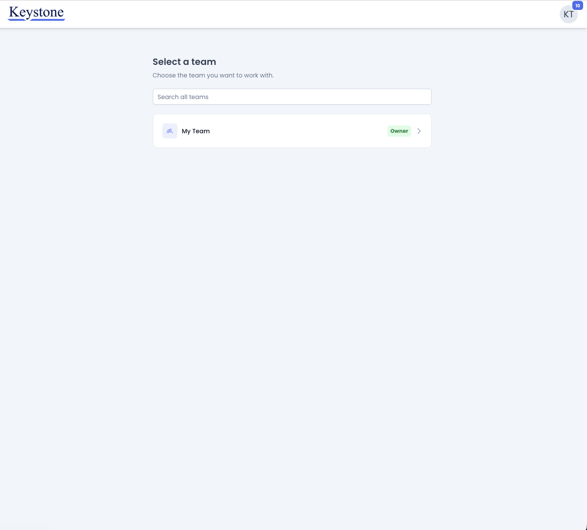
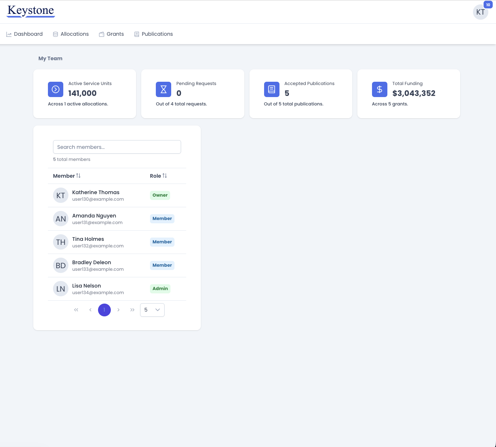
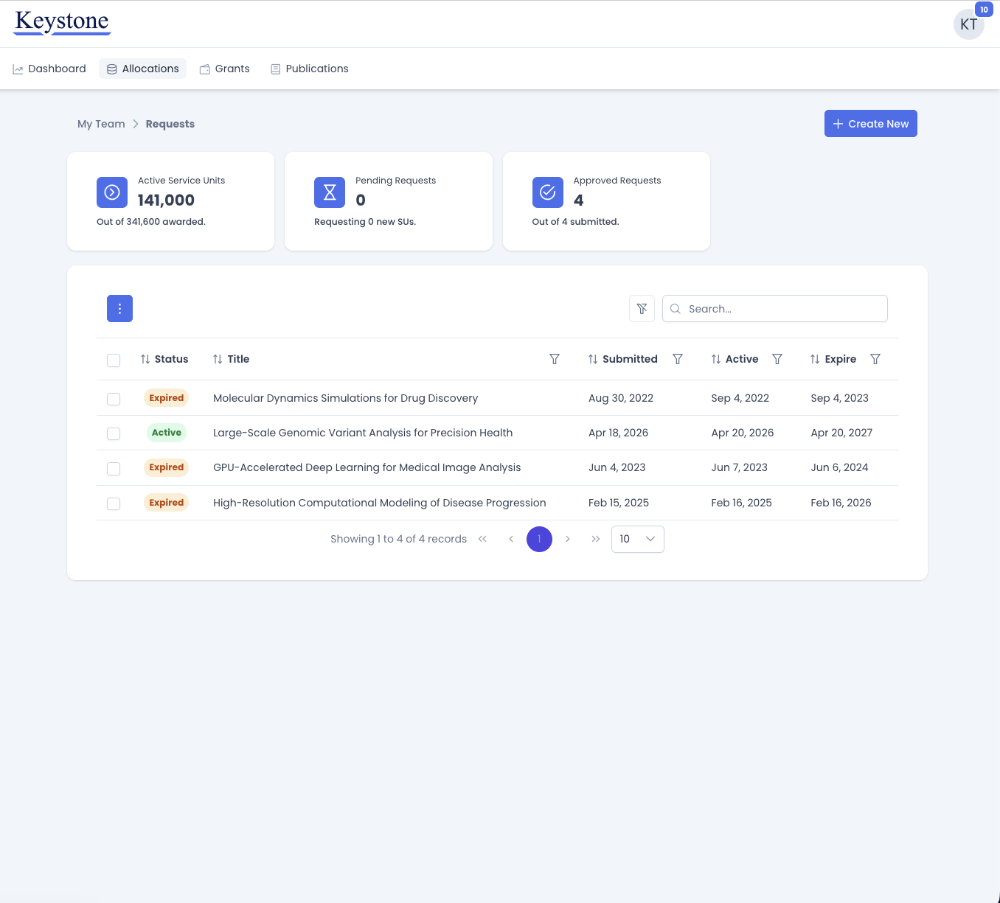
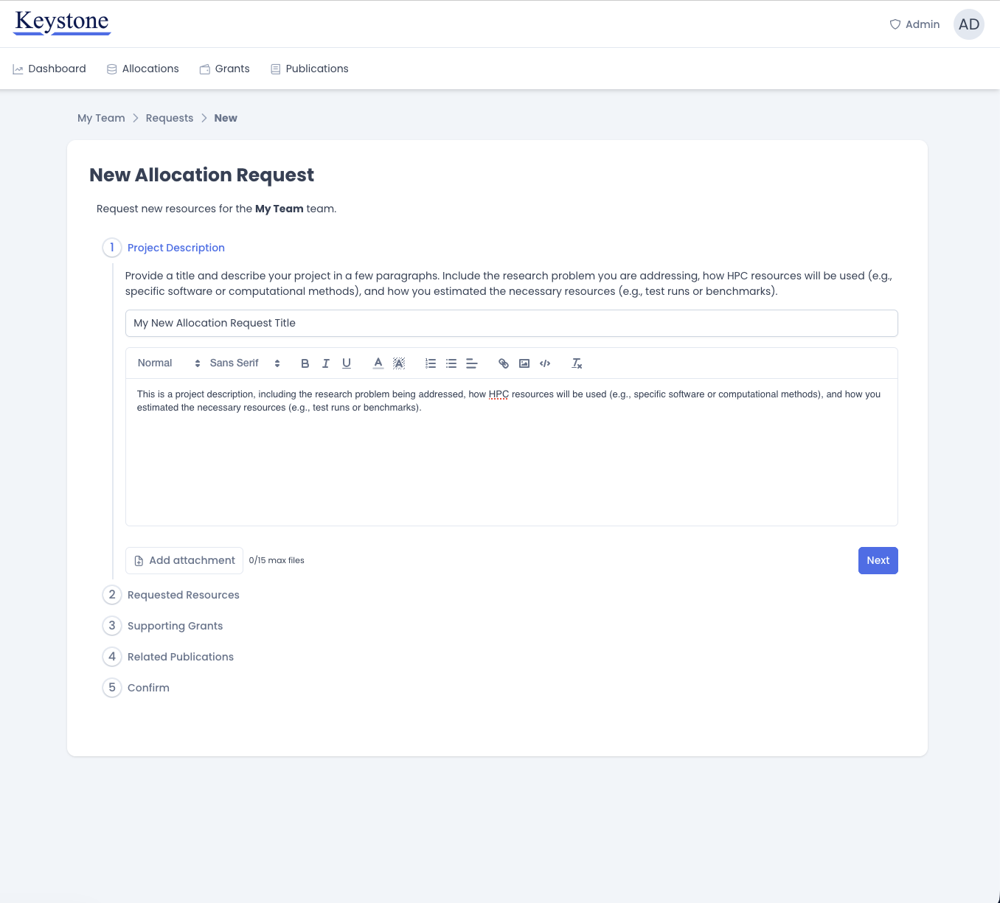
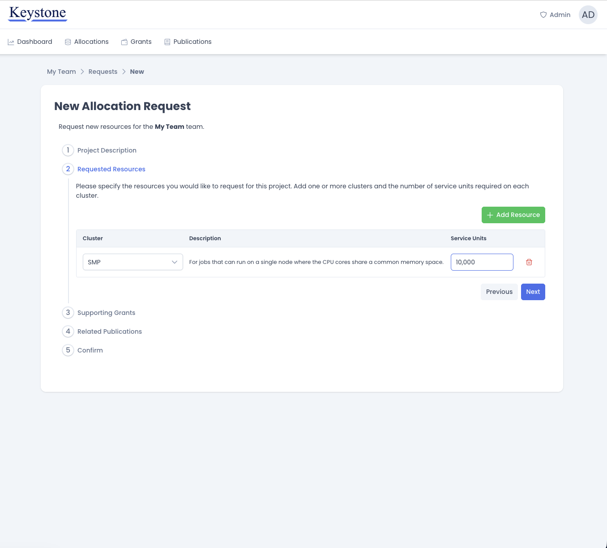
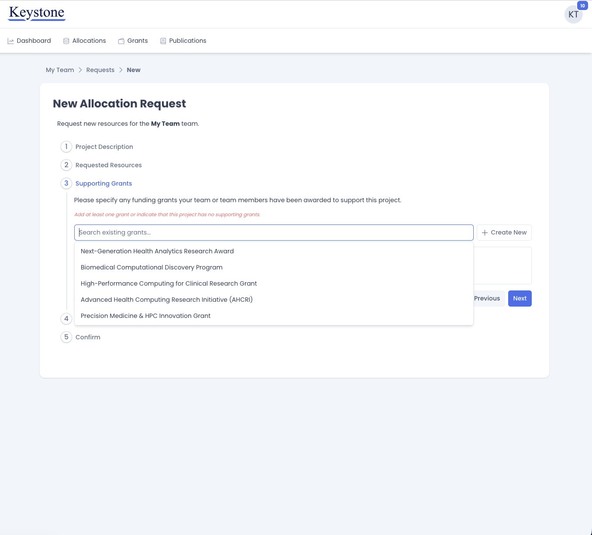
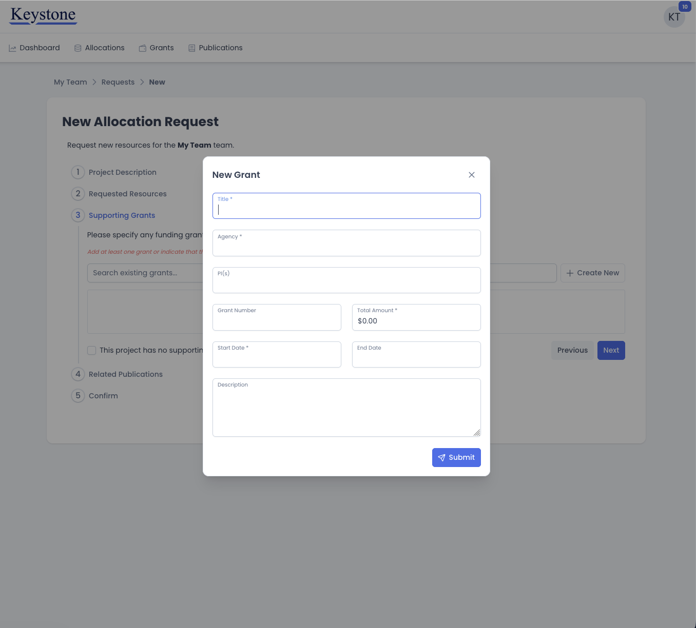
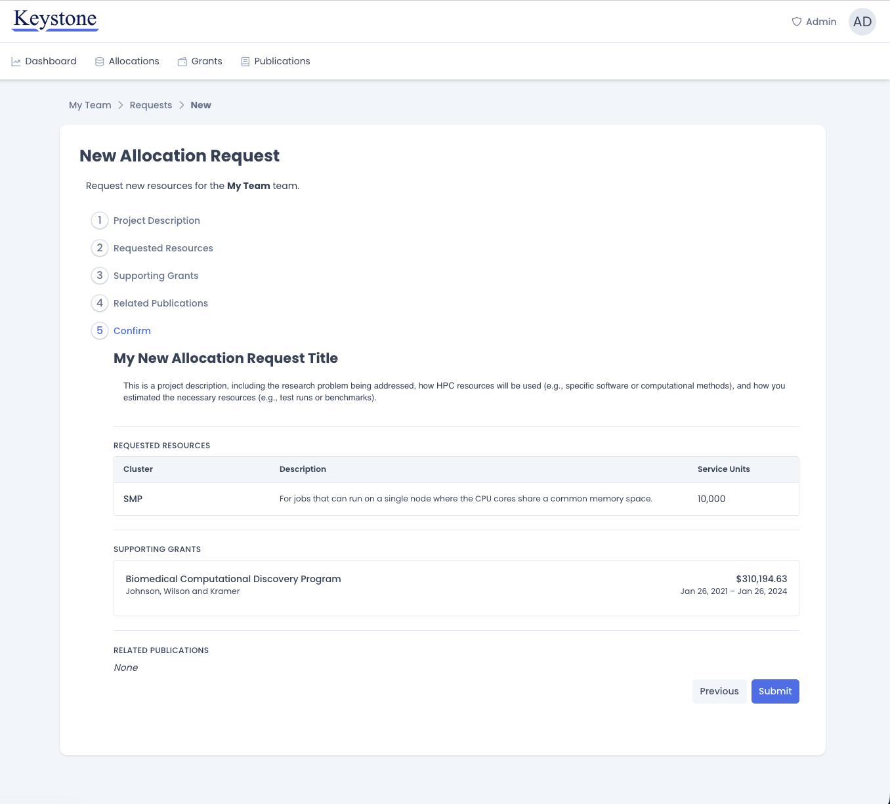
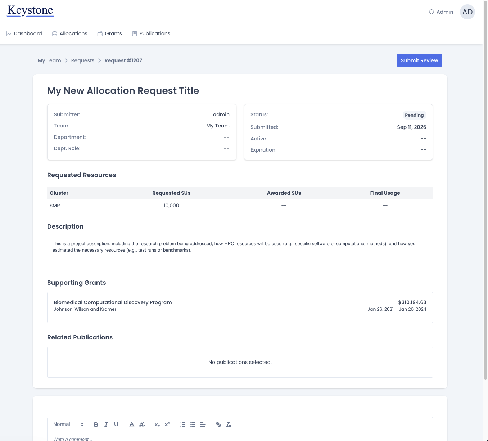

# Requesting Resources

The CRCD uses the Keystone platform for managing access to HPC resources.
Keystone allows users submit allocation requests for their research teams and
track the status of those requests. All CRCD users have access to the Keystone
interface, however only team owners and administrators have permission to
modify team details and submit resource requests.

!!! note "Before you begin"

    Keystone is only accessible by existing CRCD users who are connected to the
    [Pitt VPN](https://services.pitt.edu/TDClient/33/Portal/KB/ArticleDet?ID=311).

    If you do not already have a CRCD account, you can request one from the CRCD help desk.

## Step 1: Log In

Navigate to [keystone.crcd.pitt.edu](https://keystone.crcd.pitt.edu) and sign in with your
Pitt username and password.

## Step 2: Select Your Team

After logging in, Keystone will present you wil a list of all teams where you are a member
along with your role in each team.
To submit a new resource request, select the team for which you want to submit a request.

!!! info "Changing teams later"

    Most tasks in Keystone are handled at the team level.
    Users should take care to select the proper team when submitting new allocation requests.
    You can navigate back to this page at any time to select a different team.

## Step 3: Open the Allocations Page

After selecting a team you will be navigated to the team dashboard.
This page displays a high level team summary, including the current team members and the
team's active service units.

From the dashboard, click **Allocations** in the navigation bar to see the team's current allocation requests.

This Allocations page lists every request the team has submitted, along with its status and activation date.
Users can click any row to open the full details of that request.

The summary cards above the table show how many service units the team currently has active,
how many are tied up in pending requests, and how many requests have been approved.

!!! tip "Service units"

    Resources are requested in service units, or SUs. See the
    [Service Units](../slurm/service-units.md) page for an explanation of how SUs are calculated
    and consumed on each cluster.

## Step 4: Start a New Request

Click **Create New** in the upper right of the Allocations page.
This opens the **New Allocation Request** wizard.
Complete each step in the wizard and click **Next** to advance, or **Previous**
to go back and revise an earlier step. Nothing is submitted until you reach the final step.

### 4.1 Project Description

In the first step, give your request a short, descriptive title, then describe the project in the text editor
below it. The description is what a CRCD administrator reads when deciding on your request, so be
specific. A request that explains where its numbers came from is reviewed much more quickly
than one that does not. A good description covers three things:

- **The research problem** you are addressing.
- **How you will use CRCD resources** — which software, which computational methods.
- **How you arrived at the resource estimate** — test runs, benchmarks, or scaling from prior
  work.

### 4.2 Requested Resources

Specify which clusters you need and how many service units you need on each. Click
**Add Resource** to add a row, choose a cluster from the dropdown, and enter the number of
service units. A short description of each cluster's intended workload appears beside your
selection.

Add a separate row for every cluster your project needs. Use the delete icon at the end of a
row to remove it.

!!! tip "Choosing a cluster"

    If you are unsure which cluster suits your workload, the
    [Hardware Profiles](../hardware_profiles/index.md) section describes the architecture and
    intended use of each one.

### 4.3 Supporting Grants and Publications

The next two steps record the funding that supports your project and any publications that
have resulted from it.
The CRCD uses these records to report on the research its infrastructure enables, which in
turn justifies continued investment in that infrastructure.

Both steps work the same way.
Start typing in the search field to see the records already on file for your team, then click
a result to attach it to the request.
Selected records are listed below the search field and you can attach more than one.

!!! note "Projects with no grants or publications"

    Each step requires either at least one attached record or the checkbox indicating that
    none apply.
    New projects frequently have no publications yet, in which case tick the checkbox and
    continue.

!!! tip "Acknowledging CRCD"

    Publications that made use of CRCD resources should acknowledge them. See
    [Citing CRCD](../acknowledge-crc.md) for the language to use.

If the record you need is not yet on file, you do not need to leave the form to add it.
Click **Create New** to open a dialog for the new record, complete the fields, and click
**Submit**.

Submitting the new record automatically attaches the record to your request and saves it to the team's existing
CRCD records at the same time.

### 4.4 Confirm and Submit

The final step summarizes everything you have entered.
Review the summary and use **Previous** to step back and correct any errors.
When you are satisfied, click **Submit**.

## After You Submit

Submitting the request automatically navigates you to the request detail page.
The request is assigned a ID number and given a **Pending** status until it has been reviewed.
A CRCD administrator will review your request and update this page to display the latest approval state
and the number of awarded service units.

You can return to this page at any time from the **Allocations** tab.
Use the comment box at the bottom of the page to ask a question or provide additional
information while the request is under review.

