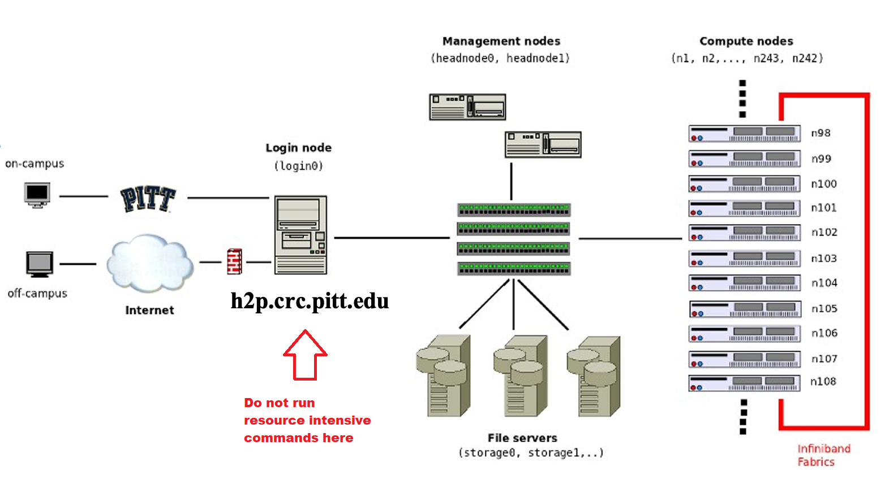

# Job Scheduling Policy

## Login Nodes are for Interactive, Non-intensive Work Only

Many users are logged into the login nodes of the H2P and HTC clusters at the same time. These are the gateways everyone 
uses to perform interactive work like editing code, submitting and checking the status of jobs, etc.

Executing processing scripts or commands on these nodes can cause substantial slowdowns for the rest of the users. 
For this reason, it is important to make sure that this kind of work is done in either an interactive session on a node 
from one of the clusters, or as a batch job submission.

Resource-intensive processes found to be running on the login nodes may be killed at anytime.

<ins>**The CRC team reserves the right to revoke cluster access of any user who repeatedly causes slowdowns on the login 
nodes with processes that can otherwise be run on the compute nodes.**</ins>



## Jobs are Subject to Priority Queueing
There are settings in place within the Slurm Workload Manager that allow all groups (and users within those groups) 
to have equal opportunity to run calculations. This concept is called “Fair Share”. The fair share is a multiplicative 
factor in computing a job’s “Priority”. At Pitt, we use a multi-factor priority system which includes:

Age [0,1] – Length of time the job been in the queue and eligible to be scheduled. Longer time spent in the queue 
recieves higher priority. The maximum is attained at a queue time of 7 days. The priority weight for age is 2000.

Job Size [0,1] – Required Nodes, CPUs, and Memory usage. Larger requests receive increased priority. The maximum 
corresponds to using all the resources on the cluster. The priority weight for job size is 2000.

Quality of Service (QOS) [0,1] - Factor based on the Walltime of the job. Normalized to the highest (short QOS). 
The priority weight for QOS is 2000.

<link rel="stylesheet" href="https://cdn.datatables.net/1.13.4/css/jquery.dataTables.min.css">

<table class="display cell-border" id="nTable">
    <thead>
        <tr>
            <td>Name</td>
            <td>Priority</td>
            <td>QOS Factor</td>
            <td>Max Walltime (D-HH:MM:SS)</td>
        </tr>
    </thead>
    <tbody>
        <tr>
            <td><code>Short</code></td>
            <td>13</td>
            <td>1.00</td>
            <td>3-00:00:00</td>
        </tr>
        <tr>
            <td><code>Normal</code></td>
            <td>12</td>
            <td>0.92</td>
            <td>3-00:00:00</td>
        </tr>
        <tr>
            <td><code>Long</code></td>
            <td>11</td>
            <td>0.84</td>
            <td>6-00:00:00</td>
        </tr>
        <tr>
            <td><code>Long-long (on SMP and HTC)</code></td>
            <td>10</td>
            <td>0.76</td>
            <td>21-00:00:00</td>
        </tr>
    </tbody>
</table>

<script type="text/javascript" src="https://code.jquery.com/jquery-3.7.0.min.js"></script>
<script type="text/javascript" src="https://cdn.datatables.net/1.13.4/js/jquery.dataTables.min.js"></script>

<script type="text/javascript">
    $(document).ready(function() {
        $('#nTable').DataTable({
            "paging": false,
            "bPaginate": false,
            "bLengthChange": false,
            "bFilter": true,
            "bInfo": false,
            "bAutoWidth": false,
            "searching": false,
            "ordering": false
        });
    });
</script>

Note: Due to the high volume nature of the work done on HTC, it's short, normal, and long QOS have a maximum number of 
submissions per user set to 6000, 5000, and 4000 respectively.

Fair Share [0,1] - A metric for overall usage by allocation that prioritizes jobs from under serviced slurm accounts. 
Less overall cluster use receives higher priority. The priority weight for fairshare is 3000.

Priority is computed as a sum of the individual factors multiplied by their priority weights. Higher 
priorities will be assigned resources first. Your jobs may receive pending status with Priority as the reason.

### Checking Job Priority
You can use the `sprio` slurm utility to see the priority of your jobs
```commandline
[nlc60@login0b ~] : sprio -M smp -u nlc60 -j 6136016
  JOBID PARTITION     USER   PRIORITY       SITE        AGE  FAIRSHARE    JOBSIZE        QOS                 
6136016 smp          nlc60       2272          0          0        269          4       2000
```

## Walltime Extensions will generally not be Granted
It is up to the job submitter to determine the demands of their job through some benchmarking before submitting, 
perform any necessary code optimization, and to then specify the memory, cpu, and time requirements 
accordingly. This ensures that the job is queued with respect to FairShare, and that CRC resources utilized by a job 
are available to other users within a reasonable time frame.

## Exceeding Usage Limits will cause Job Pending Status
After submission, a job can appear with a "status" of "PD" (not running).

There are various reasons that Slurm will put your job in a pending state. Some common explanations are listed below.

### Reasons related to resource availability and job dependencies:

<table class="display cell-border" id="aTable">
    <thead>
        <tr>
            <td>Reason</td>
            <td>Explanation</td>
            <td>Resolution</td>
        </tr>
    </thead>
    <tbody>
        <tr>
            <td>Resources</td>
            <td>The cluster is busy and no resources are currently available for your job.</td>
            <td>Your job will run as soon as the resources requested become available</td>
        </tr>
        <tr>
            <td>Priority</td>
            <td>See section on job priority</td>
            <td>Your job will run as soon as it has reached a high enough priority</td>
        </tr>
        <tr>
            <td>Dependency</td>
            <td>A job cannot start until another job is finished. This only happens if you included a &quot;--dependency&quot; 
directive in your Slurm script.</td>
            <td>Wait until the job that you have marked as a dependency is finished, then your job will run</td>
        </tr>
        <tr>
            <td>DependencyNeverSatisfied</td>
            <td>A job cannot start because another job on which it depends failed</td>
            <td>Please cancel this job, as it will never be able to run. You will need to resolve the issues in the job 
that has been marked as a dependency.</td>
        </tr>
    </tbody>
</table>
<script type="text/javascript">
    $(document).ready(function() {
        $('#aTable').DataTable({
            "paging": false,
            "bPaginate": false,
            "bLengthChange": false,
            "bFilter": true,
            "bInfo": false,
            "bAutoWidth": false,
            "searching": false,
            "ordering": false
        });
    });
</script>

### Reasons related to exceeding a usage limit:

#### JobArrayTaskLimit, QOSMaxJobsPerUserLimit and QOSMaxJobsPerAccountLimit
One or more of your jobs have exceeded limits in place on the number of jobs you can have in the queue 
**that are actively accruing priority**. Jobs with this status will remain in the queue, but will not being accruing
priority until other jobs from the submitting user have completed. 

In most cases the **per-account limit is 500 jobs**, and the **per-user limit is 100 jobs**. You can use 
`sacctmgr show qos format=Name%20,MaxJobsPA,MaxJobsPU,MaxSubmitJobsPA,MaxSubmitJobsPU,MaxTresPA%20` to view the limits 
for any given QOS. The maximum job array size is 100. These are slightly higher on HTC. 

These limits exist to prevent users who batch submit large quantities of jobs in a loop or job array from having all of 
their jobs at a higher priority than one-off submissions simply due to having submitted them all at once. 

A hard limit on the maximum number of submitted jobs (including in a job array) is 1000. This separate limit exists to 
prevent any one user from overwhelming the workload manager with a singular, very large request for resources.

#### MaxMemoryPerAccount
The job exceeds the current within-group memory quota. The maximum quota available depends on the cluster and partition. 
The table below gives the maximum memory (in GB) for each QOS in the clusters/partitions it is defined.

<table class="display cell-border" id="bTable">
    <thead>
        <tr>
            <td>Cluster</td>
            <td>Partition</td>
            <td>Short</td>
            <td>Normal</td>
            <td>Long</td>
        </tr>
    </thead>
    <tbody>
        <tr>
            <td>smp</td>
            <td>smp</td>
            <td>13247</td>
            <td>11044</td>
            <td>9999</td>
        </tr>
        <tr>
            <td></td>
            <td>legacy</td>
            <td>620</td>
            <td>620</td>
            <td>620</td>
        </tr>
        <tr>
            <td></td>
            <td>high-mem</td>
            <td>6512</td>
            <td>6512</td>
            <td>6512</td>
        </tr>
    </tbody>
</table>
<script type="text/javascript">
    $(document).ready(function() {
        $('#bTable').DataTable({
            "paging": false,
            "bPaginate": false,
            "bLengthChange": false,
            "bFilter": true,
            "bInfo": false,
            "bAutoWidth": false,
            "searching": false,
            "ordering": false
        });
    });
</script>

If you find yourself consistently running into this issue, you can use the `seff` tool to determine the efficiency of 
your completed jobs:
```commandline
[nlc60@login0b ~] : srun -M CLUSTER_JOB_RAN_ON seff YOUR_JOBID
    srun: job INTERACTIVE_SESSION_JOBID queued and waiting for resources
    srun: job INTERACTIVE_SESSION_JOBID has been allocated resources
    Job ID: YOUR_JOBID
    Cluster: CLUSTER_JOB_RAN_ON
    User/Group: USERNAME/GROUPNAME
    State: TIMEOUT (exit code 0)
    Cores: 1
    CPU Utilized: 6-00:00:52
    CPU Efficiency: 100.01% of 6-00:00:19 core-walltime
    Job Wall-clock time: 6-00:00:19
    Memory Utilized: 128.58 GB
    Memory Efficiency: 14.29% of 900.00 GB
```

#### AssocGrpBillingMinutes
- Your group's Allocation ("service units") usage has surpassed the limit specified in your active resource Allocation, 
  or your active Allocations have expired. You can double-check this with `crc-usage`. 
  [Please submit a new Resource Allocation Request following our guidelines](https://crc.pitt.edu/Pitt-CRC-Allocation-Proposal-Guidelines).


#### MaxTRESPerAccount, MaxCpuPerAccount, or MaxGRESPerAccount
In the table below, the group based CPU (GPUs for the gpu cluster) limits are presented for each QOS walltime length. 
If your group requests more CPU/GPUs than in this table you will be forced to wait until your group's jobs finish.

<table class="display cell-border" id="cTable">
    <thead>
        <tr>
            <td>Cluster</td>
            <td>Partition</td>
            <td>Short QOS (1 Day)</td>
            <td>Normal QOS (3 Days)</td>
            <td>Long QOS (6 Days)</td>
            <td>Long-long QOS (21 Days)</td>
        </tr>
    </thead>
    <tbody>
        <tr>
            <td>smp</td>
            <td>smp</td>
            <td>2304</td>
            <td>1613</td>
            <td>1152</td>
            <td>461</td>
        </tr>
        <tr>
            <td></td>
            <td>high-mem</td>
            <td>320</td>
            <td>224</td>
            <td>160</td>
            <td>64</td>
        </tr>
        <tr>
            <td>gpu</td>
            <td>gtx1080</td>
            <td>32</td>
            <td>20</td>
            <td>14</td>
            <td></td>
        </tr>
        <tr>
            <td></td>
            <td>a100</td>
            <td>16</td>
            <td>12</td>
            <td>8</td>
            <td></td>
        </tr>
        <tr>
            <td></td>
            <td>a100_multi</td>
            <td>32</td>
            <td>24</td>
            <td>8</td>
            <td></td>
        </tr>
        <tr>
            <td></td>
            <td>a100_nvlink</td>
            <td>24</td>
            <td>16</td>
            <td>8</td>
            <td></td>
        </tr>
        <tr>
            <td>mpi</td>
            <td>opa-high-mem</td>
            <td>504</td>
            <td>353</td>
            <td>252</td>
            <td></td>
        </tr>
        <tr>
            <td></td>
            <td>mpi</td>
            <td>3264</td>
            <td>2285</td>
            <td>1632</td>
            <td></td>
        </tr>
        <tr>
            <td>htc</td>
            <td>htc</td>
            <td>1216</td>
            <td>852</td>
            <td>608</td>
            <td>307</td>
        </tr>
    </tbody>
</table>
<script type="text/javascript">
    $(document).ready(function() {
        $('#cTable').DataTable({
            "paging": false,
            "bPaginate": false,
            "bLengthChange": false,
            "bFilter": true,
            "bInfo": false,
            "bAutoWidth": false,
            "searching": false,
            "ordering": false
        });
    });
</script>
