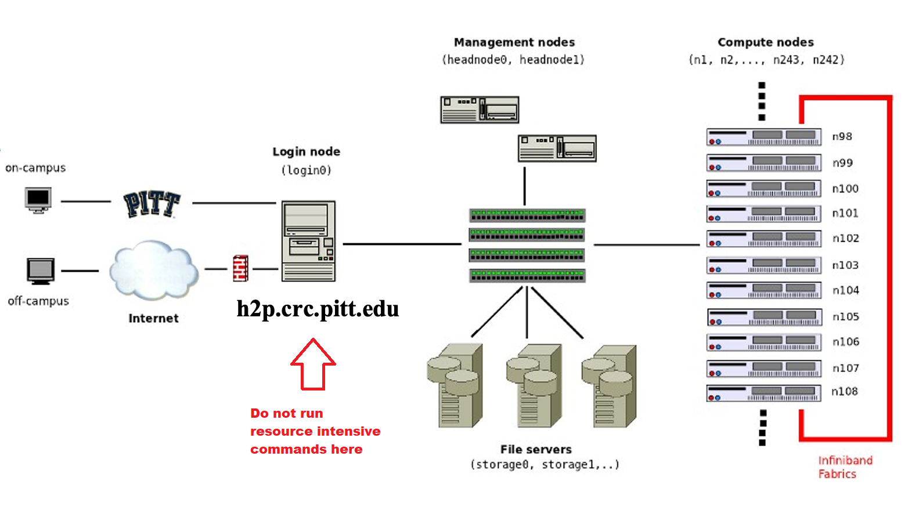

# Job Scheduling Policy

This page explains **how** the clusters are shared and **why** the limits work the
way they do. For the specific numbers — QoS walltimes, per-group resource caps,
and array limits — see [**Job Limits & QoS**](../slurm/job-limits.md).

## Login nodes are for light, interactive work only

Many users share the login nodes of the H2P and HTC clusters. They're the gateway
for interactive work like editing code and submitting or checking jobs. Running
computation directly on them slows everyone down, so that work belongs in an
[interactive session](../slurm/interactive-jobs.md) or a batch job.

To protect the shared environment, **per-user limits are enforced via cgroups
(currently 8 GB of memory per user, with CPU use also constrained)**. These apply
across all of your processes on the login node; when the node's resources are
exhausted, you may be unable to log in until usage drops. Resource-intensive
processes on the login nodes may be killed at any time.

<ins>**CRCD reserves the right to revoke cluster access from any user who
repeatedly causes login-node slowdowns with work that belongs on the compute
nodes.**</ins>



## Jobs are subject to priority queueing

Slurm gives every group — and every user within a group — a fair opportunity to
run work. When resources are busy, jobs wait in the queue and are started in order
of a computed **priority**. CRCD uses Slurm's multifactor priority, so a job's
priority is the weighted sum of several factors:

- **Age** — how long the job has been eligible in the queue. Longer waits earn
  more priority, up to a maximum reached at **7 days**.
- **Job Size** — how much the job requests. On most clusters this favors *smaller*
  jobs (see the note below).
- **QoS** — a factor based on the walltime tier, normalized so the shortest tier
  (`short`) scores highest.
- **Fair Share** — usage-based: groups that have used less of the cluster recently
  are prioritized over heavy users.
- **Partition** — a large weight that gives investor and community-owned partitions
  their higher-priority access to the hardware they contributed.

The weights differ by cluster. The current values:

| Factor | SMP | HTC | MPI | GPU |
| --- | --- | --- | --- | --- |
| Age | 2000 | 100 | 2000 | 2000 |
| Job Size | 2000 | 4000 | 4000 | 2000 |
| QoS | 2000 | 400 | 2000 | 2000 |
| Fair Share | 3000 | 100 | 3000 | 3000 |
| Partition | 50000 | 50000 | 50000 | 50000 |

!!! note "Job Size favors small jobs on most clusters"
    SMP, HTC, and GPU run with `PriorityFavorSmall`, so on those clusters a
    *smaller* job earns a higher Job Size factor — a quick, modest job can jump
    ahead of a large one. MPI is the exception: there, larger jobs are favored.
    Because the scheduler also uses **backfill**, a small, short job can start
    ahead of a larger queued job whenever doing so won't delay the higher-priority
    job's start.

### Checking a job's priority

Use `sprio` to see the priority breakdown for a pending job:

```
[nlc60@login1 ~] : sprio -M smp -u nlc60 -j 6136016
  JOBID PARTITION     USER   PRIORITY       SITE        AGE  FAIRSHARE    JOBSIZE        QOS
6136016 smp          nlc60       2272          0          0        269          4       2000
```

A job may show a pending reason of `Priority`, meaning higher-priority jobs are
ahead of it; it will start once it has risen far enough.

## Walltime extensions are generally not granted

It's up to you to estimate a job's needs — through benchmarking and any necessary
optimization — and set the memory, CPU, and time accordingly before submitting.
This keeps queueing fair and ensures resources come back to the community within a
reasonable time. Choose a QoS walltime tier that comfortably fits your job, since
extensions to a running job's walltime generally won't be granted.

## Exceeding usage limits will cause job pending status

After submission, a job can sit in a pending (`PD`) state for several reasons —
including asking for more than your group's share at once. The pending reasons and
how to resolve each are documented alongside the limits themselves on the
[**Job Limits & QoS**](../slurm/job-limits.md#why-is-my-job-pending) page.

## Related

<div class="grid cards" markdown>

-   :material-scale-balance:{ .lg .middle } __The actual limits__

    ---

    QoS walltimes, per-group CPU/GPU/memory caps, and array limits.

    [:octicons-arrow-right-24: Job Limits & QoS](../slurm/job-limits.md)

-   :material-currency-usd:{ .lg .middle } __How usage is charged__

    ---

    Service Units and the billing weights per cluster.

    [:octicons-arrow-right-24: Service Units](../slurm/service-units.md)

-   :material-console:{ .lg .middle } __Work interactively__

    ---

    Keep heavy work off the login nodes with an interactive session.

    [:octicons-arrow-right-24: Interactive Jobs](../slurm/interactive-jobs.md)

</div>
