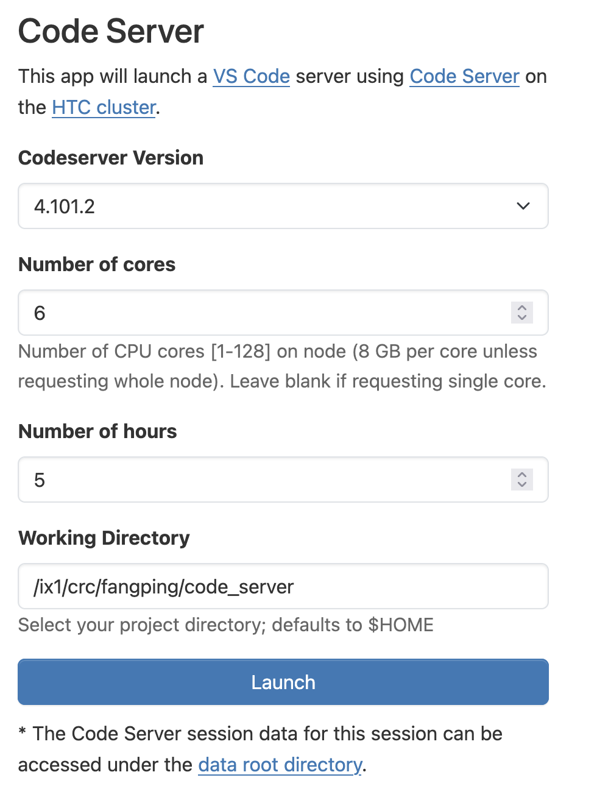
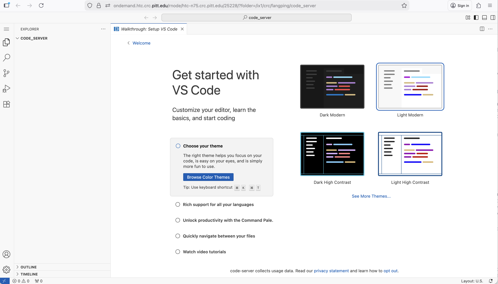
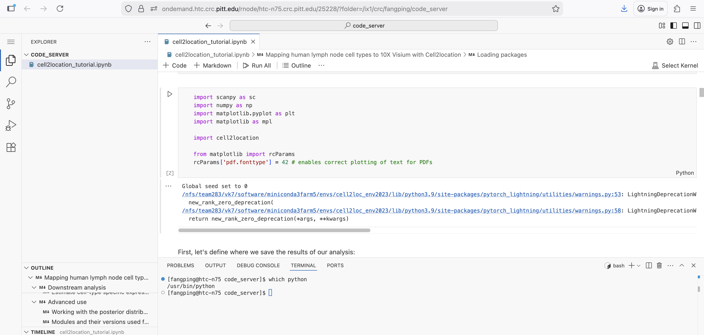
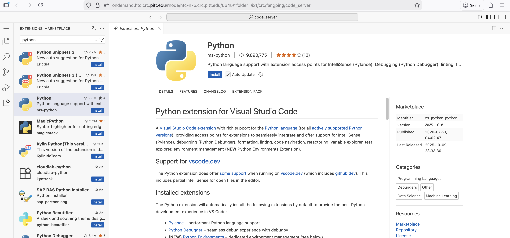
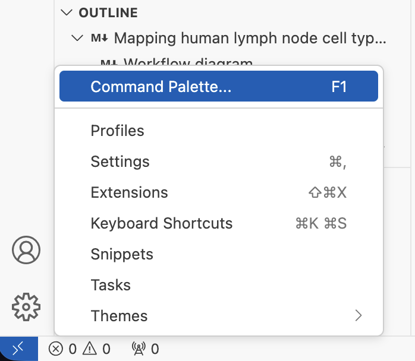
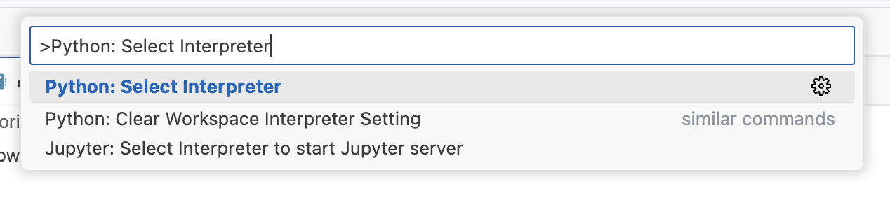
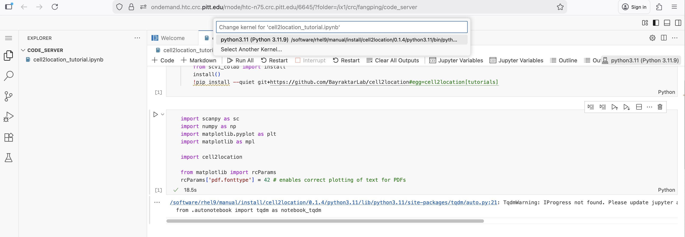
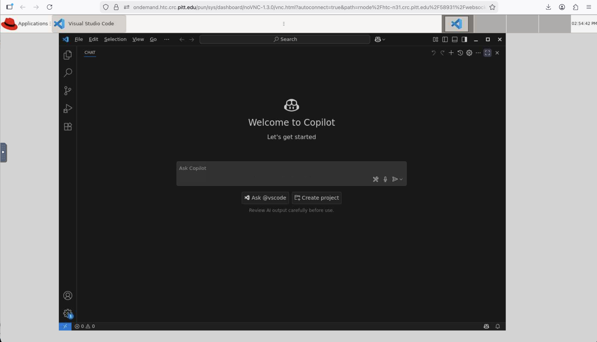

# Interactive / Remote Computing with VS Code

## 1. Code Server
Code server refers to a technology that enables running Visual Studio Code (VS Code) on a remote server and accessing it through a web browser. This setup provides a consistent development environment accessible from various devices, including laptops, tablets, and even low-powered machines.
https://github.com/coder/code-server

### Launching a Code-Server
Logon ondemand.htc.crc.pitt.edu, click Interactive Apps -> Code Server. Choose code server version, select Number of cores, Number of hours and Working Directory. Click Launch.



A new Code server session will automatically be created on one of the HTC compute nodes. Once the session has been created, start the session.



### Installing Code-Server Extensions
You can install any desired extensions from the Extensions sidebar on the left-hand side. This only needs to be done the first time you run Code Server, or whenever you need new extensions. I demonstrate installing Jupyter extensions.
Search “Jupyter” from EXTENSIONS: MARKETPLACE, select a specific extension. Click “Install”


The extensions will be installed under ~/.local/share/code-server.

Now you can open Jupyter Notebooks.



### Using customized conda environments in Code-Server

When your Jupyter notebooks depend on a customized conda environment, you can use customized conda environments in VS Code-Server. We have installed cell2location conda environment at /software/rhel9/manual/install/cell2location/0.1.4/python3.11, which can be used to execute the codes in the above Jupyter notebook.

If you have not installed the basic the basic Python extension, install Python extension for Visual Studio Code. 



Start Command Palette…



Type "Python: Select Interpreter" in the Command Palette and select this option. 



Type “/software/rhel9/manual/install/cell2location/0.1.4/python3.11/bin/python”, and Choose this Conda Environment. Now you can use this conda environment to execute the codes in the cell2location tutorial Jupyter notebook.



## 2. VSCode via VNC

Logon ondemand.htc.crc.pitt.edu, click Interactive Apps -> VSCode on htc. Choose VSCode version, select Number of cores and Number of hours. Click Launch.
You will run VSCode inside TurboVNC session. 




## 3. Tunneling


This tutorial outlines how to set up VS Code for interactive/remote development/debugging on Pitt CRCD computing nodes.

### Prerequisites

- The latest version of VS Code installed on your local machine
- Latest version of the ["Remote Development" extension pack](https://marketplace.visualstudio.com/items?itemName=ms-vscode-remote.vscode-remote-extensionpack)

### Steps performed **only once**

Add the following lines to the ssh config file on your local machine (~/.ssh/config) 
and replace <name> with your Pitt username:

```
Host htc  
  ControlMaster auto  
  ControlPath ~/.ssh/master-%r@%h:%p  
  HostName htc.crc.pitt.edu  
  User <name>

Host htcx  
  ProxyCommand ssh htc 'nc $(squeue --me --name=tunnel --states=R -h -O NodeList,Comment)'  
  StrictHostKeyChecking no  
  User <name>
```

For users on a **Windows** machine, the ControlMaster may not be available, so add the following lines instead:

```
Host htc
  HostName htc.crc.pitt.edu
  User <name>

Host htcx  
  ProxyCommand ssh htc "nc $(squeue --me --name=tunnel --states=R -h -O NodeList,Comment)"  
  StrictHostKeyChecking no  
  User <name>
```

Connect to the HTC cluster and create the following sbatch file into your home directory (`~/tunnel.sbatch`):

```shell
#!/bin/bash

#SBATCH --output="tunnel.log"  
#SBATCH --job-name="tunnel"  
#SBATCH --time=4:00:00 # walltime  
#SBATCH --cpus-per-task=2 # number of cores  
#SBATCH --mem-per-cpu=8G # memory per CPU core

# load the modules  
module load python/ondemand-jupyter-python3.8

# find open port  
PORT=$(python -c 'import socket; s=socket.socket(); s.bind(("", 0)); print(s.getsockname()[1]); s.close()')  
scontrol update JobId="$SLURM_JOB_ID" Comment="$PORT"

# start sshd server on the available port  
echo "Starting sshd on port $PORT"  
/usr/sbin/sshd -D -p ${PORT} -f /dev/null -h ${HOME}/.ssh/id_rsa
```

In the terminal on your local machine, generate an ssh key if you don't have one already using the following:
```
ssh-keygen -t rsa
```
Copy your local public ssh key to the cluster using:
```
ssh-copy-id htc
```
On `htc.crc.pitt.edu`, run the following commands if you have not done so:
```
ssh-keygen #then follow on screen instructions  
cd ~/.ssh  
cat id_rsa.pub >> authorized_keys
```

### Steps performed every time to connect your VS Code to the cluster
---------------------------------------------------------------------

From your local terminal, connect to the cluster using ssh htc and once logged in, 
type sbatch tunnel.sbatch to start the remote server. Make sure that your job does run!

Sample output:

```commandline
[user@login0b ~]$ sbatch tunnel.sbatch  
Submitted batch job 1383495  
[user@login0b ~]$ squeue -u user

  JOBID      PARTITION      NAME      USER      ST      TIME      NODES      NODELIST(REASON)  
1383495            htc    tunnel      user       R      0:17          1           htc-1024-n0
```

Open VS Code on your local machine and connect to your projects using `Remote Explorer` with `htcx` as the ssh target.

### Changes you need to do to allocate resources with GPUs
----------------------------------------------------------

Add the following host to the ssh config file on your local machine (`~/.ssh/config`) and 
replace `<name>` with your username:
```
Host gpux  
  ProxyCommand ssh htc 'nc $(squeue -M gpu --me --name=tunnel --states=R -h -O NodeList,Comment)'  
  StrictHostKeyChecking no  
  User <name>
```

Change the contents of the sbatch file in your home directory on HTC (`~/tunnel.sbatch`) to:
```shell
#!/bin/bash  
#SBATCH --output="tunnel.log"  
#SBATCH --job-name="tunnel"  
#SBATCH --cpus-per-task 2  
#SBATCH --time 0-01:00:00  
#SBATCH --clusters=gpu  
#SBATCH --partition=a100  
#SBATCH --gres=gpu:1

module load python/ondemand-jupyter-python3.8 # load the modules

# find open port  
PORT=$(python -c 'import socket; s=socket.socket(); s.bind(("", 0));  
print(s.getsockname()[1]); s.close()')  
scontrol update JobId="$SLURM_JOB_ID" Comment="$PORT"  
# start sshd server on the available port  
echo "Starting sshd on port $PORT"  
/usr/sbin/sshd -D -p ${PORT} -f /dev/null -h ${HOME}/.ssh/id_rsa
```
