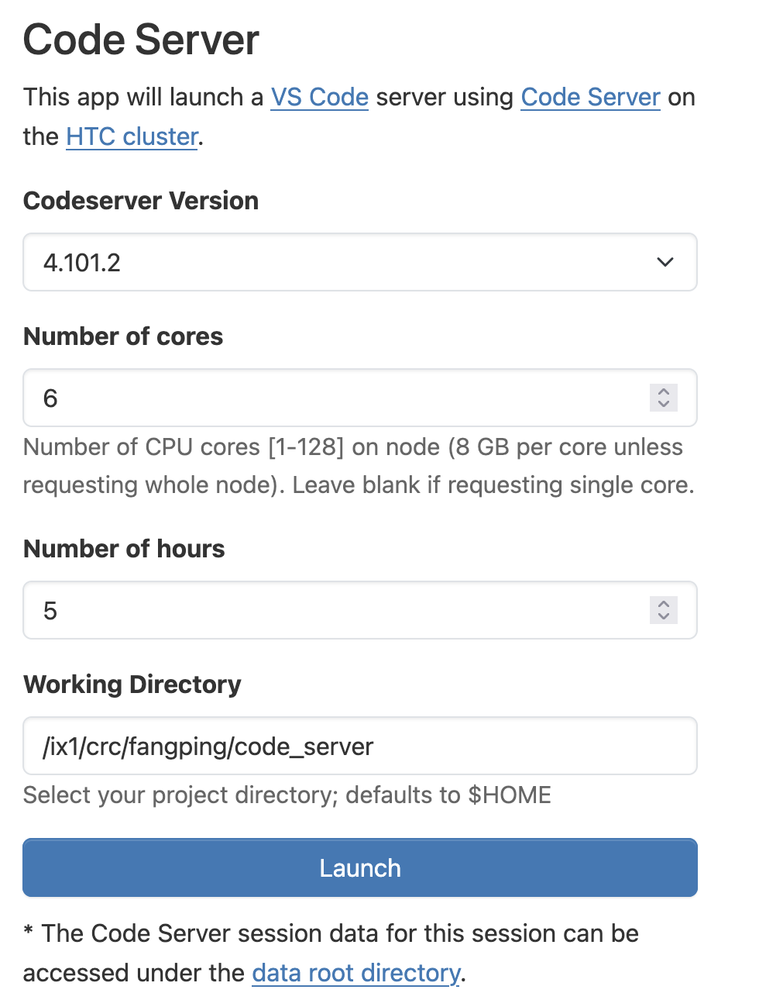
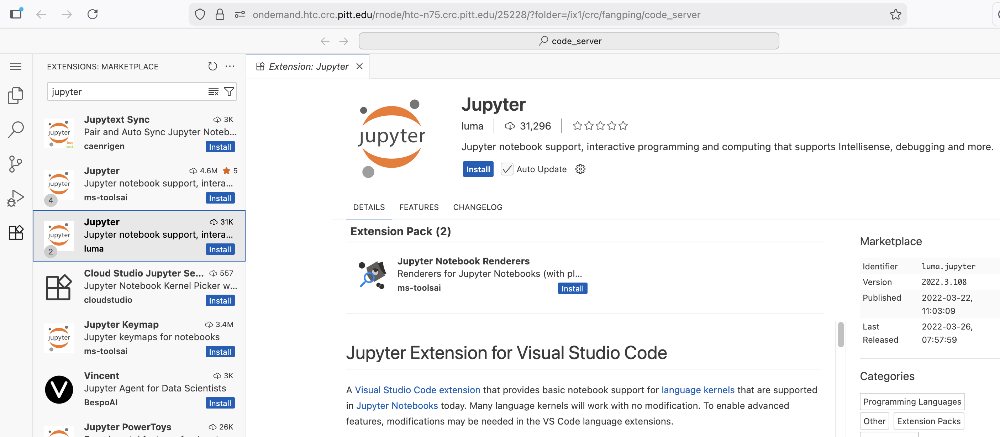
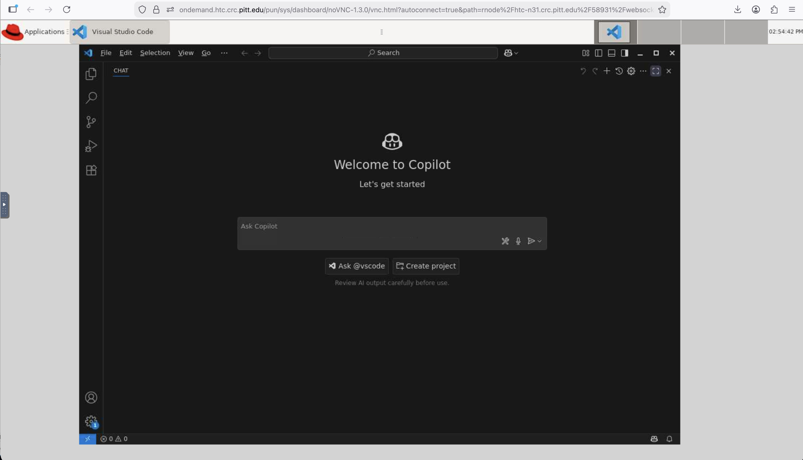

# Remote Development with VS Code

You can use Visual Studio Code with CRCD in three ways. Pick based on how much
setup you want and whether you'd rather work in a browser or in your own local
VS Code:

| Method | Where VS Code runs | Best when |
| ------ | ------------------ | --------- |
| [Code Server](#code-server) | In your browser, via Open OnDemand | You want the quickest start with nothing to install |
| [VS Code via VNC](#vs-code-via-vnc) | In a browser desktop (TurboVNC), via Open OnDemand | You want the full desktop VS Code UI in the browser |
| [Remote tunnel](#remote-tunnel) | Your **local** VS Code, connected to a compute node | You want your own VS Code, extensions, and settings against cluster resources |

The first two run through [Open OnDemand](../getting-started/open-ondemand.md)
and need no local setup. The tunnel is the most powerful but the most involved.

## Code Server

[Code Server](https://github.com/coder/code-server) runs VS Code on a compute
node and serves it to your browser.

Log on to `ondemand.htc.crc.pitt.edu`, click **Interactive Apps → Code Server**,
choose a version, number of cores, hours, and working directory, then **Launch**.
A session is created on an HTC compute node; start it once it's ready.



### Installing extensions

Install extensions from the Extensions sidebar (only needed the first time, or
when you need new ones). For example, search "Jupyter" in **Extensions:
Marketplace** and click **Install**; extensions are stored under
`~/.local/share/code-server`. You can then open Jupyter notebooks.



### Using a conda environment

To run notebooks against a specific conda environment, open the Command Palette,
type **Python: Select Interpreter**, and enter the path to that environment's
`python`. For example, the `cell2location` environment installed at
`/software/rhel9/manual/install/cell2location/0.1.4/python3.11/bin/python`.
(Install the Python extension first if you haven't.) See
[Python](../applications/python.md) for creating your own environments.

## VS Code via VNC

Log on to `ondemand.htc.crc.pitt.edu`, click **Interactive Apps → VSCode on
htc**, choose a version, cores, and hours, then **Launch**. VS Code runs inside a
TurboVNC desktop session in your browser.



## Remote tunnel

This connects the VS Code installed on **your own machine** to a CRCD compute
node using the Remote-SSH extension.

!!! note "This is the advanced option"
    It requires SSH key setup and an SSH config. If you just want VS Code
    quickly, use Code Server above.

**Prerequisites**

- The latest VS Code on your local machine.
- The [Remote Development extension pack](https://marketplace.visualstudio.com/items?itemName=ms-vscode-remote.vscode-remote-extensionpack).

### One-time setup

**1. Set up passwordless SSH.** The tunnel needs your public key installed on the
login node (so you connect without a password) and a key in your cluster home
directory that the compute-node `sshd` will use as its host key. Both are covered
on [Passwordless SSH](../getting-started/passwordless-ssh.md) — follow it to
create an `ed25519` key pair before continuing.

**2. Add an SSH config.** On your local machine, add to `~/.ssh/config` (replace
`<username>` with your Pitt username):

```text
Host htc
  HostName htc.crc.pitt.edu
  User <username>
  ControlMaster auto
  ControlPath ~/.ssh/master-%r@%h:%p

Host htcx
  ProxyCommand ssh htc 'nc $(squeue --me --name=tunnel --states=R -h -O NodeList,Comment)'
  StrictHostKeyChecking no
  User <username>
```

!!! note "Windows"
    If `ControlMaster` isn't available on your machine, omit the `ControlMaster`
    and `ControlPath` lines from the `Host htc` block; the rest is unchanged.

**3. Create the tunnel job script.** On the cluster, create `~/tunnel.sbatch`:

```bash
#!/bin/bash
#SBATCH --output="tunnel.log"
#SBATCH --job-name="tunnel"
#SBATCH --time=4:00:00
#SBATCH --cpus-per-task=2
#SBATCH --mem-per-cpu=8G

module load python   # any Python module works (see Discovering Software); used only to find a free port

# find an open port and record it in the job's Comment field
PORT=$(python -c 'import socket; s=socket.socket(); s.bind(("", 0)); print(s.getsockname()[1]); s.close()')
scontrol update JobId="$SLURM_JOB_ID" Comment="$PORT"

# start an sshd on that port, using your key as the host key
echo "Starting sshd on port $PORT"
/usr/sbin/sshd -D -p ${PORT} -f /dev/null -h ${HOME}/.ssh/id_ed25519
```

### Connecting (each time)

From your local terminal, `ssh htc`, then start the tunnel job:

```
[user@login1 ~]$ sbatch tunnel.sbatch
Submitted batch job 1383495
[user@login1 ~]$ squeue -u $USER
  JOBID  PARTITION    NAME   USER  ST   TIME  NODES  NODELIST(REASON)
1383495        htc  tunnel   user   R   0:17      1  htc-1024-n0
```

Once the job is running, open VS Code locally and connect via **Remote Explorer**
using `htcx` as the SSH target.

### Requesting a GPU

Add a `gpux` host to your local `~/.ssh/config`:

```text
Host gpux
  ProxyCommand ssh htc 'nc $(squeue -M gpu --me --name=tunnel --states=R -h -O NodeList,Comment)'
  StrictHostKeyChecking no
  User <username>
```

And change the `#SBATCH` lines in `~/tunnel.sbatch` to target the GPU cluster:

```bash
#SBATCH --time=0-01:00:00
#SBATCH --cpus-per-task=2
#SBATCH --cluster=gpu
#SBATCH --partition=a100      # a100 | l40s | h200 | ... (see the GPU hardware page)
#SBATCH --gres=gpu:1
```

Then connect using `gpux` as the SSH target instead of `htcx`. See the
[GPU cluster](../hardware_profiles/gpu.md) page for available partitions.

## Related

<div class="grid cards" markdown>

-   :material-web:{ .lg .middle } __Browser access__

    ---

    Code Server, VNC, and other apps through Open OnDemand.

    [:octicons-arrow-right-24: Open OnDemand](../getting-started/open-ondemand.md)

-   :material-key:{ .lg .middle } __Set up SSH keys__

    ---

    Passwordless SSH, required for the remote tunnel.

    [:octicons-arrow-right-24: Passwordless SSH](../getting-started/passwordless-ssh.md)

-   :material-console:{ .lg .middle } __Interactive sessions__

    ---

    Other ways to get a shell on a compute node.

    [:octicons-arrow-right-24: Interactive Jobs](interactive-jobs.md)

</div>
