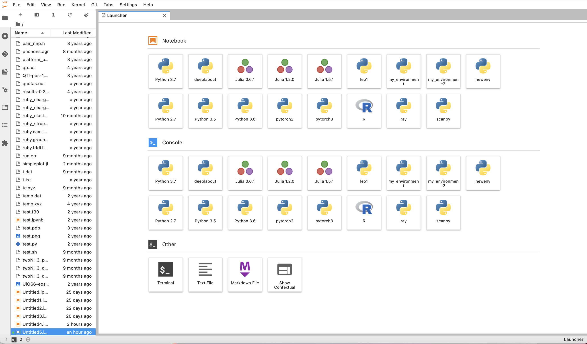

# Jupyter Hub

## **Summary**

In addition to Jupyter notebook sessions via Open OnDemand, CRC also hosts the functionality for the multi-user equivalent
[Jupyter Hub](https://jupyter.org/hub).

[**Log in to Jupyter Hub**](https://hub.crc.pitt.edu)

## **Accessing CRC Jupyter Hub**

The **Server Options** dropdown gives you the option to create a Jupyter Hub instance on your local machine, on the SMP cluster 
(1 core, 3 hours), or on the GPU cluster with GTX 1080 (1 GPU, 3 hours) or A100 (1 GPU, 3 hours).

After making your selection, click on **Start** and you will be redirected once the job is provisioned on the cluster. This may 
take a few minutes, depending on the cluster's load.

Once the job has started, click on **Start My Server**, which will lead you to the Launcher page.

Here you can open a Jupyter notebook, a Console or even a Terminal. Your files stored on the CRC cluster are visible in the left pane.

Notebooks and Consoles can be started using a specific _kernel_. Some of these kernels correspond to standard Python (or Julia and R) 
environments, for instance Python 3.7. Other kernels can contain user-defined virtual environments, with specific packages installed. 
We provide guidelines on how to create Python virtual environments, install software in them and make them visible as user-defined 
kernels in Jupyter Hub at [python](../applications/python.md).

General information about Juyter notebook capabilities are available at [https://jupyter.org](https://jupyter.org). Jupyter notebooks 
created using the CRC Jupyter Hub are automatically saved to your home directory on the CRC cluster. The **File** menu near the top 
left corner of Jupyter Hub allows you to rename your files or to save them to non-default directories.
