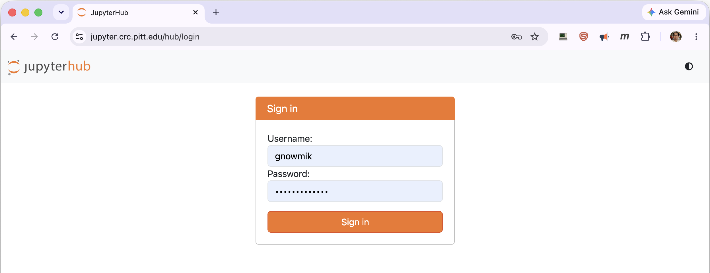
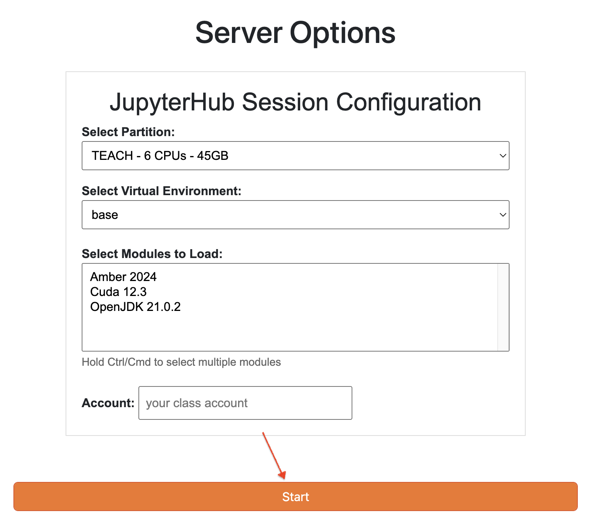
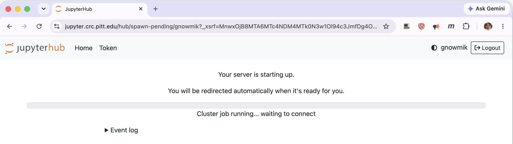
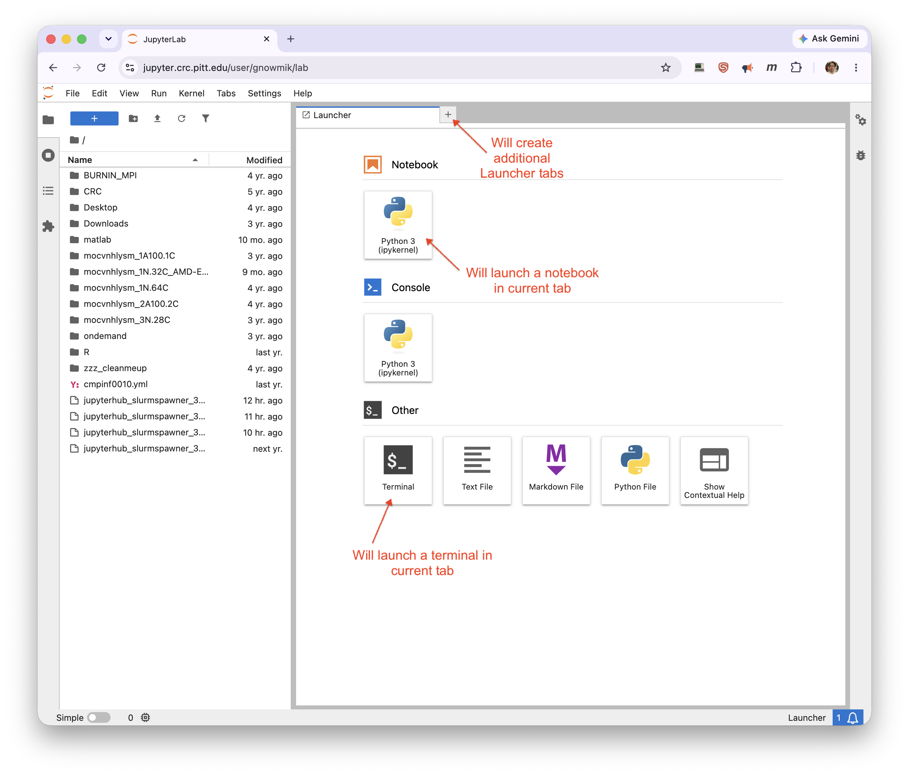
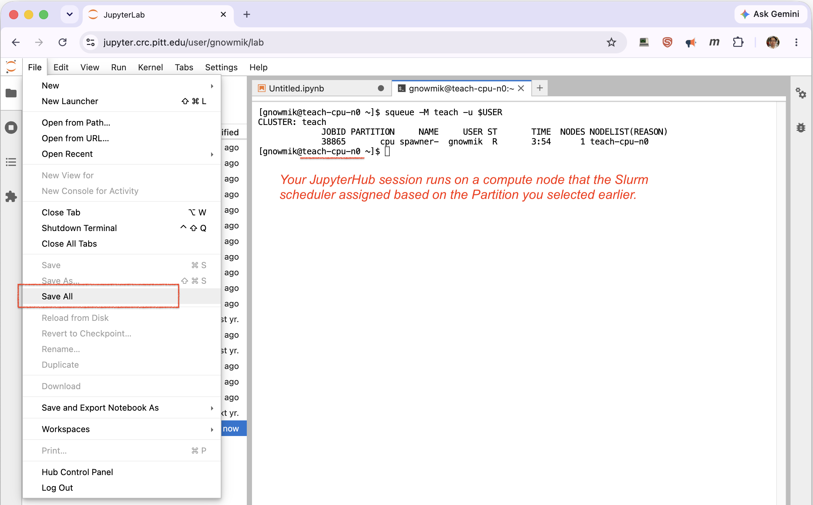
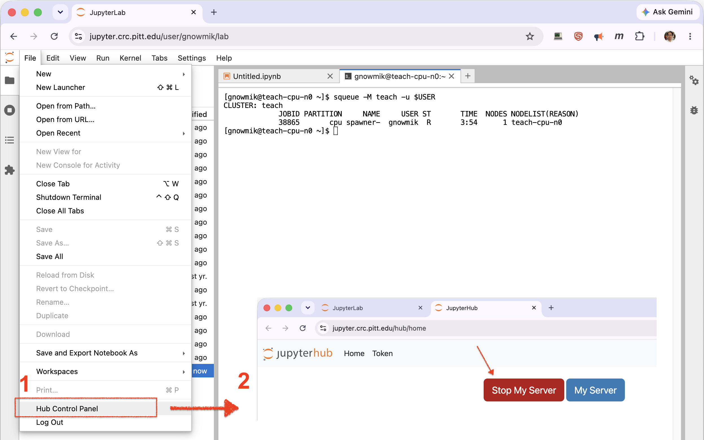
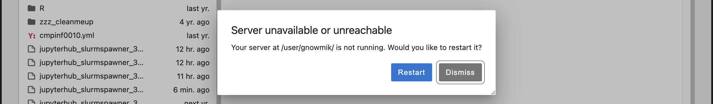
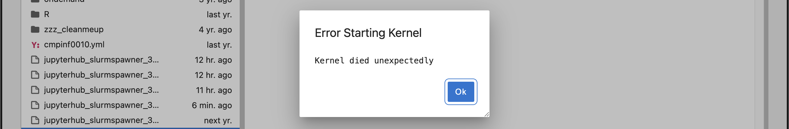
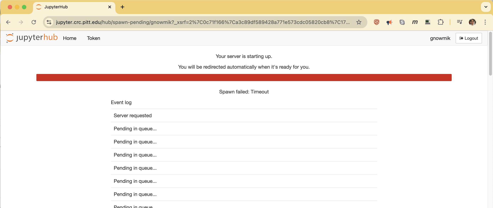
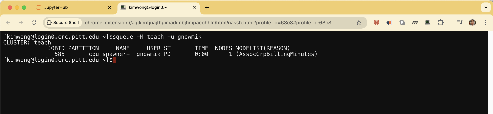

# JupyterHub on the Teach Cluster

[JupyterHub](https://jupyter.org/hub) provides students access to Jupyter notebooks with the capability of connecting to dedicated
computing resources on the [Teach cluster](../hardware_profiles/teach.md). Through this web portal, students can request access to CPU and GPU compute nodes for classwork.

## Step 1. Connecting to JupyterHub

Point your browser to the address below and authenticate using your Pitt credentials. The username needs to be all
lowercase and is the same one used to access my.pitt.edu. The web host should be accessible for all users while
connected through Wireless-PittNet. If that is not the case, please try again while on the [GlobalProtect VPN](https://services.pitt.edu/TDClient/33/Portal/KB/ArticleDet?ID=3426).

- **web hostname:** <https://jupyter.crc.pitt.edu>
- **authentication credentials:** Pitt username (all lowercase) and password

## Step 2. Configuring the JupyterHub session

After logging in, you will be presented with the JupyterHub configuration page, which looks like the image below.

{ width="62%" }

The **Select Partition** dropdown menu provides 4 preset configurations on the Teach cluster. The configurations are as
follows:

- **Teach - 6 CPUs - 45GB**
- **Teach - Nvidia GTX 1080 GPU - 2 CPUs - 20GB**
- **Teach - Nvidia Titan X GPU - 3 CPUs - 24GB**
- **Teach - Nvidia L4 GPU - 16 CPUs - 60GB**

The 4 configurations are designed to best utilize the available resources on the Teach cluster. All of them are
configured to run for 3 hours.

The **Select Virtual Environment** dropdown menu allows you to select the Python environment you want to use. The default
is the **base** environment, which is a standard Python 3.11 installation. If your class needs a specific Python
environment, please submit
a [help ticket](https://services.pitt.edu/TDClient/33/Portal/Requests/TicketRequests/NewForm?ID=yXkHi62rHa8_&RequestorType=Service) and we will create it for you, so you can select it from the dropdown menu. The menu also includes a **Provide custom
path** option which allows you to specify a custom Python environment path. Please refer to the [Create a virtual environment for JupyterHub](../web-portals/jupyterhub-venv.md) for more instructions on how to create a custom
Python environment for JupyterHub.

You can use the **Account** field to specify a different Slurm account to use for the session other than your default
account. As an example, let's say that you are in a research group with a Slurm account called `panthers` and this is your
default Slurm association. In the current semester, you are enrolled in a class that has a Slurm account called `datasci`.
If you do not specify `datasci` in the **Account** field, your default Slurm account will be used and you may encounter errors 
because research group accounts typically do not have Resource Allocation on the Teach cluster.

Pressing *Start* will launch a Slurm job to the Teach cluster and send back a Jupyter Notebook on the web GUI.

## Step 3. Interacting with the Jupyter Notebook

If successful, you will see the GUI below. The [Project Jupyter site](https://docs.jupyter.org/en/latest/) has good documentation
on all aspects of the GUI.

Should you run into problems, please submit a [help ticket](https://services.pitt.edu/TDClient/33/Portal/Requests/TicketRequests/NewForm?ID=yXkHi62rHa8_&RequestorType=Service) and we will troubleshoot. A potential error could be that your account does not have an allocation on the Teach cluster. A symptom
of this error is shown in the [Appendix](#appendix-errors) at the bottom.

## Step 4. Ending session

Be sure to *Save All* your work before ending your session.

Next, select the *Hub Control Panel* to bring up the option to Stop My Server, which will end the Slurm job and hence your 
JupyterHub session.

You may see additional warning/error messages in the tab where you have your Notebook open. You can safely ignore these and 
close your browser window. Essentially, you have stopped the server (stopped the Slurm job) and so the front-end can no longer 
connect to it. Stopping the server also killed the Python kernel that was running.

 
 

## Appendix: Errors

Your request for a Jupyter Notebook on the Teach cluster will fail if your account does not have a Resource Allocation there. The 
error may manifest as shown below. Please submit a [help ticket](https://services.pitt.edu/TDClient/33/Portal/Requests/TicketRequests/NewForm?ID=yXkHi62rHa8_&RequestorType=Service) and we will create it for you.

