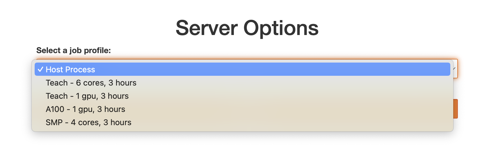

# JupyterHub on the Teach Cluster

[JupyterHub](https://jupyter.org/hub) gives students access to Jupyter notebooks backed by dedicated computing
resources on the Teach cluster. Through this web portal, students can request CPU and GPU compute nodes for classwork.

## Step 1. Connecting to JupyterHub

Point your browser to the address below and authenticate with your Pitt credentials. Your username is the same one you
use for my.pitt.edu, in all lowercase. The host should be reachable for all users on Wireless-PittNet; if it isn't, try
again while connected to the [VPN](https://services.pitt.edu/TDClient/33/Portal/KB/ArticleDet?ID=3426).

- **Web hostname:** <https://jupyter.crc.pitt.edu>
- **Authentication:** Pitt username (all lowercase) and password

## Step 2. Configuring a JupyterHub session

After logging in, you're presented with the JupyterHub configuration page:

The **Select Partition** dropdown offers four preset configurations on the Teach cluster:

- **Teach — 6 CPUs — 45 GB**
- **Teach — NVIDIA GTX 1080 GPU — 2 CPUs — 20 GB**
- **Teach — NVIDIA Titan X GPU — 3 CPUs — 24 GB**
- **Teach — NVIDIA L4 GPU — 16 CPUs — 60 GB**

These four presets are designed to make the best use of the available resources on the Teach cluster, and all run for up
to 3 hours.

The **Select Virtual Environment** dropdown chooses the Python environment. The default is the **base** environment, a
standard Python 3.11 installation. If your class needs a specific environment, submit a
[help ticket](https://services.pitt.edu/TDClient/33/Portal/Requests/TicketRequests/NewForm?ID=yXkHi62rHa8_&RequestorType=Service)
and we'll create it so you can select it from the dropdown. The menu also has a **Provide custom path** option for
specifying your own environment — see
[Create a virtual environment for JupyterHub](../web-portals/jupyterhub-venv.md) for how to build one.

Pressing **Start** launches the job on the Teach cluster and returns a Jupyter Notebook in the web GUI.

Use the **Account** field to charge a Slurm account other than your default. For example, if your default association is
a research group's `panthers` account but you're using JupyterHub for a class whose account is `datasci`, enter
`datasci` here. Leave it blank to use your default account.

## Step 3. Interacting with the Jupyter Notebook

If successful, you'll see the GUI below. The [Project Jupyter documentation](https://docs.jupyter.org/en/latest/)
covers all aspects of the interface in detail.

If you can't get a Jupyter Notebook instance, submit a
[help ticket](https://services.pitt.edu/TDClient/33/Portal/Requests/TicketRequests/NewForm?ID=yXkHi62rHa8_&RequestorType=Service)
and we'll troubleshoot. One likely cause is that your account doesn't have an allocation on the Teach cluster — the
symptom of that is shown in the [Appendix](#appendix-errors).

## Step 4. Ending your session

Be sure to save all your work before ending your session.

Select the **Hub Control Panel** to bring up the option to stop the server.

## Appendix: Errors

Your request for a Jupyter Notebook on the Teach cluster will fail if your account doesn't have an allocation there. The
error may look like the screens below.

