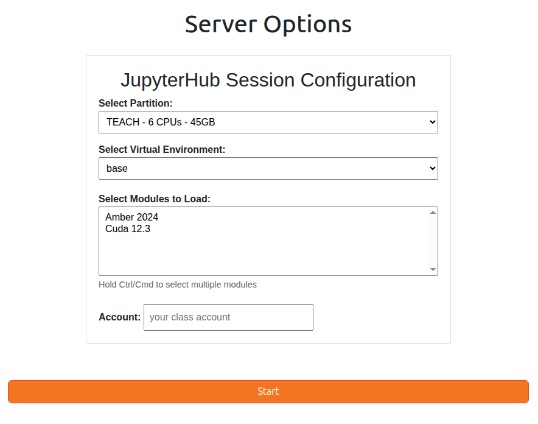

# JupyterHub on the Teach Cluster

[JupyterHub](https://jupyter.org/hub) provides students access to Jupyter notebooks with the capability of connecting to dedicated
computing resources on the Teach Cluster. Through this webportal, students can request access to CPU and GPU compute nodes for classwork.

## Step 1. Connecting to JupyterHub 

Point your browser to the address below and authenticate using your Pitt credentials. The username needs to be all lowercase and is the
same one used to access my.pitt.edu. The web host should be accessible for all users while connected through Wireless-PittNet. If that is 
not the case, please try again while on [VPN](https://services.pitt.edu/TDClient/33/Portal/KB/ArticleDet?ID=293).

* **web hostname:** [https://jupyter.crc.pitt.edu](https://jupyter.crc.pitt.edu)
* **authentication credentials:** Pitt username (all lowercase) and password

## Step 2. Selecting Resources

The **Select a job profile** dropdown menu provides several preset configurations. Please submit 
a [help ticket](https://services.pitt.edu/TDClient/33/Portal/Requests/TicketRequests/NewForm?ID=yXkHi62rHa8_&RequestorType=Service)
if you want us to create a custom profile for your class. 

The *Host Process* profile will run the Jupyter Notebook on the VM server hosting the JupyterHub
webportal. Our recommendation is that you do not choose *Host Process* but instead select one of the dedicated resources on the Teach
Cluster.

Pressing *Start* will launch the job to the Teach Cluster and send back a Jupyter Notebook on the web GUI.

## Step 3. Interacting with the Jupyter Notebook

If you encounter success, you will see the GUI below. The [Project Jupyter site](https://docs.jupyter.org/en/latest/) has good documentation 
on all aspects of the GUI. 

Should you be unsuccessful in getting a Jupyter Notebook instance, please submit a 
[help ticket](https://services.pitt.edu/TDClient/33/Portal/Requests/TicketRequests/NewForm?ID=yXkHi62rHa8_&RequestorType=Service)
and we will troubleshoot. A potential error could be that your account does not have an allocation on the Teach Cluster. A symptom
of this error is shown in the [Appendix](#appendix-errors) at the bottom.

## Step 4. Ending session

Be sure to save all your work before ending your session.

Select the *Hub Control Panel* to bring up the option to stop the server.

## **Appendix: Errors**

Your request for a Jupyter Notebook on the Teach Cluster will fail if your account does not have an allocation there. The error may
manifest as shown below.

