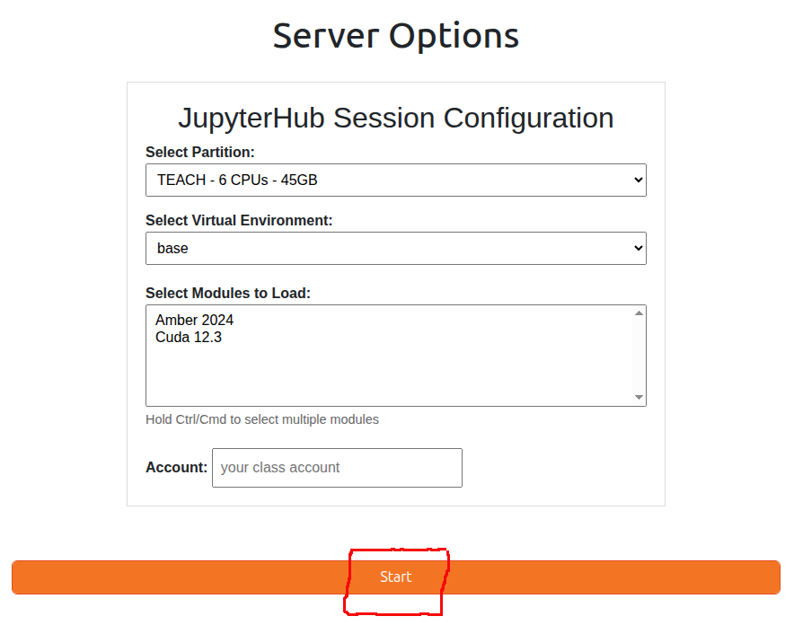

# JupyterHub on the Teach Cluster

[JupyterHub](https://jupyter.org/hub) provides students access to Jupyter notebooks with the capability of connecting to dedicated
computing resources on the Teach Cluster. Through this webportal, students can request access to CPU and GPU compute nodes for classwork.

## Step 1. Connecting to JupyterHub 

Point your browser to the address below and authenticate using your Pitt credentials. The username needs to be all 
lowercase and is the same one used to access my.pitt.edu. The web host should be accessible for all users while 
connected through Wireless-PittNet. If that is not the case, please try again while on [VPN](https://services.pitt.edu/TDClient/33/Portal/KB/ArticleDet?ID=293).

* **web hostname:** [https://jupyter.crc.pitt.edu](https://jupyter.crc.pitt.edu)
* **authentication credentials:** Pitt username (all lowercase) and password


## Step 2. Configuring Jupyterhub session

After logging in, you will be presented by the JupyterHub configuration page which looks like the image below.

The **Select Partition** dropdown menu provides 4 preset configurations on the TEACH cluster. The configurations are as 
follows:

* **Teach - 6 CPUs - 45GB**
* **Teach - Nvidia GTX 1080 GPU - 2 CPUs - 20GB**
* **Teach - Nvidia Titan X GPU - 3 CPUs - 24GB**
* **Teach - Nvidia L4 GPU - 16 CPUs - 60GB**

The 4 configurations are designed to best utilize the available resources on the TEACH cluster. All of them are 
configured to run for 3 hours.

The **Select Virtual Environment** dropdown menu allows you to select the Python environment you want to use. The default 
is the **base** environment, which is a standard Python 3.11 installation. If your class needs a specific Python 
environment, please submit 
a [help ticket](https://services.pitt.edu/TDClient/33/Portal/Requests/TicketRequests/NewForm?ID=yXkHi62rHa8_&RequestorType=Service)
and we will create it for you, so you can select it from the dropdown menu. The menu also includes a **Provide custom 
path** option which allows you to specify a custom Python environment path. Please refer to the
[Create a virtual environment for JupyterHub Article](../web-portals/jupyterhub-venv.md) for more instructions on how to create a custom 
Python environment for JupyterHub.

Pressing *Start* will launch the job to the Teach Cluster and send back a Jupyter Notebook on the web GUI.




You can use the **Account** field to specify a different SLURM account to use for the session other than your default 
account, for example, if you are part of a research group with a SLURM account called ```panthers``` and it's your 
default SLURM association; however, you will be using JupyterHub for a class that has a SLURM account called 
```datasci```, you can specify ```datasci``` in the **Account** field. If you leave it blank, your default SLURM 
account will be used.

## Step 3. Interacting with the Jupyter Notebook

If you encounter success, you will see the GUI below. The [Project Jupyter site](https://docs.jupyter.org/en/latest/) has good documentation 
on all aspects of the GUI. 

Should you be unsuccessful in getting a Jupyter Notebook instance, please submit a 
[help ticket](https://services.pitt.edu/TDClient/33/Portal/Requests/TicketRequests/NewForm?ID=yXkHi62rHa8_&RequestorType=Service)
and we will troubleshoot. A potential error could be that your account does not have an allocation on the Teach Cluster. A symptom
of this error is shown in the [Appendix](#appendix-errors) at the bottom.


## Step 4. Ending session

Be sure to save all your work before ending your session.


Select the *Hub Control Panel* to bring up the option to stop the server.


## **Appendix: Errors**

Your request for a Jupyter Notebook on the Teach Cluster will fail if your account does not have an allocation there. The error may
manifest as shown below.


