# RStudio Server on the GPU Cluster

[Open OnDemand](https://openondemand.org) provides researchers with remote web access to RStudio Server with the capability of connecting to 
dedicated GPUs. Through this webportal, researchers can leverage GPU compute nodes for accelerating their data analysis and AI/ML workloads.

## Step 1. Connecting to Open OnDemand

Point your browser to the address below and authenticate using your Pitt credentials. The username needs to be all 
lowercase and is the same one used to access my.pitt.edu. The web host should be accessible for all users while 
connected through Wireless-PittNet. If that is not the case, please try again while on [VPN](https://services.pitt.edu/TDClient/33/Portal/KB/ArticleDet?ID=293).

* **web hostname:** [https://ondemand.htc.crc.pitt.edu](https://ondemand.htc.crc.pitt.edu)
* **authentication credentials:** Pitt username (all lowercase) and password

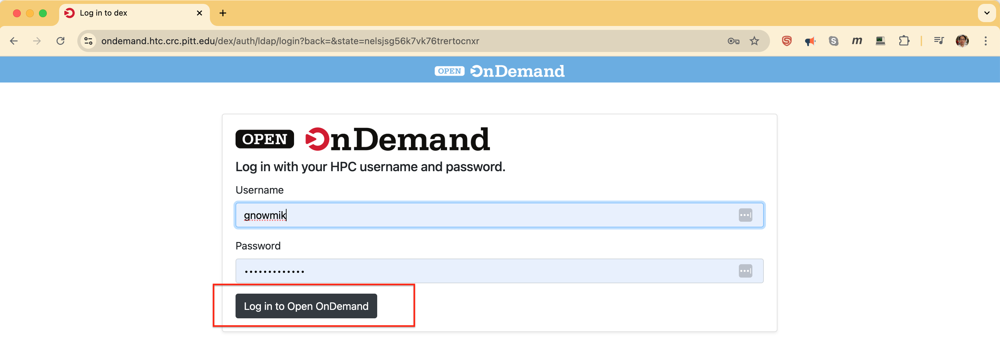

## Step 2. Selecting from Interactive Apps 

The **Interactive Apps** dropdown menu provides several installed software packages, including *RStudio Server on gpu*. 

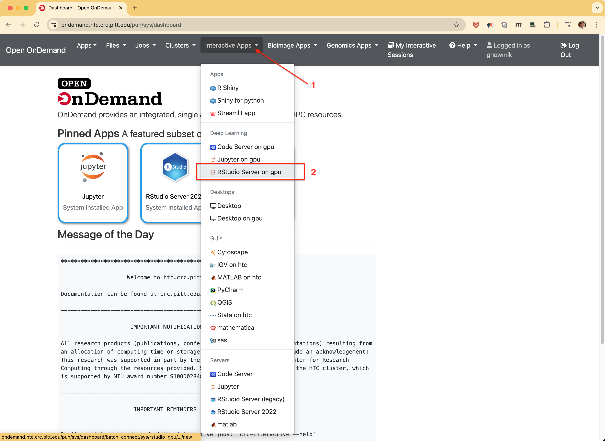

You will then be taken to a form where you can select the R version and GPU type from dropdown menus, the number of CPU cores and GPU
cards, the host memory, and for how long you will need the resource. The *Account* field is for users who belong to multiple Slurm accounts
and want to debit the used SUs from a particular account. Leaving this field empty will debit the SUs from the default allocation.

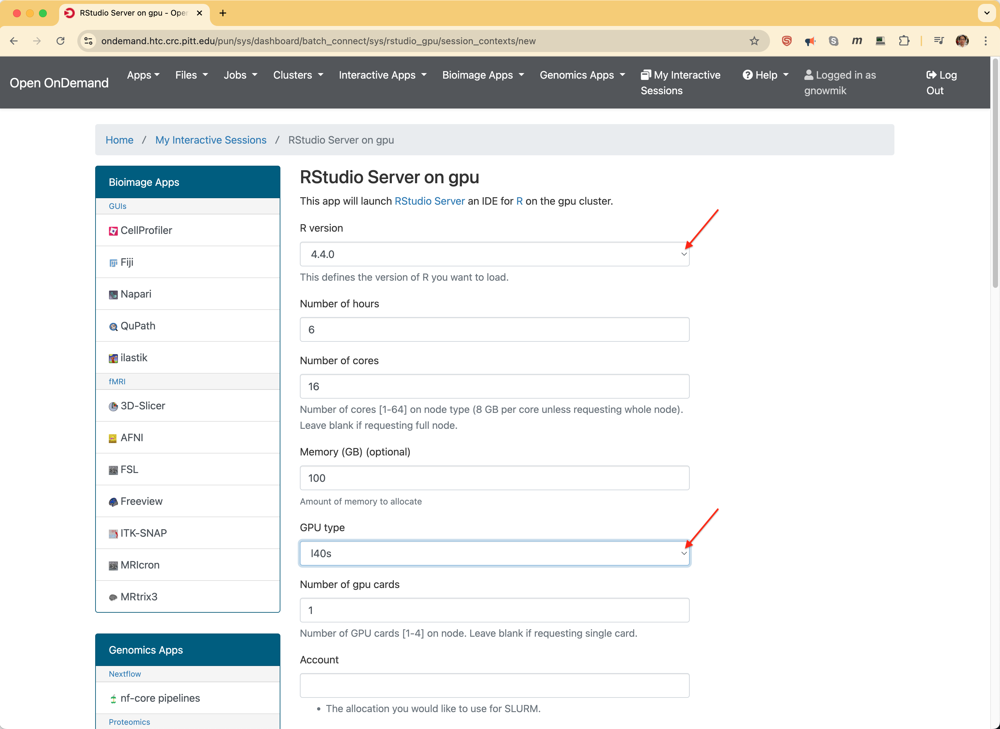

Pressing *Launch* will submit the job to the GPU Cluster, launch an RStudio Server instance on the assigned compute node, and send back
a link on the web GUI to *Connect to RStudio Server*. 

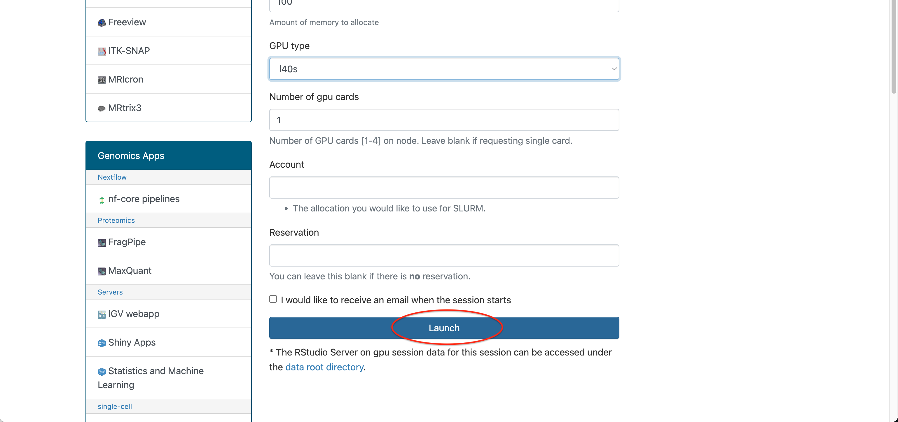

Shown below are the three stages of the job flow. The *Queued* status means that the job has been submitted to the Slurm scheduler.

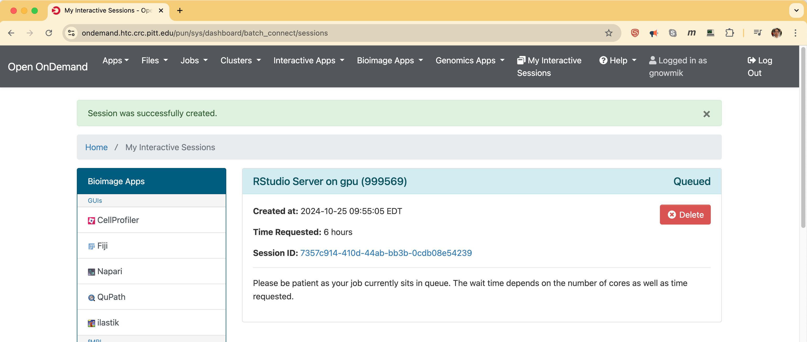

The *Starting* status means that Slurm was successful in finding/allocating the requested compute resources for the job. In this case,
the requested resource is 1 node with 16 cores as shown in the graphic.

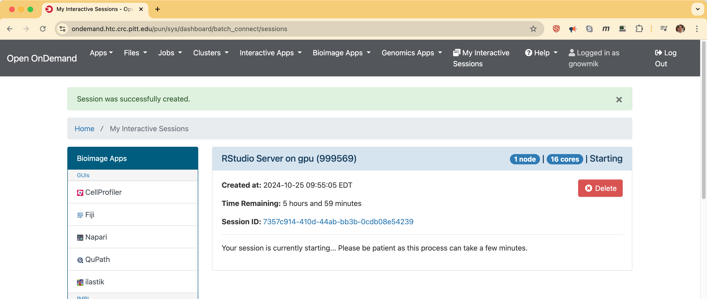

The *Running* status means that the RStudio Server job is currently running on the indicated *Host* and will continue to run until the
*Time Remaining* gets exhausted. Clicking on the *Connect to RStudio Server* will launch another browser tab with the familiar RStudio
Server interface.

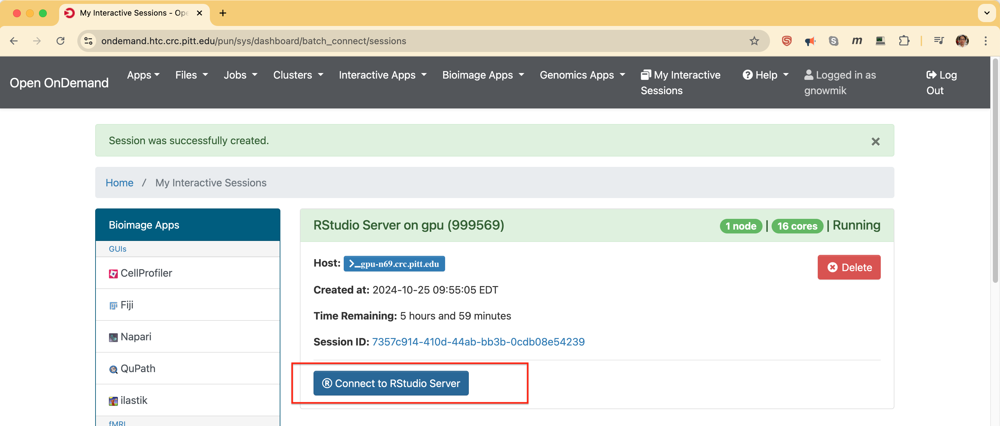

## Step 3. Interacting with the RStudio Server

If you encounter success, you will see the GUI below. The [RStudio GitHub site](https://github.com/rstudio/rstudio) has a link to 
the [RStudio User Guide](https://docs.posit.co/ide/user/), including documentation on all aspects of the GUI. 

Should you be unsuccessful in getting an RStudio Server instance, please submit a 
[help ticket](https://services.pitt.edu/TDClient/33/Portal/Requests/TicketRequests/NewForm?ID=yXkHi62rHa8_&RequestorType=Service)
and we will troubleshoot. A potential error could be that your account does not have an allocation on the requested cluster or that
the requested resource is currently busy. A symptom of this error is shown in the [Appendix](#appendix-errors) at the bottom.

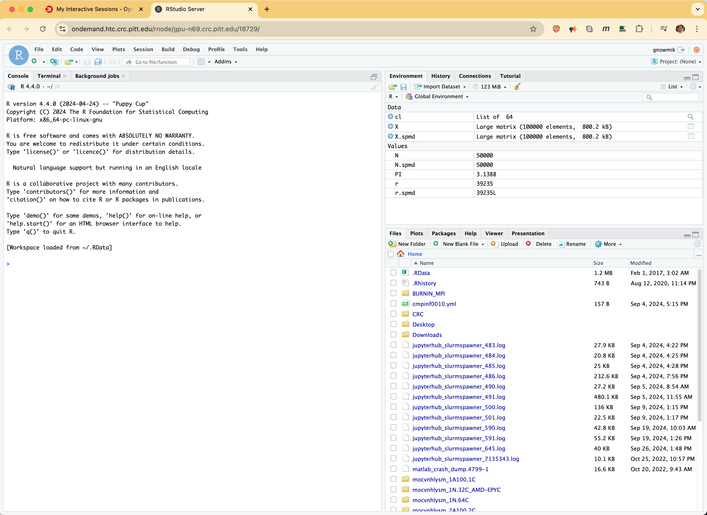

## Step 4. Ending session

The RStudio Server running through Open OnDemand will persist until the *Time Remaining* gets exhausted or you *Delete* the job. If
you were to close the web browser window or somehow you got kicked off due to networking problems, your session will continue to 
run in the background. To get back to your session, log in to Open OnDemand and click on *My Interactive Sessions* at the top
menu bar to see all running (or queued) OnDemand jobs.

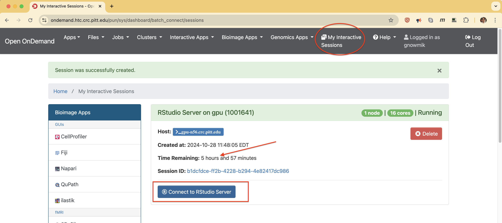

Clicking on *Connect to RStudio Server* will open another browser tab to your session:

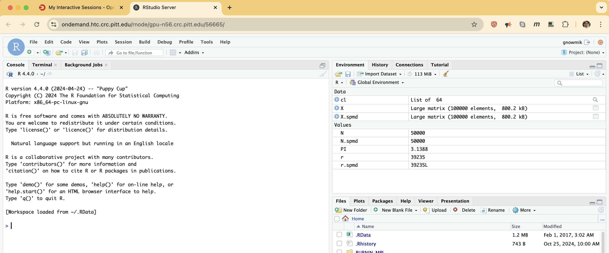

If you are indeed done with your work and wanted to terminate the session to return the compute resource back to the community pool
and stop the charge against your allocation, click on *Delete* followed by the confirmation *OK*. Before doing so, it's best 
to save your work to the filesystem first.  

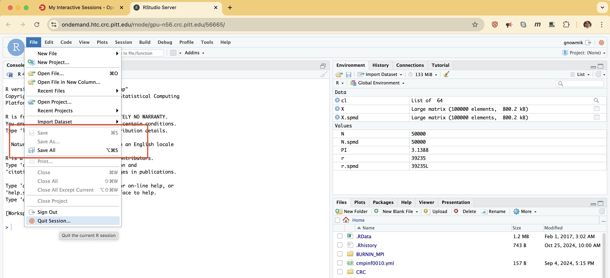
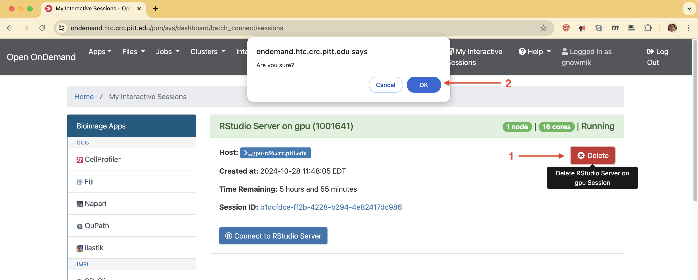

Now when you click on *My Interactive Sessions*, you will see that the session is no longer there. Other OnDemand jobs that you
have not deleted will still be listed.

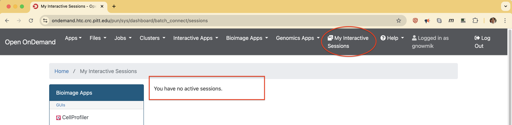

## **Appendix: Errors**

Sometimes jobs that are submitted through Open OnDemand will remain in the *Queued* state for a long time. Below, we describe 
two possible reasons and steps to address the issue.

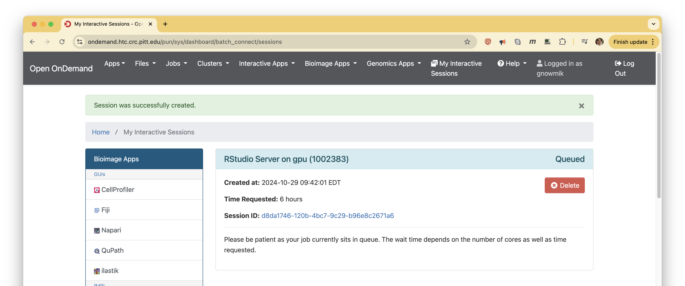

!!! example "Errors and Solutions"
    === "Error 1: No Resources"
        
        ### ^^ERROR 1:^^ OnDemand job remains queued due to lack of computing resources
        
        In the job specification below, I am requesting 4x A100_80GB GPUs on the a100_nvlink partition. As can be discovered on our
        [**Computing Hardware**](https://crc.pitt.edu/resources/computing-hardware), this type of resource is limited in availability.
        CRC only has two nodes with eight of these GPUs on each.
        
        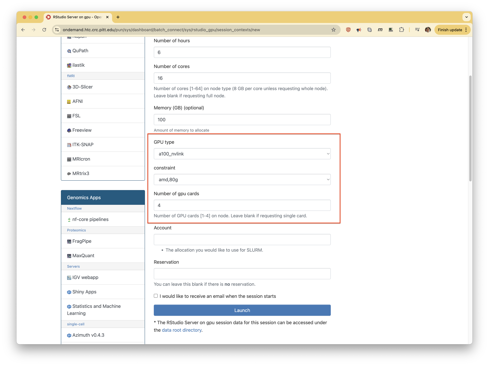
        
        When I *Launch* this job, it remains in the *Queued* state for more than five minutes; whereas, typically my jobs progress to 
        the *Running* state after a couple of minutes.
        
        
        
        Unfortunately, the current job panel does not provide the needed Slurm job information for troubleshooting. You can start the
        troubleshooting by opening an ssh terminal to the cluster. Click on the *Clusters* menu and select either one of the available
        *Shell Access* options.
        
        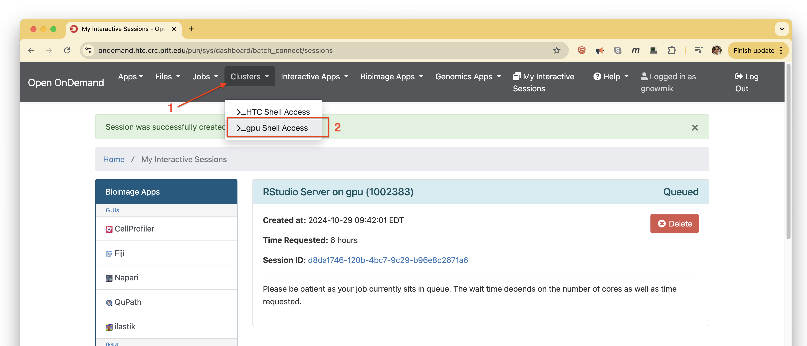
        
        This will launch an ssh session within another webpage tab. Execute the following command on the commandline 
        
        ```commandline
        squeue -M gpu -u $USER
        ```
        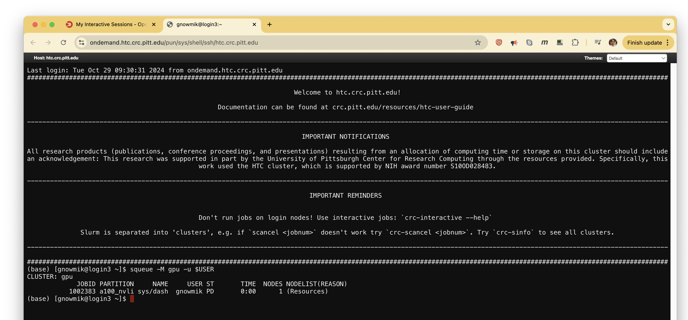
        
        ### ^^Possible Solution to ERROR 1^^ 
        
        The above `squeue` command shows that the job is in the *PD* (pending) state due to *(Resources)*, which means that Slurm 
        cannot find available resources to meet the job specifications. The job will remain in the *PD* state until other jobs 
        currently using the resources complete.
        
        One solution is to modify your job specification to target another type of resources that may be available. In the job 
        specification below, I changed the GPU type from A100_80GB to A100_40GB.
        
        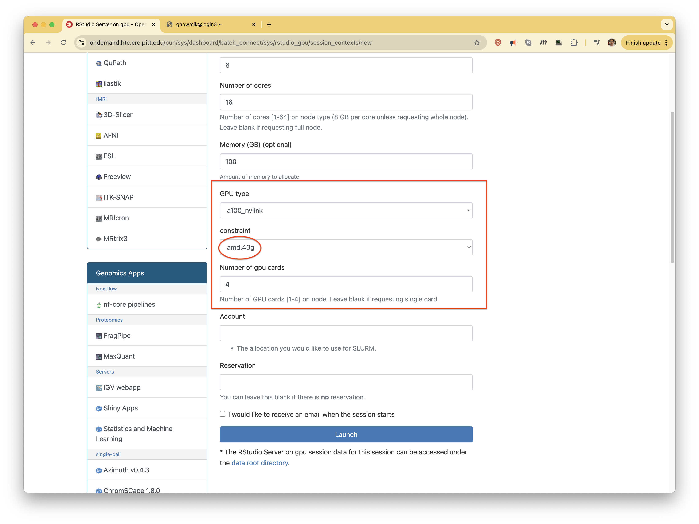
        
        For this case, Slurm was able to find the required resources and entered into the *Running* state, allocating 4x GPUs on
        node `gpu-n28.crc.pitt.edu` with 64 CPU cores.
        
        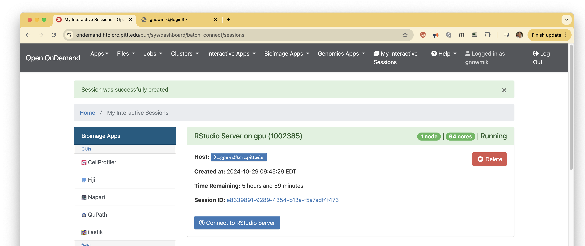
        
        If you execute the `squeue` command again in the terminal, you will see that the output matches the info shown on the
        job panel.
        
        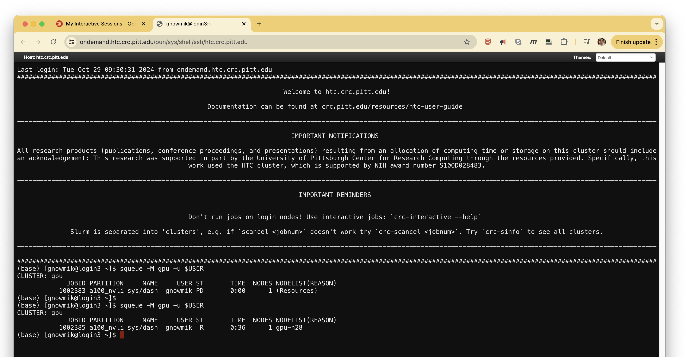

    === "Error 2: No Allocation"

        ### ^^ERROR 2:^^ OnDemand job remains queued due to not having any allocation on a cluster or the allocation had expired
        
        To synthetically create this error for the purpose of this manual, I used my superuser privileges and zeroed out my 
        allocation on the GPU cluster. You will see that I have no allocation on GPU in the screenshot of my terminal below. For 
        this demo, I requested one L40S GPU from the job submission panel.
        
        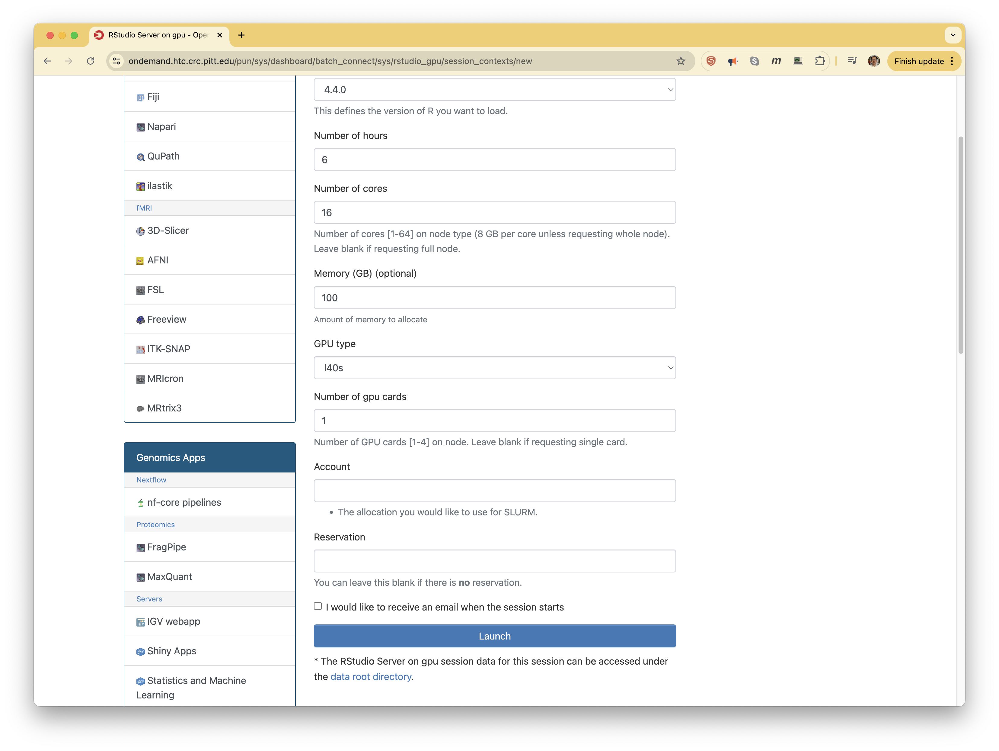
        
        The launched job remains in the *Queued* state for a several minutes.
        
        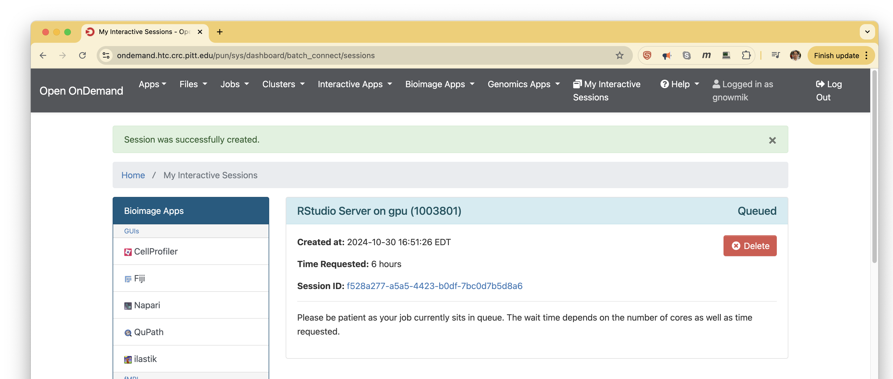
        
        To debug the issue, I open a terminal by going to the *Clusters* menu and launching one of the *Shell Access* from the 
        selection.
        
        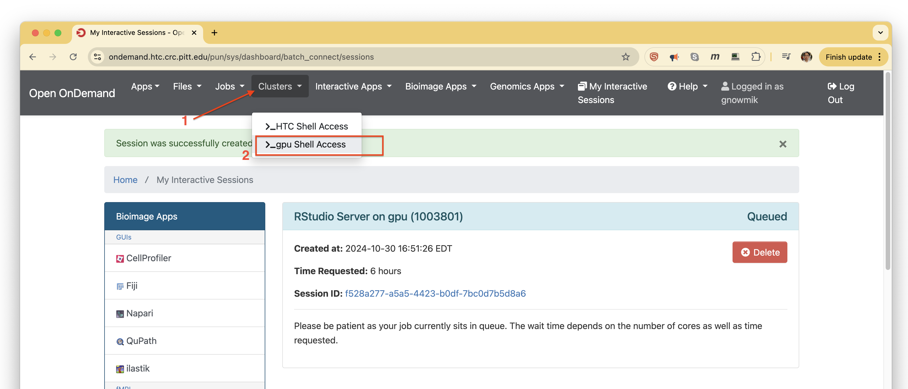
        
        Within the terminal window, I execute the command `squeue -M all -u $USER`, which instructs Slurm to display my jobs on
        all the clusters. The reason provided for the job to remain in the PD (pending) state is *AssocGrpBillingMinutes*, which 
        indicates that my job does not have any SUs to debit from. This source of this error may be due to an expired allocation
        or that I don't have any allocation on the requested cluster. In this situation, it is the latter cause.
        
        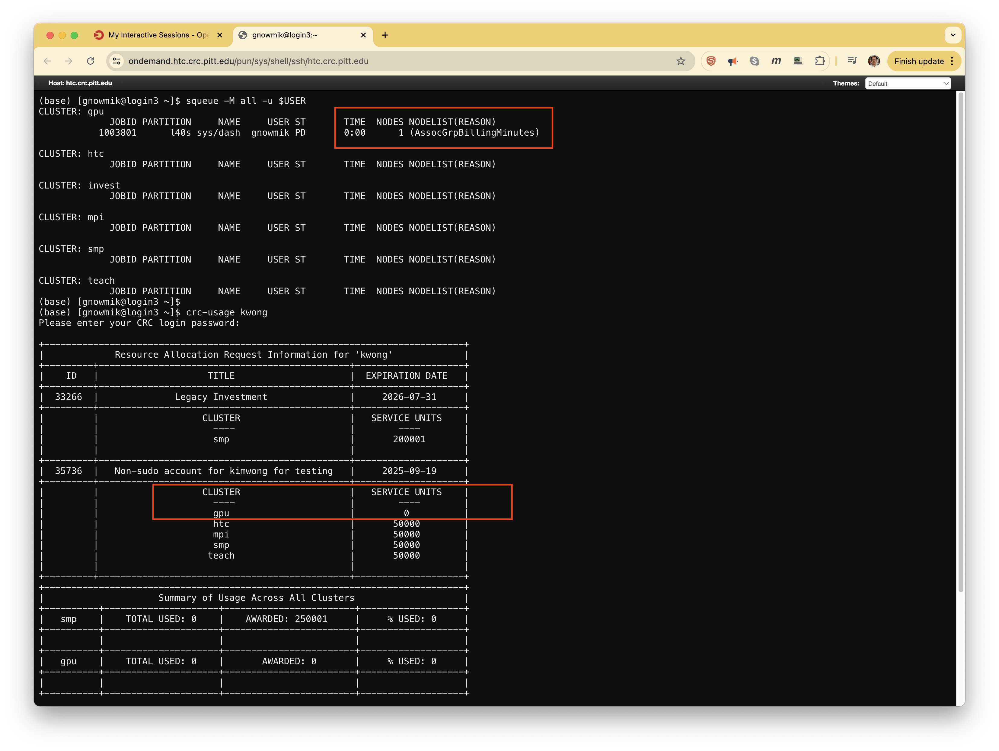
        
        ### ^^Possible Solution to ERROR 2^^
        
        You will need an allocation on the requested cluster.  Please submit a 
        [Service Request Form](https://crc.pitt.edu/service-request-forms), selecting the *On-Time Startup Allocation* if this 
        is your first time asking for computing time or selecting the *Annual Project Allocation* for all renewals.
