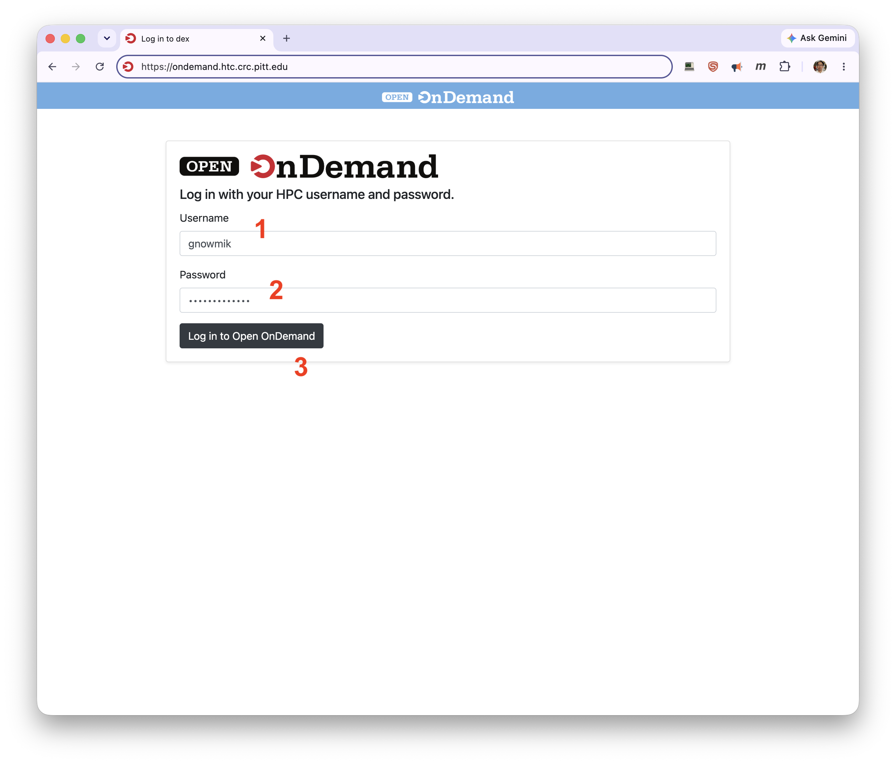
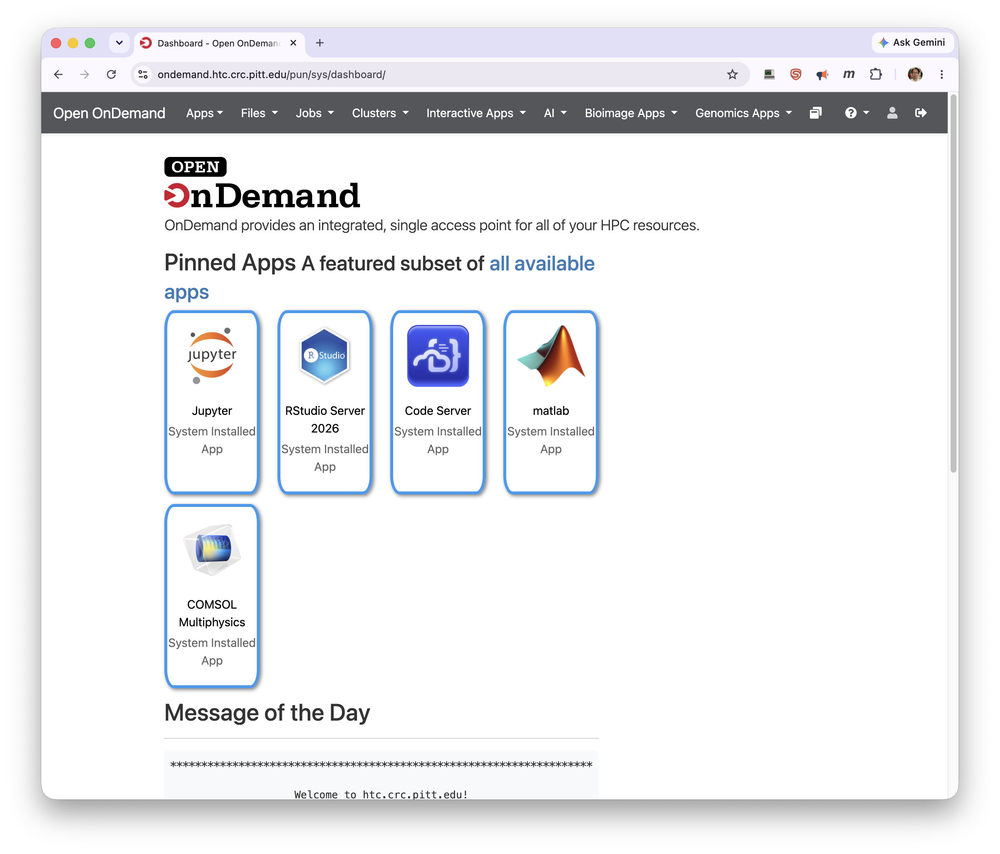

# Open OnDemand

Open OnDemand lets you work on the HTC cluster through a web browser — upload and
download files, create and submit jobs, open a shell, and run GUI applications such as
RStudio and Jupyter, without connecting over SSH. It was created by the
[Ohio Supercomputer Center (OSC)](https://www.osc.edu/resources/online_portals/ondemand),
whose documentation (including video tutorials) is a good further reference.

[Log in to Open OnDemand](https://ondemand.htc.crc.pitt.edu)

## Accessing Open OnDemand

Open OnDemand is reachable only from the University network. From off campus, on Pitt
wireless, or on a UPMC-networked device, first connect to the
[GlobalProtect VPN](https://services.pitt.edu/TDClient/33/Portal/KB/ArticleDet?ID=3426)
(see [Step 1](../getting-started/getting-started-step1-account.md)). Then open
<https://ondemand.htc.crc.pitt.edu> and sign in with your Pitt username (1) and password
(2), then click **Log in to Open OnDemand** (3).

!!! tip "Use a supported browser"
    Chrome and Firefox are fully supported. Safari and other browsers may work for some
    apps but are not officially supported.

The OnDemand **Dashboard** opens. The menu bar across the top is your starting point:
**Files** for file management, **Clusters** for a shell, **Jobs** for composing and monitoring
jobs, and **Interactive Apps** (along with the themed **AI**, **Bioimage Apps**, and
**Genomics Apps** menus) for GUI applications. The **Pinned Apps** tiles below are
quick-launch shortcuts to a featured subset; follow **all available apps** to see the rest.
To end your session, choose **Log Out** at the top right and close your browser.

## Managing files

The **Files** menu on the Dashboard lists your directories on the CRCD file systems — your
home directory first, followed by your group storage under `/ix`, `/ix1`, and `/vast`.
Selecting one opens the **File Explorer** in a new tab, with your home directory always
shown in the left panel.

The File Explorer's toolbar lets you open a terminal, create files and directories, upload
and download, copy or move, delete, navigate up a level, jump to an absolute path, copy the
current path, toggle hidden files (dotfiles) and owner/permission columns, and filter by
name. If a directory isn't listed in the **Files** menu, use **Change Directory** to reach
it by its absolute path.

## Shell access

The **Clusters** menu opens an in-browser terminal on the HTC login nodes — the same
environment you would get by connecting with SSH.

## Interactive apps

The **Interactive Apps**, **AI**, **Bioimage Apps**, and **Genomics Apps** menus — and the
**Pinned Apps** shortcuts on the Dashboard — launch GUI applications such as Jupyter, RStudio,
Code Server, MATLAB, COMSOL, and various domain tools, each on a compute node with dedicated
resources. The pattern is the same for every app:

1. Choose the app from the menu.
2. Set the job parameters (version, cores, memory, time limit) and click **Launch**.
3. Wait for the job to start, then click **Connect to …**.
4. When finished, return to the Dashboard and click the red **Delete** button to end the
   session and free the resources.

!!! warning "Deleting is not optional"
    Closing the app's browser tab does **not** end the job. Until you click **Delete** on the
    Dashboard, the interactive session keeps consuming your allocation.

!!! note "‘Failed to connect’ right after launching"
    If you click **Connect** and see *Failed to connect to htc-n\*\*.crc.pitt.edu:&lt;port&gt;*,
    the app's web server usually isn't ready yet. Wait a minute or two and refresh.

For the per-app details — Jupyter (and Python/conda environments), Jupyter on GPU, RStudio,
MATLAB, and the genomics apps — see
[**OnDemand Interactive Apps**](../web-portals/open-ondemand-apps.md).

## FAQ

**I can't log in — I get an "Internal Server Error" mentioning no space left on the device.**
OnDemand writes files to your home directory at startup, and your home has a 75 GB quota. If
it's full, connect to a login node (or use a
[file-transfer tool](../data-management/file-transfer-methods/index.md)) and remove or
relocate files to your group storage (`/ix`, `/ix1`, `/vast`).

**My session closes shortly after starting, showing "Completed" with only a message that the
card will be retained for a few more days.**
Open the link after **Session ID:** and read `output.log` in that folder — it usually explains
the error. If it's unclear, submit a
[help ticket](https://services.pitt.edu/TDClient/33/Portal/Requests/TicketRequests/NewForm?ID=yXkHi62rHa8_&RequestorType=Service)
with the log contents or the session ID.
