# Open OnDemand

## Summary

The Open OnDemand interface lets you work on the HTC cluster through a web browser.

**[Log in to Open OnDemand](https://ondemand.htc.crc.pitt.edu)**

With OnDemand you can upload and download files; create, edit, submit, and monitor jobs; and run GUI applications
(such as RStudio Server and Jupyter Notebook) without connecting to the HTC cluster through a traditional terminal.

OnDemand was created by the Ohio Supercomputer Center (OSC). This page outlines how to use it on the HTC cluster. For
more help, see OSC's [extensive OnDemand documentation](https://www.osc.edu/resources/online_portals/ondemand)
(including video tutorials) or submit a [help ticket](https://crc.pitt.edu/tickets).

## Accessing Open OnDemand

If your computer is off the Pitt network — working remotely, on Pitt wireless, or on a UPMC-networked laptop — first
connect to the [Pitt VPN (GlobalProtect)](https://www.technology.pitt.edu/services/pittnet-vpn-globalprotect) so you
can reach CRCD resources.

!!! note "VPN role"
    Reaching the CRCD clusters may require a specific GlobalProtect VPN role rather than the default. If you connect to
    the VPN but still cannot reach OnDemand, confirm the current required role with CRCD via a
    [help ticket](https://crc.pitt.edu/tickets).

After connecting to the VPN, navigate to <https://ondemand.htc.crc.pitt.edu> in your web browser and sign in with your
Pitt username and password.

!!! tip "Supported browsers"
    Chrome or Firefox are recommended. Safari and Internet Explorer are not fully supported and may not work correctly
    with some of the portal's apps.

The OnDemand **Dashboard** opens. From the menus across the top you can manage files and submit jobs to the HTC
cluster. To end your session, choose **Log Out** at the top right of the Dashboard and **close your browser**.

## Managing Files

The OnDemand interface provides a visual view of the cluster file system, letting you create, edit, and move files.

Click the **Files** dropdown in the top menu bar of the Dashboard. The list shows your directories on the CRCD file
systems — your home directory first, followed by your group's project storage (for example `/ix`, `/ix1`, or `/vast`).
Choosing one opens the **File Explorer** in a new browser tab, with your home directory always shown in a panel on the
left.

The buttons near the top of the File Explorer perform these functions:

| Button | Function |
| ------ | -------- |
| Open in Terminal | Open a terminal in a new browser tab |
| New File | Create a new empty file |
| New Directory | Create a new subdirectory |
| Upload | Copy files from your computer to the cluster |
| Download | Copy the selected file(s) from the cluster to your computer |
| Copy/Move | Copy or move the selected file(s) to the current directory |
| Delete | Delete the selected file(s) |
| Go up Directory (up arrow) | Navigate to the parent directory |
| Change Directory | Enter an absolute path to view a different directory |
| Copy Path | Copy the current directory's absolute path to the clipboard |
| Show Dotfiles | Toggle the display of hidden files |
| Show Owner/Mode | Toggle the display of owner and permission settings |
| Filter | Restrict the display to names containing a value |

If you have files in directories not listed in the dropdown, use **Change Directory** to navigate to them by absolute
path.

## Shell Access

An in-browser terminal with access to the HTC login nodes is available from the **Clusters** dropdown on the Dashboard.
The session logs you in exactly as if you had connected to the HTC cluster over SSH.

## Interactive Apps

Jump to a specific app:

- [Jupyter Notebook/Lab](#jupyter-notebooklab)
- [Jupyter Notebook/Lab on GPU](#jupyter-notebooklab-on-gpu)
- [RStudio](#rstudio)
- [MATLAB](#matlab)
- [Genomics Apps](#genomics-apps)

!!! note "\"Failed to connect\" right after launching"
    When you click **Connect to ...** and see "Failed to connect to htc-n\*\*.crc.pitt.edu:&lt;port&gt;", don't worry —
    the web server usually just isn't ready yet. Wait 1–2 minutes and refresh your browser.

### Jupyter Notebook/Lab

Jupyter Notebook and JupyterLab allow interactive code development, and both run through OnDemand on a compute node
using dedicated resources.

Launch one from **Interactive Apps → Jupyter Notebook**. A job submission screen appears:

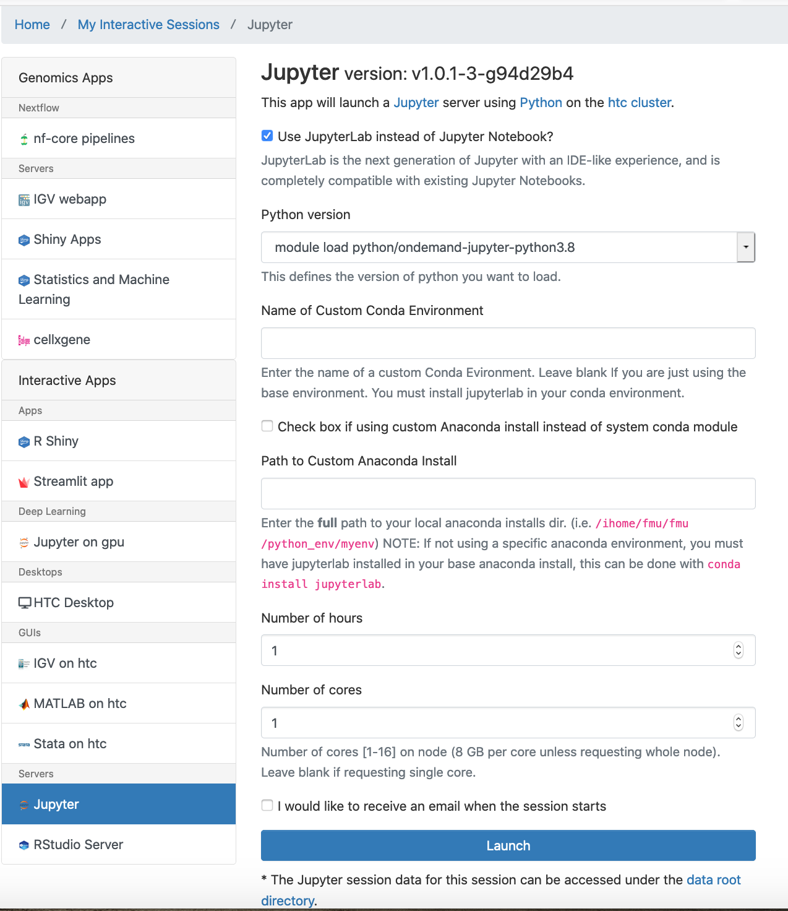

Set the job parameters. Unless you're using thread-parallelized numerical libraries (such as NumPy) or need more
memory, requesting more than one CPU is not advisable. Click **Launch** to submit the interactive job; when it starts
and Jupyter is provisioned, click **Connect to Jupyter** to open the interface in a new tab.

**Creating an environment with the base Anaconda installation**

Load the base Anaconda module with `module load python/ondemand-jupyter-python3.8`.

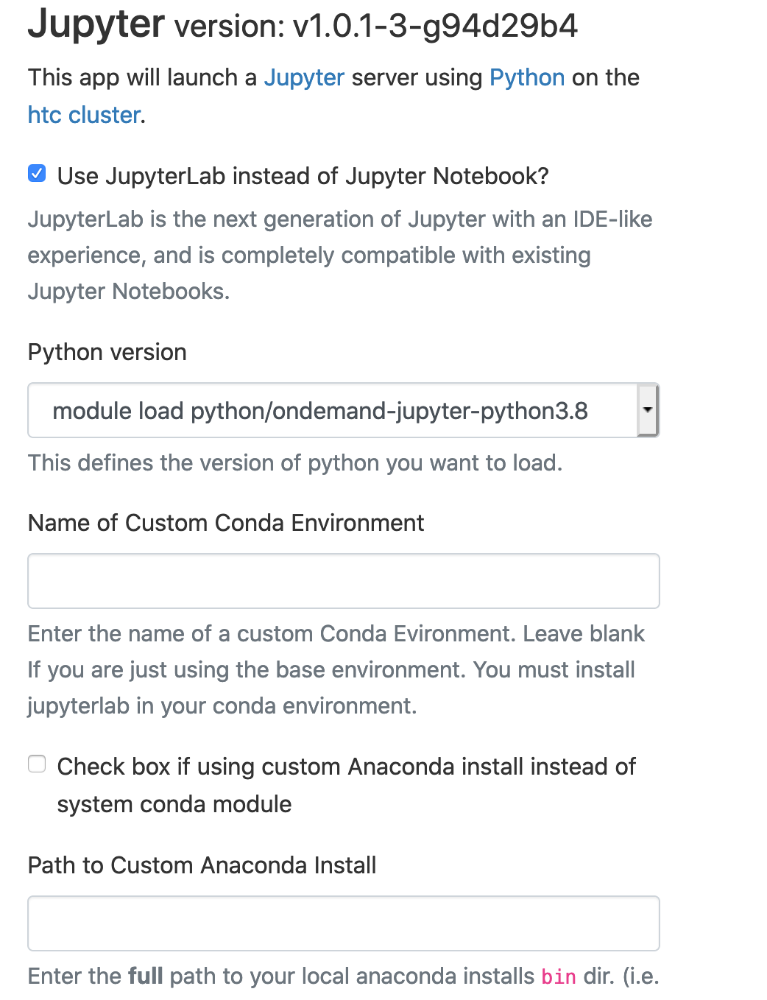

Select **Terminal**:

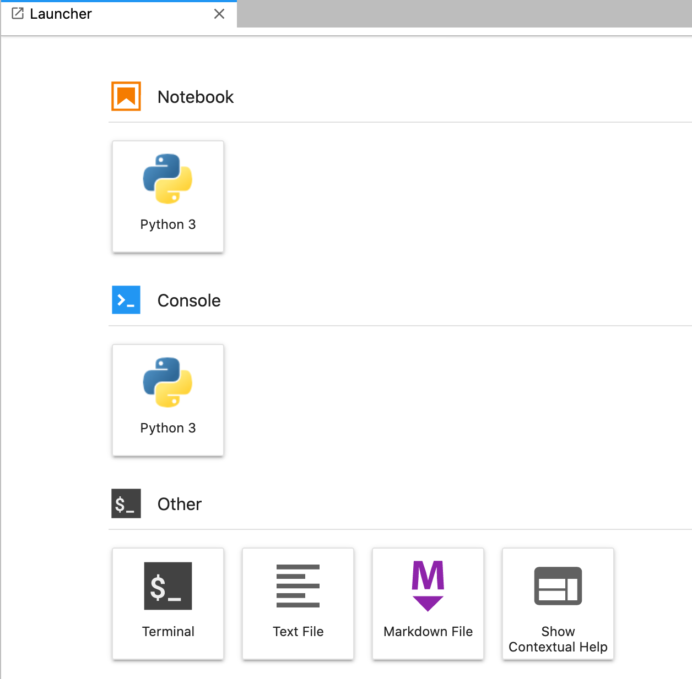

Generate a conda environment:

```
[fmu@htc-n22 ~]$ echo $PATH
/ihome/crc/install/python/ondemand-jupyter-python3.8/bin:/usr/local/bin:/bin:/usr/bin:...
[fmu@htc-n22 ~]$ conda env list
# conda environments:
base   /ihome/crc/install/python/ondemand-jupyter-python3.8

[fmu@htc-n22 ~]$ conda create -n scanpy python=3.8
Collecting package metadata (current_repodata.json): done
Solving environment: done
...
[fmu@htc-n22 ~]$ source activate scanpy
(scanpy) [fmu@htc-n22 ~]$ pip install 'scanpy[leiden]'
...
(scanpy) [fmu@htc-n22 ~]$ conda install -c bioconda samtools
...
(scanpy) [fmu@htc-n22 ~]$ conda deactivate
[fmu@htc-n22 ~]$
```

The environment is installed at `~/.conda/envs/scanpy`.

**Using the conda environment with Jupyter Notebook/Lab**

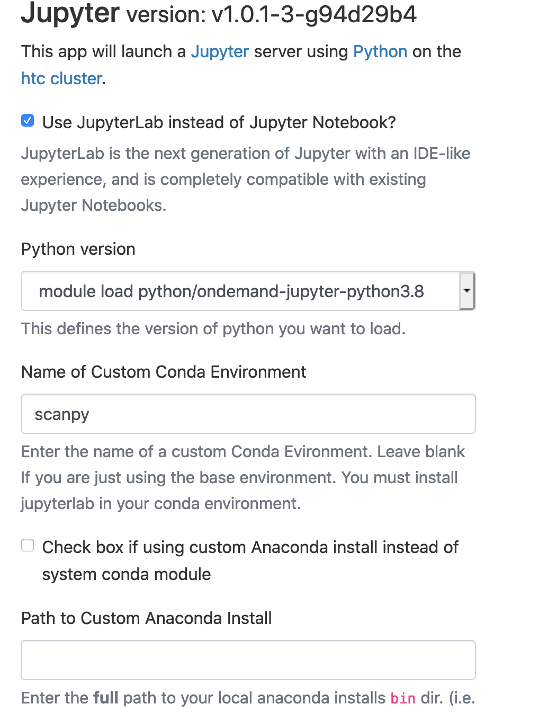

If you are using another user's conda environment, give the full path as the Name of Custom Conda Environment (for
example, `/ihome/fmu/fmu/.conda/envs/scanpy`).

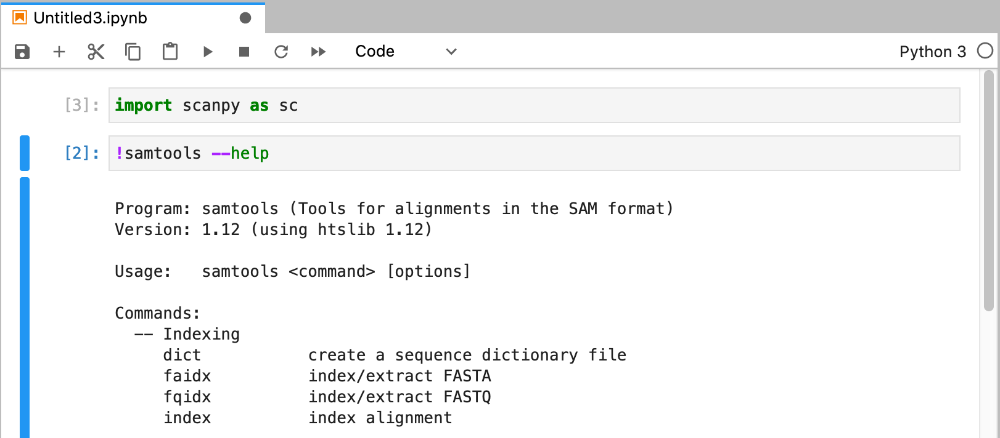

You can open a Terminal and use `conda install` to add packages to your local `scanpy` environment.

**Using a custom Anaconda install**

```
[fmu@login1 ~]$ cd /ihome/crc/build/python
[fmu@login1 python]$ bash Miniconda3-py38_4.9.2-Linux-x86_64.sh -b -p ~/python_env/myenv
PREFIX=/ihome/fmu/fmu/python_env/myenv
...
[fmu@login1 python]$ cd ~/python_env/myenv/bin
[fmu@login1 bin]$ ./conda install -c conda-forge jupyterlab   # also installs notebook
[fmu@login1 bin]$ # ./conda install -c conda-forge notebook   # if you don't use jupyterlab
[fmu@login1 bin]$ ./conda install -c conda-forge voila        # if you plan to use voila
...
```

The full path to this local Anaconda install is `/ihome/fmu/fmu/python_env/myenv`.

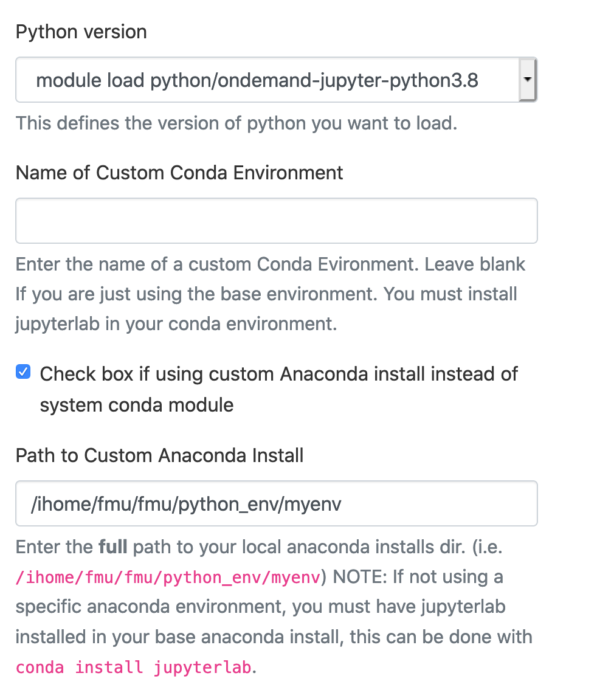

**ipykernel does not activate the conda environment**

`ipykernel` is one way to use a conda environment with Jupyter Notebook/Lab, but note that it does **not** activate the
environment.

```
[fmu@login1 ~]$ module load python/ondemand-jupyter-python3.8
[fmu@login1 ~]$ source activate scanpy
(scanpy) [fmu@login1 ~]$ conda install ipykernel
...
(scanpy) [fmu@login1 ~]$ python -m ipykernel install --user --name scanpy
Installed kernelspec scanpy in /ihome/fmu/fmu/.local/share/jupyter/kernels/scanpy
(scanpy) [fmu@login1 ~]$ conda deactivate
[fmu@login1 ~]$
```

The environment now appears in your Jupyter notebook:

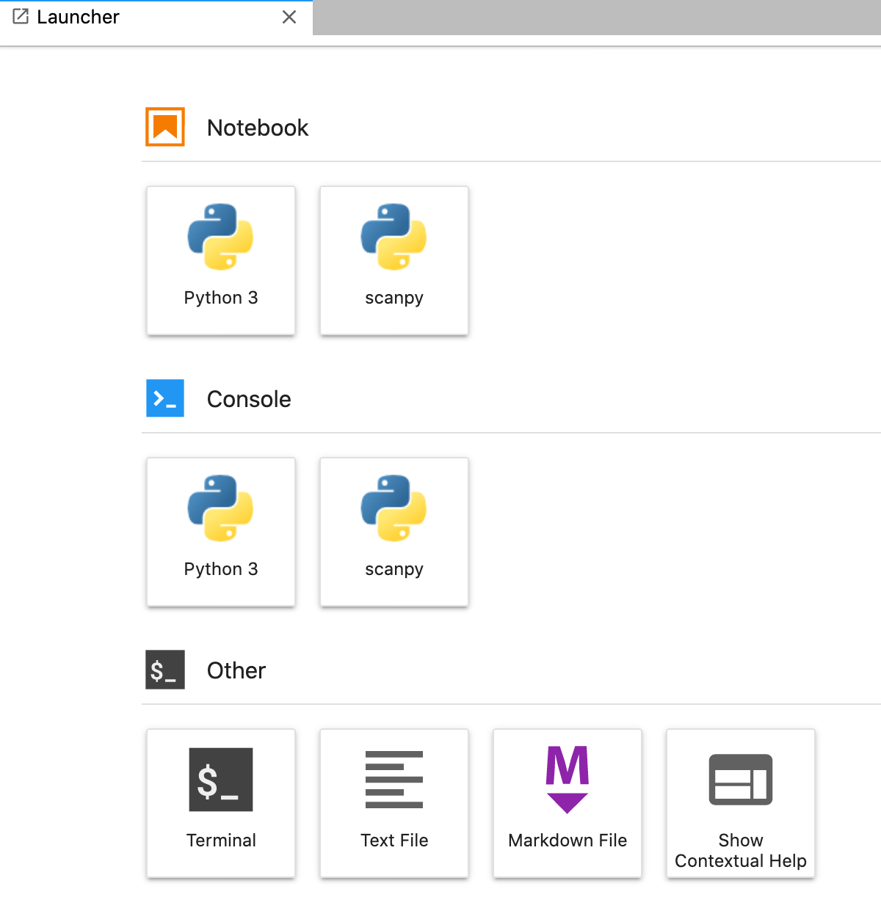

This launches a kernel from the `scanpy` environment, but notably does not *activate* the environment:

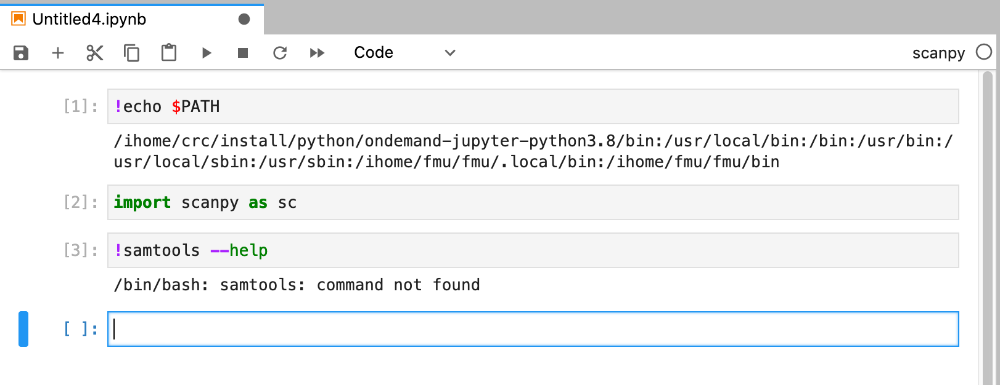

**Generate a personal modulefile**

```
[fmu@login1 ~]$ mkdir modulefiles
[fmu@login1 ~]$ module use ~/modulefiles
[fmu@login1 ~]$ cd modulefiles
[fmu@login1 modulefiles]$ cp /ihome/crc/modules/Core/python/ondemand-jupyter-python3.8.lua myenv.lua
[fmu@login1 modulefiles]$ vi myenv.lua   # set: local package_root = "/ihome/fmu/fmu/python_env/myenv"
[fmu@login1 modulefiles]$ module load myenv

[fmu@login1 ~]$ module purge
[fmu@login1 ~]$ module use ~/modulefiles
[fmu@login1 ~]$ module load myenv
[fmu@login1 ~]$ which conda
~/python_env/myenv/bin/conda
```

!!! warning "Do not run `conda init`"
    Recent Anaconda distributions suggest `conda activate` instead of `source activate`, and if you use it you'll be
    prompted to run `conda init`. **Don't.** Loading one of our Anaconda modules already loads the base conda
    environment, but `conda init` writes lines into your `~/.bashrc` that prepend the base environment to your `PATH`
    before the default system modules load — which breaks `conda activate` itself and can hide system libraries.

    **If you've already run `conda init`:** open `~/.bashrc`, move the block it added into a separate script (for
    example `conda_init.sh`), and after logging in run `source conda_init.sh`. You should then be able to use
    `conda activate`.

!!! note "Packages in `~/.local` can break sessions"
    `~/.local/bin` is on the default path, so `pip install --user` packages land there and may hide other Python
    modules, causing errors — sometimes ending a Jupyter session shortly after it starts. Install into a conda or
    virtual environment instead. Check a session's [debugging output](#Debug-Output) to identify a problematic package.

**Stopping your Jupyter session:** in the Dashboard, click the red **Delete** button.

### Jupyter Notebook/Lab on GPU

This variant runs Jupyter on the GPU cluster for interactive development with GPU acceleration. Launch it from
**Interactive Apps → Jupyter on gpu**:

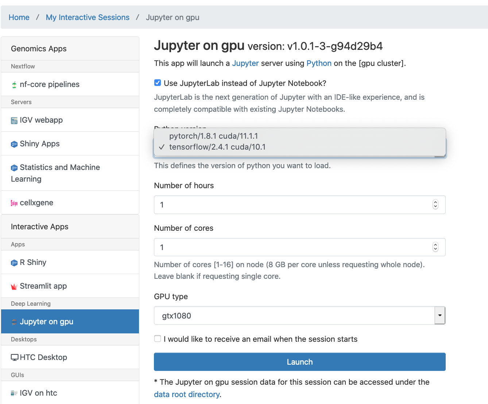

Set the job parameters, choosing a machine-learning framework and GPU type (only one GPU card can be allocated). Click
**Launch**, and when the session starts click **Connect to Jupyter**.

!!! tip "Check available versions"
    The framework versions offered here change over time. In a terminal, run `module spider tensorflow` or
    `module spider pytorch` to see what's currently available.

**Stopping your session:** in the Dashboard, click the red **Delete** button.

### RStudio

RStudio Server runs the RStudio IDE in your browser on a cluster compute node, so you can run more compute-intensive R
programs than on a login node. To start it:

- Select **Interactive Apps → RStudio Server** from the Dashboard.
- Choose the R version and time limit.

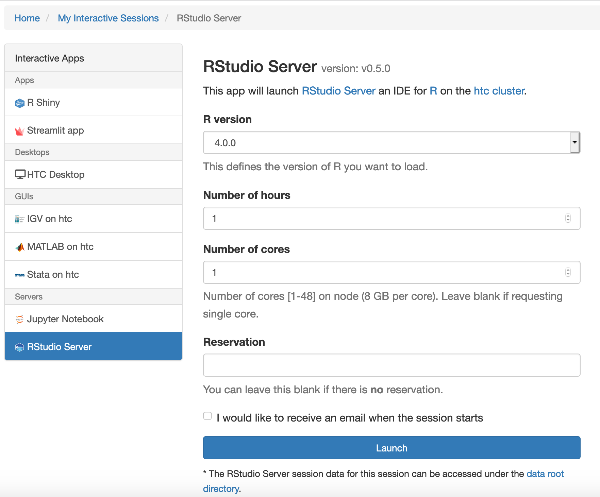

- Choose the number of cores, keeping in mind that R can internally thread-parallelize vector-based processing.
- Click **Launch**; you may wait in the queue for resources.
- When the session starts, click **Connect to RStudio Server** to open RStudio in a new window.

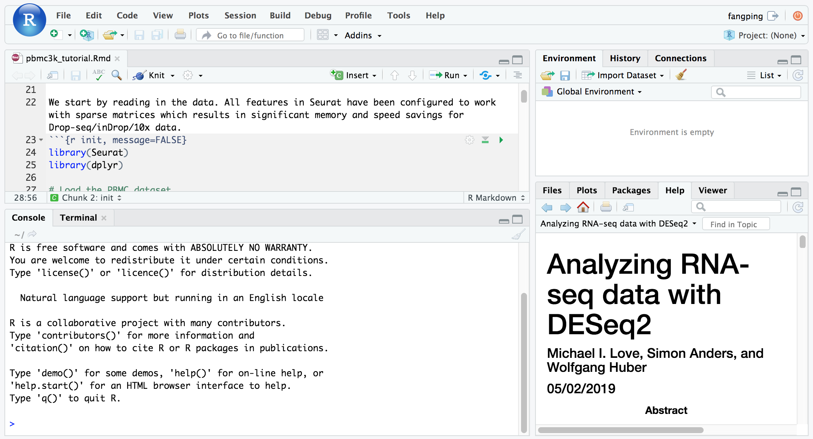

Each R module loads its toolchain (for example, `module load gcc/8.2.0 r/3.6.0`) and includes many preinstalled R and
Bioconductor packages. In the R console, load a library to check whether it's already installed; if you need others,
submit a [help ticket](https://crc.pitt.edu/tickets).

You can also install your own packages. R searches your personal library path before the root installation and stops at
the first match — check the search path with `.libPaths()`. To install your own packages, open **Clusters → HTC Shell
Access**, load an R module (e.g. `module load gcc/8.2.0 r/3.6.0`), run `R`, then:

```r
install.packages("pkg_name")                     # CRAN package
BiocManager::install("Bioconductor_pkg_name")    # Bioconductor package
```

!!! warning "Home-directory quota and stale sessions"
    RStudio Server stores configuration and session files in your home directory, which has a **75 GB** quota. Filling
    it — with large project files, or sessions that RStudio auto-saves on timeout — causes errors. RStudio's state lives
    in `~/.local/share/rstudio` (or `~/.rstudio` on legacy servers); delete unused sessions under
    `~/.local/share/rstudio/sessions`. When switching R versions, removing `~/.local/share/rstudio` entirely
    (`rm -rf ~/.local/share/rstudio`) is recommended — it's regenerated for the new version.

The RStudio interface is a single-threaded process, so it can't do two things at once. A long-running operation can make
another (such as saving a file) time out with a **Status code 502** message; usually nothing crashes — wait for the
running code to finish and try again. If you exceed your requested time limit you'll see **Status code 503**; start a
new session from **Interactive Apps → RStudio**.

**Stopping your RStudio session:** choose **File → Quit Session** or click the red icon at the top right of the RStudio
window.

!!! warning "Quitting RStudio does not end your job"
    Quitting RStudio only closes the RStudio session — it does **not** release your interactive HTC job, which keeps
    consuming CPU hours. To end the job, return to the Dashboard and click the red **Delete** button.

## GUI Apps through VNC

Open OnDemand supports several GUI applications through VNC, including MATLAB, Stata, and IGV. For the VNC-based MATLAB,
click **Interactive Apps → MATLAB on htc**, choose the MATLAB version, number of hours, and cores, click **Launch**,
and then **Launch MATLAB** when the session is ready.

### MATLAB

`matlab-proxy` is a Python package that launches MATLAB and serves it to a web browser.

To use it, click **Interactive Apps → MATLAB** (**not** "MATLAB on htc"), and choose the MATLAB version, number of
hours, and cores.

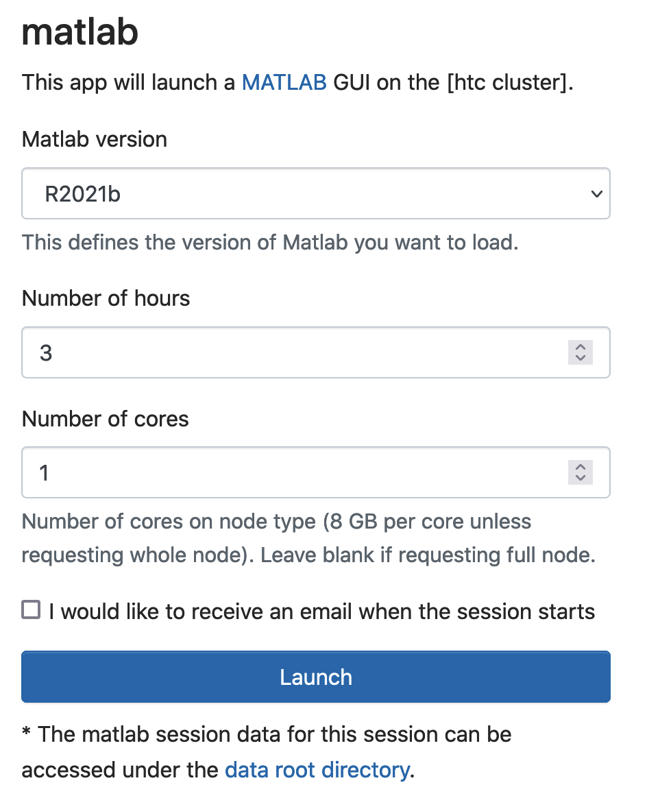

Click **Launch**, and when the session is ready click **Connect to MATLAB**.

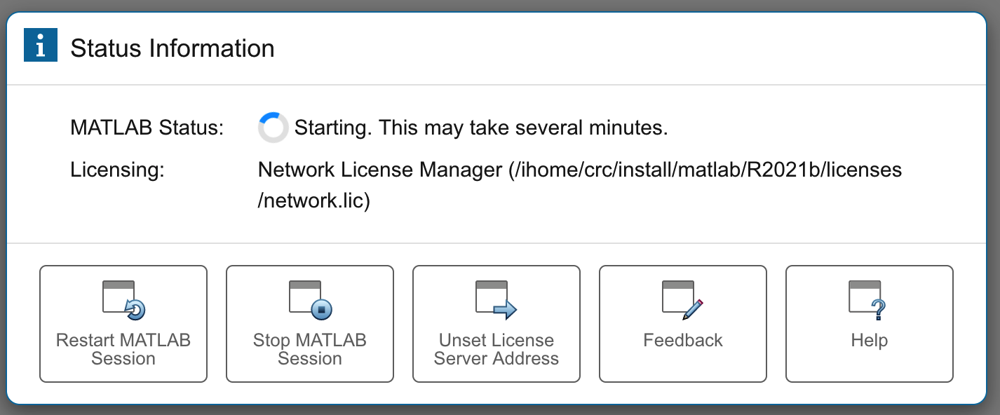

This MATLAB is a web application, and the MATLAB Proxy is under active development.

### Genomics Apps

Several web-based genomics applications are deployed through OnDemand, under **Genomics Apps**:

- [nf-core pipelines](https://crc.pitt.edu/nf-core) — a web app to launch nf-core pipelines on the HTC cluster.
- [IGV webapp](https://crc.pitt.edu/genome_browser) — the IGV genome browser based on igv.js.
- **Shiny Apps** — several Shiny genomics web applications.
- **Statistics and Machine Learning** — the Shiny Radiant application.
- **cellxgene** — an interactive explorer for single-cell transcriptomics data.

To start a Shiny app, click **Genomics Apps → Shiny Apps**, then choose the application, number of hours, and cores.

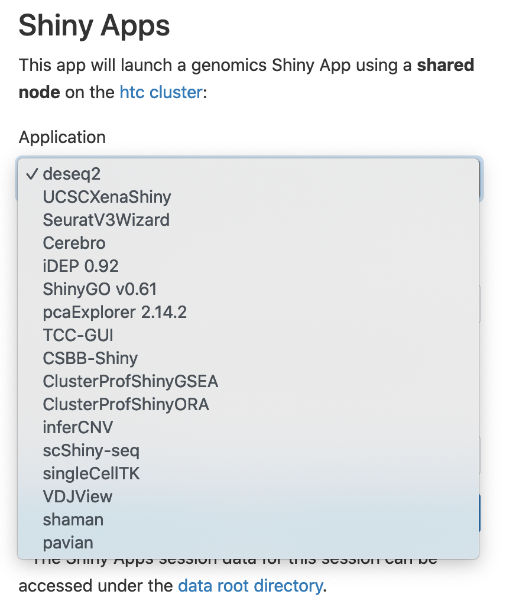

Click **Launch**, and when the session is ready click **Connect to Shiny**.

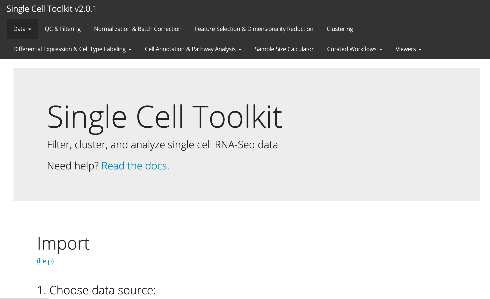

!!! note "\"Failed to connect\" right after launching"
    As with the other apps, a "Failed to connect to htc-n\*\*.crc.pitt.edu:&lt;port&gt;" message usually just means the
    web server isn't ready yet. Wait 1–2 minutes and refresh.


## FAQ { #Debug-Output }

**I can't log in to OnDemand — I get "Internal Server Error" and something about no space left on the device. How do I
fix it?**

OnDemand creates files in your home directory when it starts, and if home has hit its **75 GB** quota you'll get this
error. SSH into a login node and free up space by deleting files or moving them to your group's project storage (for
example `/ix`, `/ix1`, or `/vast`). You can also move data with one of the
[file transfer tools](../data-management/file-transfer-methods/index.md).

**My session closes shortly after starting, showing "Completed" and only "For debugging purposes, this card will be
retained for X more days." How do I find out what went wrong?**

Click the link after **Session ID:**, then open `output.log` in that location — it records errors from the session.
Some issues you can fix yourself; others stem from the app's configuration. If the log shows errors but the fix isn't
clear, submit a [help ticket](https://crc.pitt.edu/tickets) with the `output.log` contents or the session ID.
