# **Psych (Psychiatry Department Web Portal)**

## **Summary**

The Psychiatry Web Portal is the gateway to CRCD compute and storage resources for the Department of Psychiatry.

**[Log in to Psych](https://psych.crc.pitt.edu)**

To access this portal, you need to have a [user account](https://crc.pitt.edu/getting-started#) within CRCD and be a member of the \`psych\` group.

The portal server is firewalled within PittNet and as such [you will need to be on VPN](https://crc.pitt.edu/user-support/resource-documentation/vpn-and-accessing-clusters) or be directly connected to PittNet via Ethernet.

Once connected, you can run commands directly on the server and submit batch jobs to the CRCD clusters.

All CRCD software can be accessed using a terminal and our LMOD software provisioning system.

\[TOC Contents\]

## **Access Methods**

While we call it a Web Portal, Psych is actually a linux server that uses FastX to create interactive desktop sessions (similar to OnDemand) forwarded to your local display, through either a web browser or the desktop client.

### **FastX Desktop Client (Recommended)**

Due to some user experience issues with copy and pasting in the browser version, the new preferred method for accessing psych is via the [F](http://www.starnet.com/download/fastx-client)[astX desktop client (Download Here)](https://www.starnet.com/download/fastx-client)[.](http://www.starnet.com/download/fastx-client) The functionality is otherwise identical to the web browser, but copy/paste is substantially better (highlight + right-click and ctrl-c/ctrl-v between FastX session and local machine windows).

NOTE: If you are on Windows and do not have admin access to your workstation, **you may need to use the nonroot client.**

Download with the link above and install with the default settings.

After it is installed, start FastX and an empty connections window will appear. These images are from a Windows PC, but connecting should be the same on OSX and Linux.

Click the plus button to add a new connection.

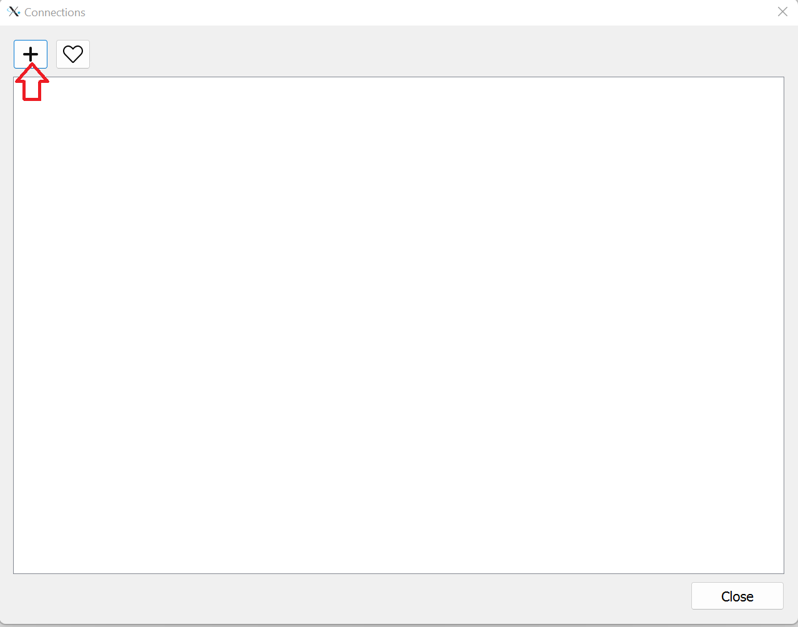

In the dropdown at the top, make sure \`ssh\` is selected. Enter **psych.crc.pitt.edu** as the Host, and **your CRCD Username (Pitt ID, all lowercase)** as the User. Click OK to continue.

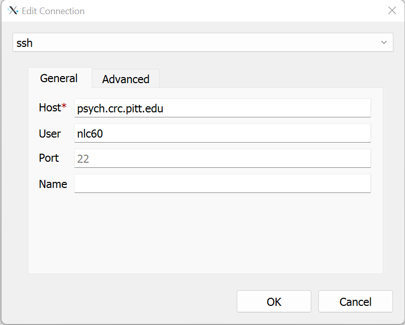

The new connection will now be in your list. Double click it. If it is your first time connecting, you will be prompted to add the server to your list of known hosts. Click continue.

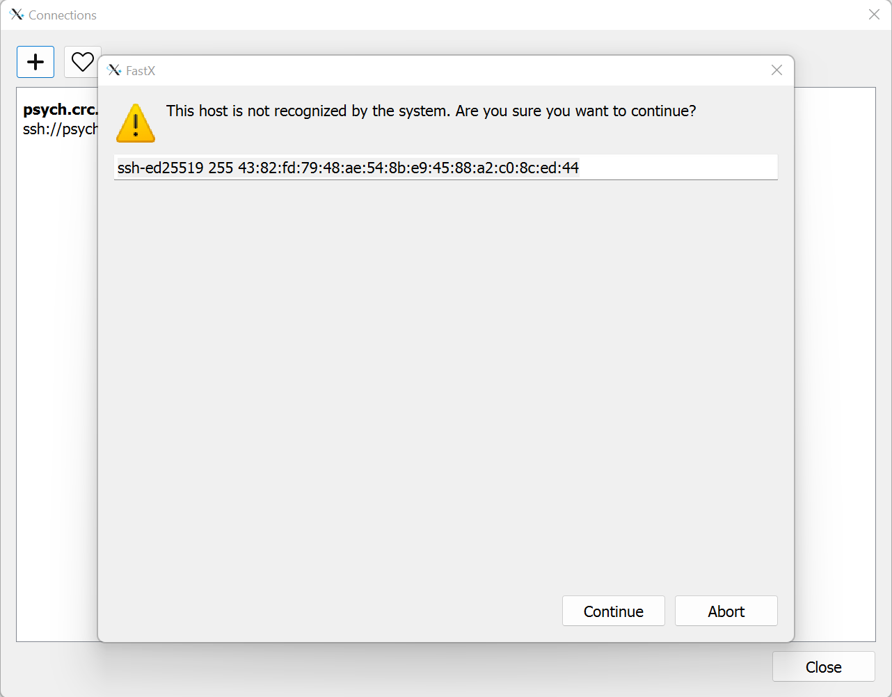

You will then be prompted for your CRC account password.

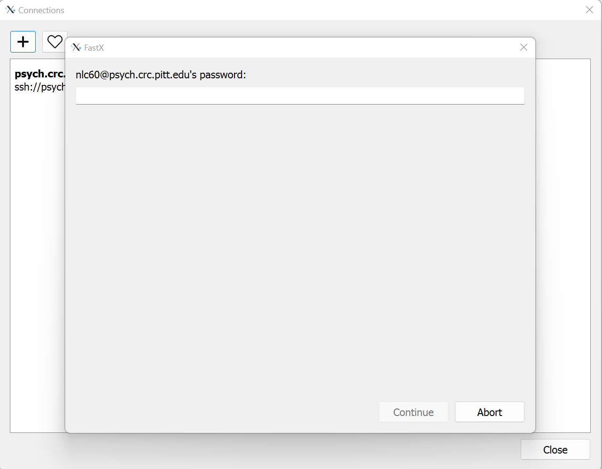

Next you will be prompted to select the type of linux GUI you want. The MATE desktop with VirtualGL optimization is an appropriate choice for most people.

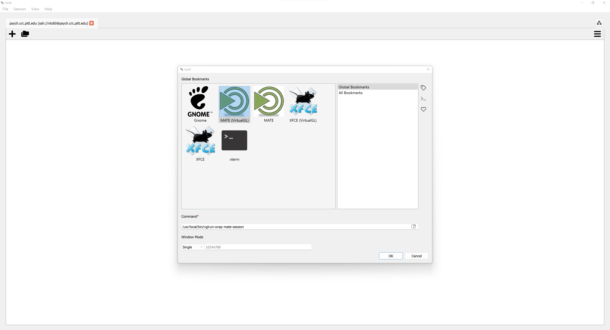

A desktop interface will appear, and you can open a terminal to load modules like you normally would.

To exit out of your session, click on **System** in the top left corner and select **Log Out** from the drop-down menu. If you don't log out, your session will continue to run in the background even if you lose internet connection.

Below is an example showing that copy and paste works how you would expect:

Selecting text from an instance of notepad++ (right window) on my local machine, I can paste directly into gedit inside the FastX session by right clicking and selecting paste.

The same thing works from the other direction, copying another line of text from gedit in the FastX session, and pasting into notepad++ on my local machine. You can use keyboard shortcuts (ctrl+v/ctrl+c on Windows, cmd+c/cmd+v on OSX) between them as well.

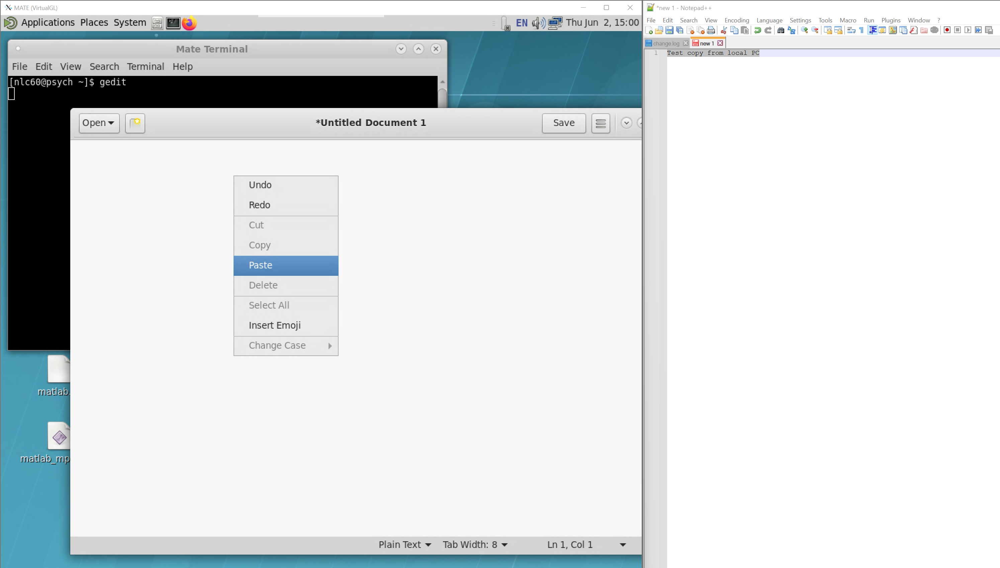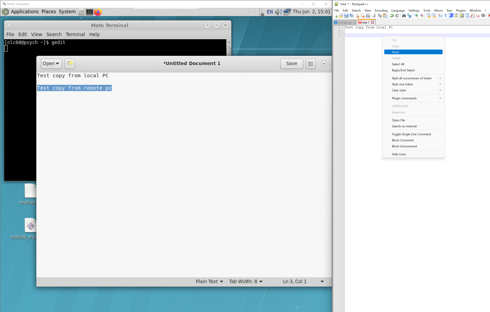

### **FastX Web Portal in a Browser**

To access the Psych Web Portal, open a web browser to [https://psych.crc.pitt.edu](https://psych.crc.pitt.edu) and login using your Pitt username **(in lowercase)** and password. 

**Note: the web browser method is known to have a particularly inconvenient copy/paste functionality between the psych session and your local machine.**

**Please use the FastX desktop client method above to have normal highlight + right click and ctrl+c/ctrl+v functionality.**

*   Click on the + to open a new session or click on an existing session if you wish to continue where you left off.

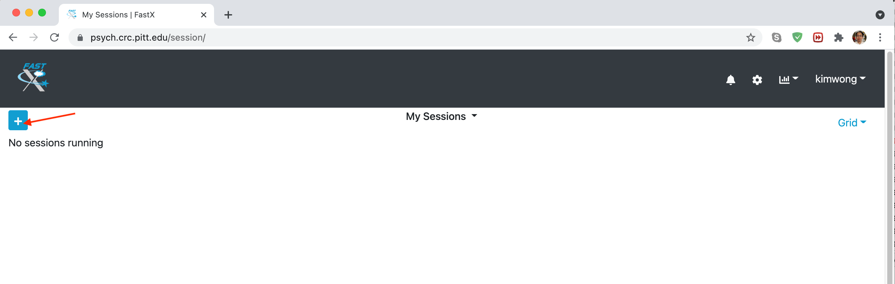

*   When opening a new session, you will be presented with several options for starting a Linux GUI desktop environment or a terminal. The MATE desktop with VirtualGL optimization is an appropriate choice.

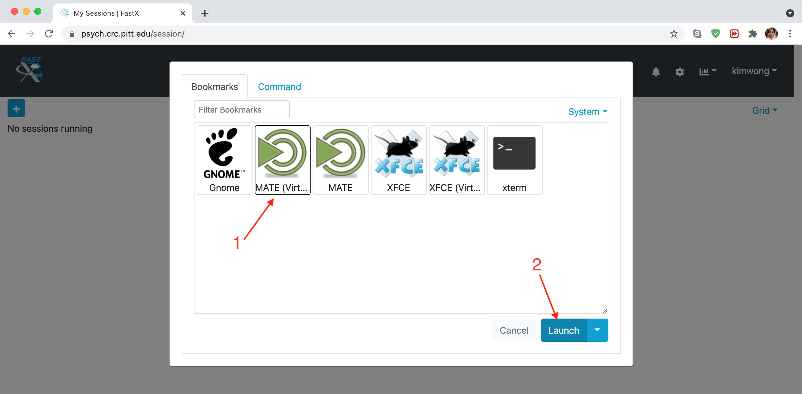

*   The final interface that you will see is a Linux desktop within your web browser. This is the web portal for accessing CRC resources.

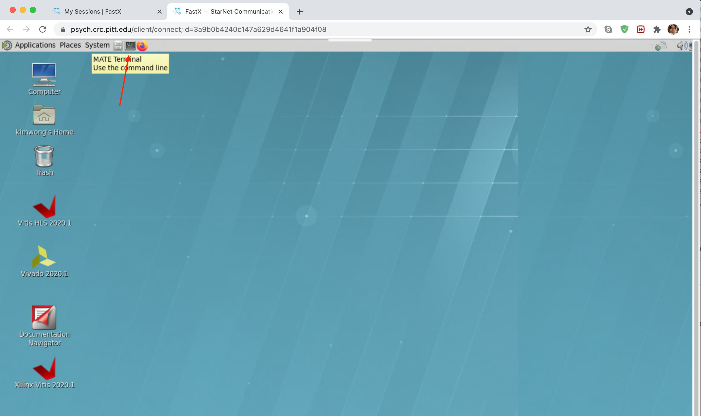

*   Software that opens a GUI will be displayed within this virtual desktop environment.

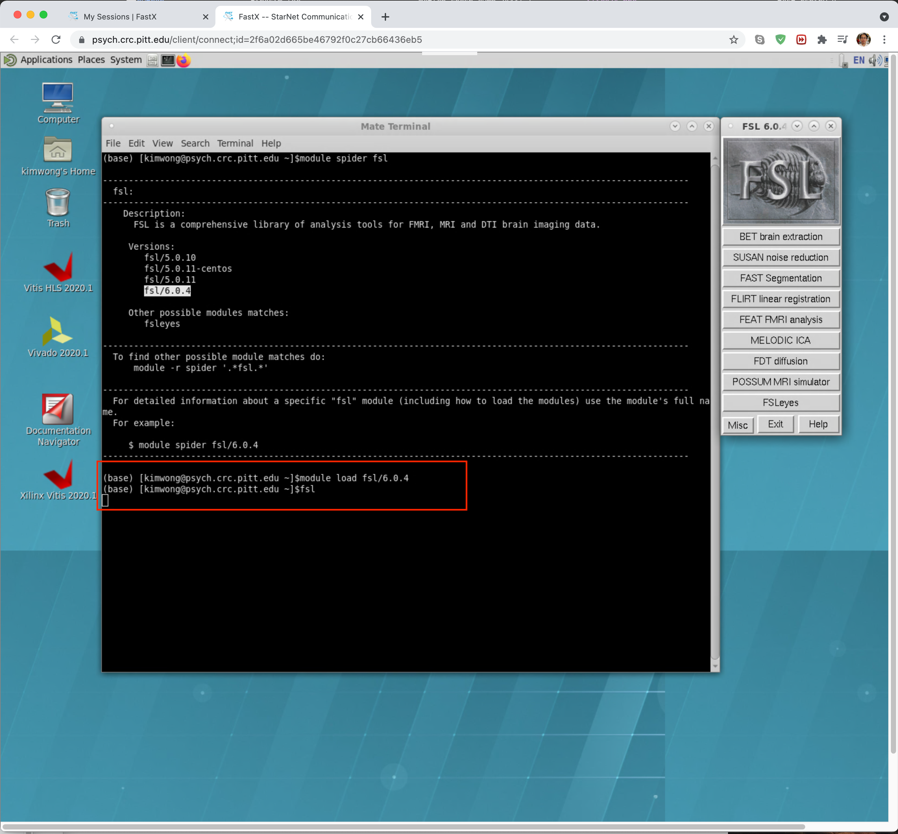

*   To exit out of your session, click on System and select Log Out from the drop-down menu. If you don't log out, your session will continue to run in the background even if you lose internet connection.
*   For example, you can start a calculation on the server, close your laptop to go to lunch, and then log back in afterwards to see the progress of your job.

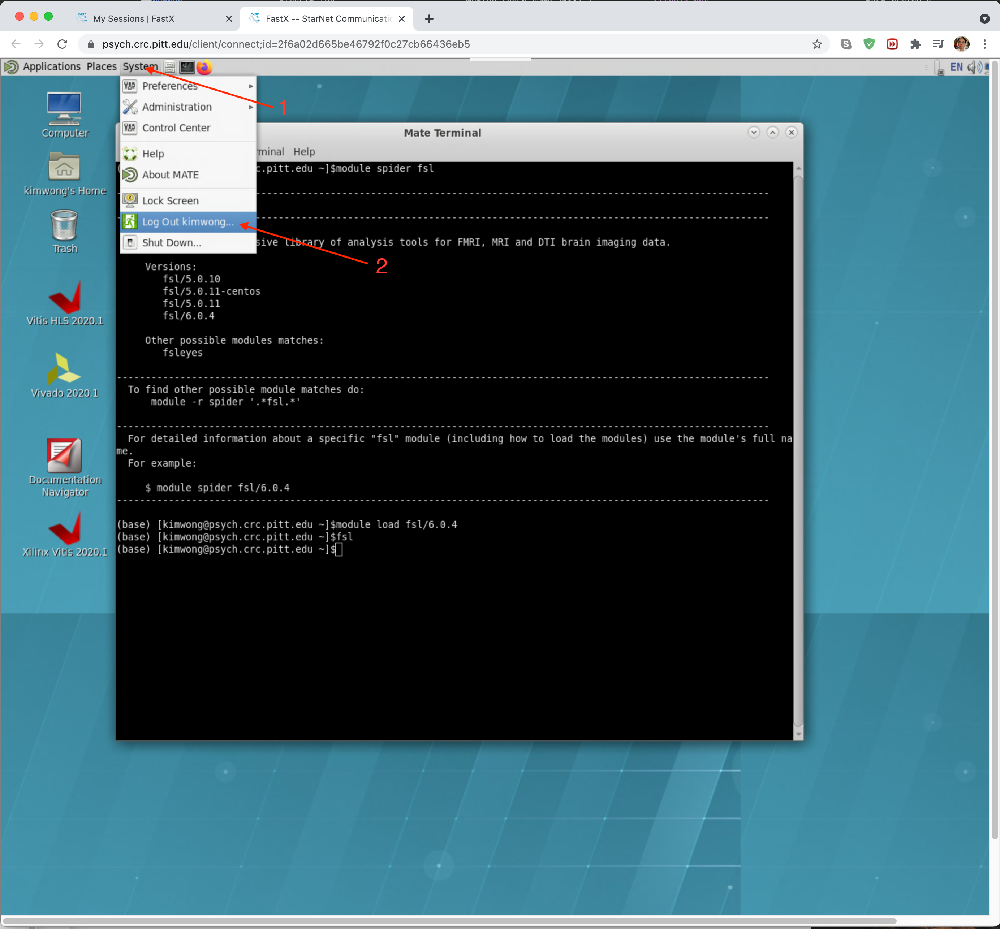

## **FAQs**

Q: When I log in via the web portal, I am prompted for a second password. What do I put here?

A: This is what happens when you enter your username (pitt ID) as all capitals instead of all lower case. You should re-attempt the connection using all lower case letters in your user name.
