# Psych (Psychiatry Department Web Portal)

## Summary

The Psychiatry Web Portal is the gateway to CRCD compute and storage resources for the Department of Psychiatry.

**[Log in to Psych](https://psych.crc.pitt.edu)**

To use this portal you need a [CRCD user account](https://crc.pitt.edu/getting-started) and membership in the `psych`
group.

The portal server is firewalled within PittNet, so you must be connected to the
[VPN](https://services.pitt.edu/TDClient/33/Portal/KB/ArticleDet?ID=3426) or directly connected to PittNet via
Ethernet. Once connected, you can run commands directly on the server and submit batch jobs to the CRCD clusters. All
CRCD software is available through a terminal and our Lmod software provisioning system.

## Access Methods

While we call it a Web Portal, Psych is actually a Linux server that uses FastX to create interactive desktop sessions
(similar to OnDemand), forwarded to your local display through either a web browser or the desktop client.

### FastX Desktop Client (recommended)

Because copy/paste is awkward in the browser version, the preferred way to access Psych is the
[FastX desktop client](https://www.starnet.com/download/fastx-client). Functionality is otherwise identical to the
browser, but copy/paste works far better (highlight + right-click, and Ctrl-C/Ctrl-V between the FastX session and your
local windows).

!!! note "Windows without admin rights"
    If you're on Windows and don't have admin access to your workstation, you may need to use the **nonroot** client.

Download from the link above and install with the default settings. Start FastX; an empty connections window appears.
(These screenshots are from Windows, but connecting is the same on macOS and Linux.) Click the **plus** button to add a
new connection.

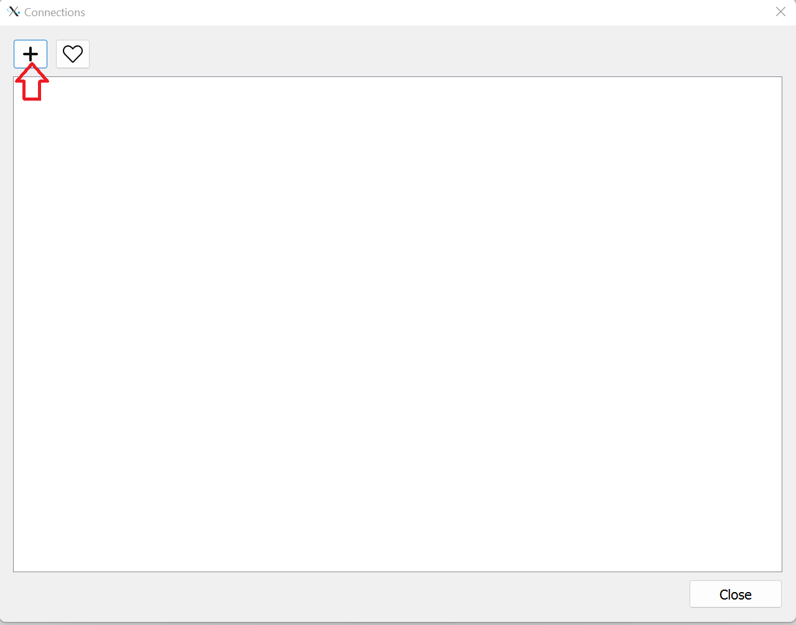

In the dropdown at the top, make sure `ssh` is selected. Enter **psych.crc.pitt.edu** as the Host and your CRCD username
(Pitt ID, all lowercase) as the User, then click **OK**.

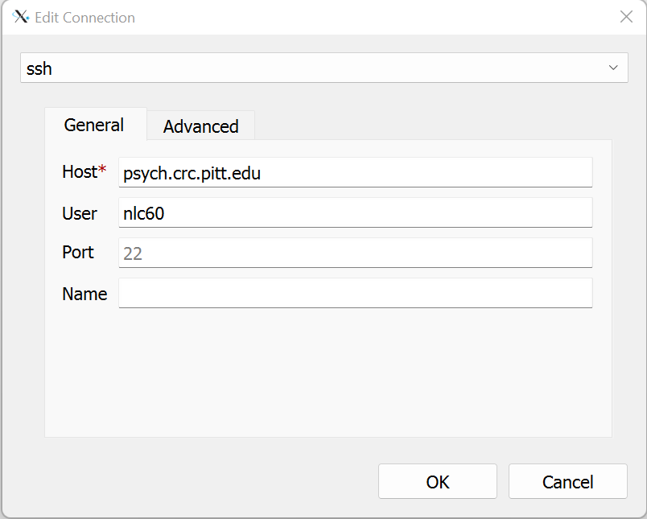

The new connection appears in your list. Double-click it. The first time you connect, you're prompted to add the server
to your known hosts — click **Continue**.

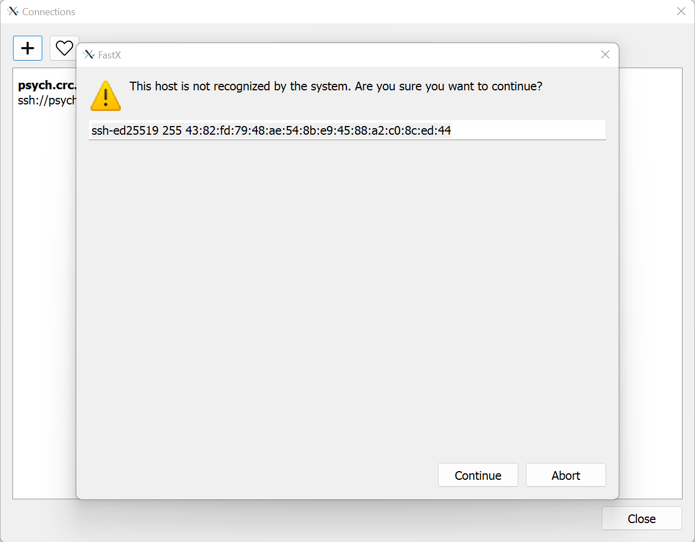

You're then prompted for your CRCD account password.

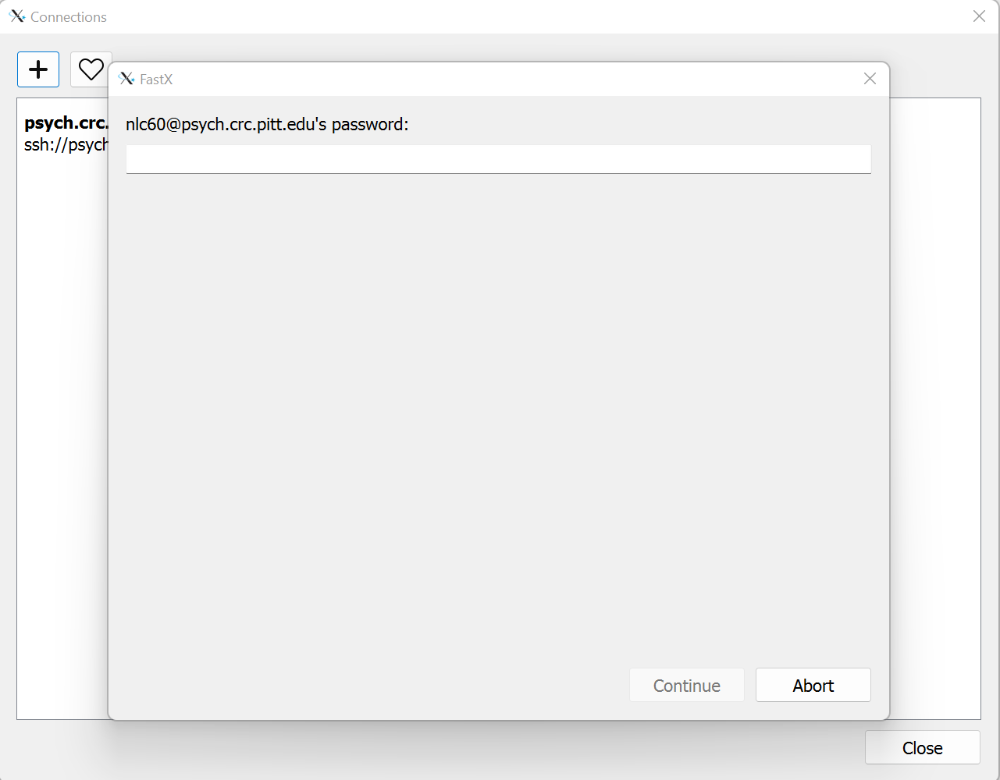

Next, select the type of Linux GUI you want. The **MATE desktop with VirtualGL optimization** is a good choice for most
people.

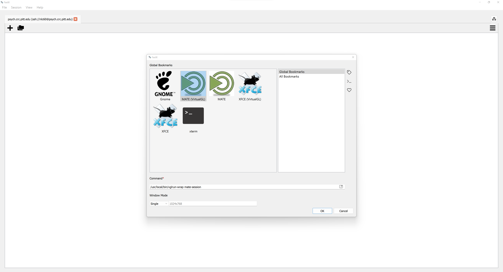

A desktop appears, and you can open a terminal and load modules as usual.

To exit, click **System** in the top-left corner and select **Log Out**. If you don't log out, your session keeps
running in the background even if you lose your internet connection.

The images below show that copy/paste works as expected — selecting text from Notepad++ (right window) on the local
machine and pasting into gedit inside the FastX session, and the reverse. Keyboard shortcuts (Ctrl-C/Ctrl-V on Windows,
Cmd-C/Cmd-V on macOS) work between them too.

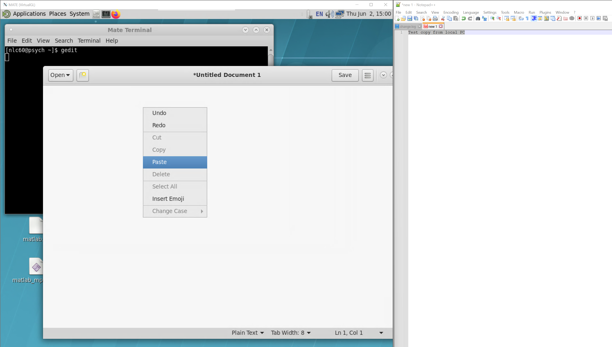

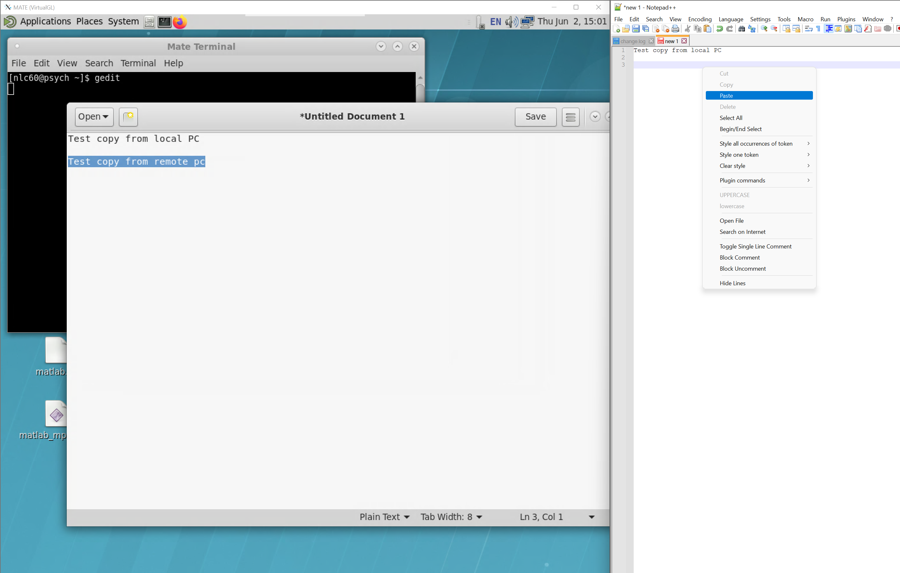

### FastX Web Portal in a Browser

To use the browser version, open <https://psych.crc.pitt.edu> and log in with your Pitt username (lowercase) and
password.

!!! warning "Copy/paste is limited in the browser"
    The browser method has notably inconvenient copy/paste between the Psych session and your local machine. For normal
    highlight + right-click and Ctrl-C/Ctrl-V behavior, use the FastX desktop client method above.

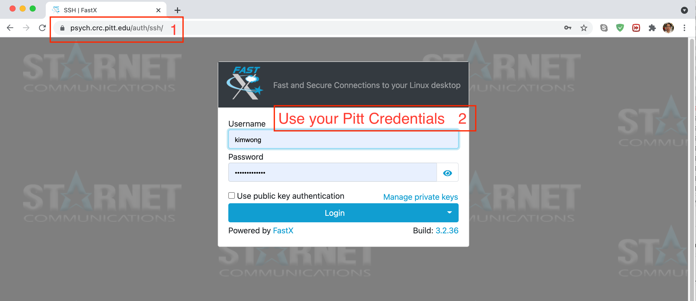

Click the **+** to open a new session, or click an existing session to continue where you left off.

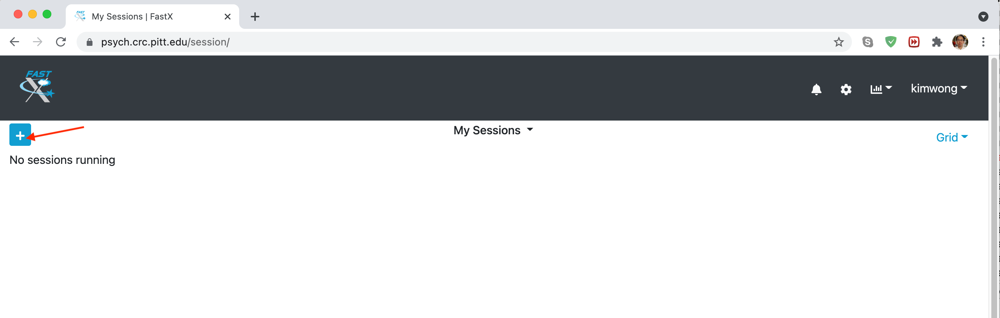

When opening a new session, you're offered several options for a Linux GUI desktop or a terminal. The MATE desktop with
VirtualGL optimization is a good choice.

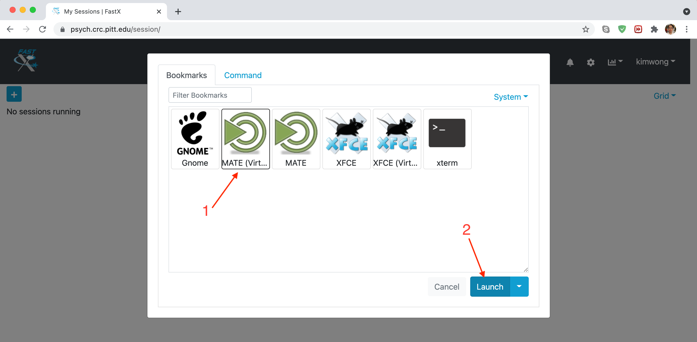

The result is a Linux desktop inside your web browser — the web portal for accessing CRCD resources.

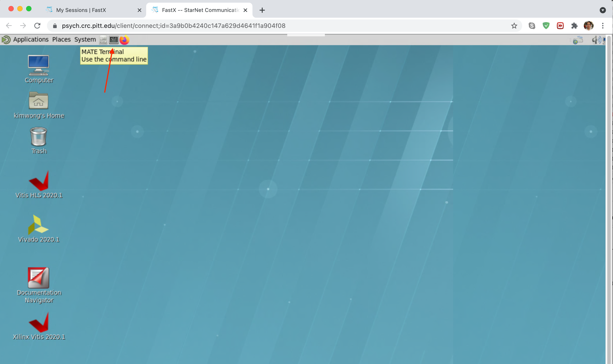

Software that opens a GUI is displayed within this virtual desktop.

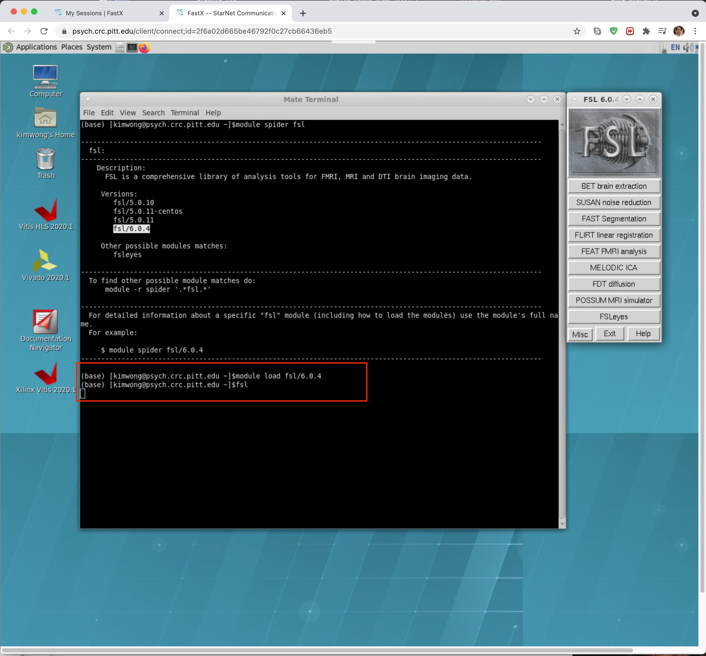

To exit, click **System** and select **Log Out**. If you don't log out, your session keeps running in the background
even if you lose your connection — so, for example, you can start a calculation, close your laptop for lunch, and log
back in later to check its progress.

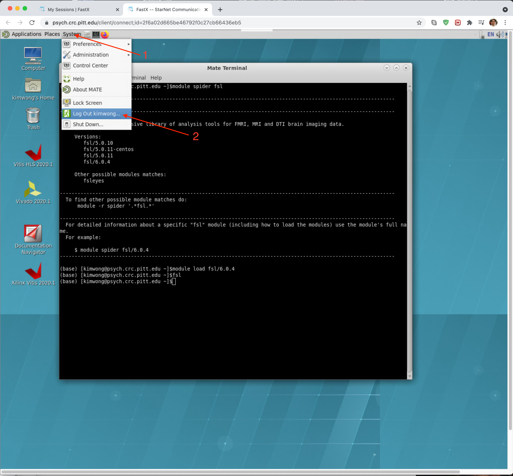

## FAQ

**When I log in via the web portal, I'm prompted for a second password. What do I enter?**

This happens when you type your username (Pitt ID) in uppercase instead of lowercase. Reconnect using all-lowercase
letters in your username.
