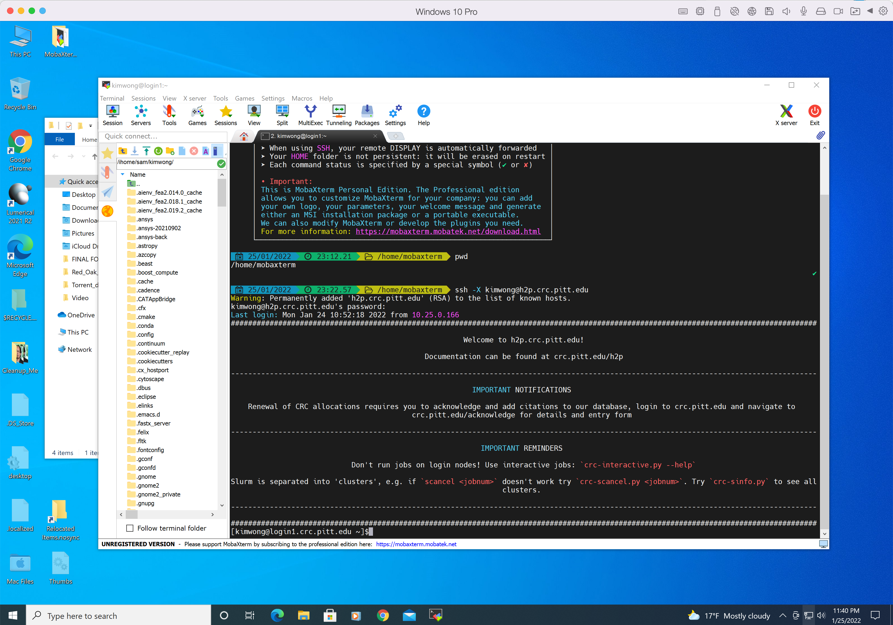

# SSH Connection Using a Terminal

??? warning "Appropriate usage of login node"
    The login nodes are the gateways we use to perform light interactive work like editing code, submitting and 
    checking the status of jobs, etc. Executing CPU-heavy scripts on these nodes can cause slowdown for everyone.
    It is important to make sure that CPU-heavy work is done in either an interactive session on on a compute 
    node or as a batch job submission.

    Resource-intensive processes running on the login nodes may be killed at anytime.

    <ins>**The CRCD team reserves the right to revoke cluster access of any user who repeatedly causes slowdowns on the login
    nodes with processes that can otherwise be run on the compute nodes.**</ins>

SSH ([**Secure Shell**](https://en.wikipedia.org/wiki/Secure_Shell)) is a network protocol that allows for secure access 
to a computer over an unsecured network. This is the protocol for connecting to the CRCD login nodes.

As with any of the other methods for connecting to CRCD resources, you should start by ensuring you have a proper 
connection to the [**GlobalProtect VPN**](https://services.pitt.edu/TDClient/33/Portal/KB/ArticleDet?ID=3426). With this 
connection established, you can proceed with the steps below.

Clients running MacOS can use the built-in Terminal app (in Applications/Utilities) or 
[**iTerm2**](https://iterm2.com/). Clients running Windows can use [**MobaXterm**](https://mobaxterm.mobatek.net/) or [**PuTTY**](https://www.chiark.greenend.org.uk/~sgtatham/putty/latest.html) to
access a terminal emulator.

To render graphics from the remote session, you will also need an X server on your client. For MacOS, you will need 
to install [**XQuartz**](https://www.xquartz.org/). MobaXterm comes bundled with an X server.

!!! note "Connection settings"

    | Setting | Value |
    | ------- | ----- |
    | Remote Host | `h2p.crc.pitt.edu` or `htc.crc.pitt.edu`|
    | Port | `22` |
    | Username | Your Pitt username, all lowercase |
    | Authentication | Pitt password, or an SSH key — see [Passwordless SSH](../getting-started/passwordless-ssh.md) |

The syntax to connect to the CRCD login node from your terminal commandline is

```commandline
ssh -X <Username>@h2p.crc.pitt.edu
```

where `<Username>` is your Pitt username in lowercase and the answer to the prompt is the corresponding password. 
The -X option enables X forwarding for applications that generate a GUI such as xclock. 

!!! tip "Skip the password next time"
    You can log in with an SSH key instead of typing your Pitt password on every
    connection. See [Passwordless SSH](../getting-started/passwordless-ssh.md) to set it up.

If this is the first time that your client machine is logging into `h2p.crc.pitt.edu`, you will see a warning that "The authenticity of the host ... can't be established" and if you wish to continue connnecting. Answer: yes.

If your connection is successful, your client session will look like the screenshot below.

!!! example "Successfully logged in to login node"
    === "MacOS"
        

    === "Windows"
        


<ins>**Definitions**</ins>

*   **terminal emulator** -- a software program that provides a text-based interface to the system, allowing users to type 
commands into a shell prompt to run programs and to manage files without a graphical user interface (GUI)
*   **Linux shell** -- a text-based user-interface that interprets user commands and scripts. CRCD supports `bash` and `csh`, with
 `bash` being the default
*   **Linux commandline** -- this is the shell prompt line where your cursor is highlighted and where you input commands to the
 remote host
