# Viz

## Summary

Viz is a set of nodes with a graphical desktop environment enabled. This page covers what you need to know to use it.

**[Log in to Viz](https://viz.crc.pitt.edu)**

You can treat this machine as another login node, with the added ability to run a graphical desktop. You can also submit
jobs to H2P or HTC from within the Viz interface.

## Accessing Viz

Like the other CRCD resources, Viz requires a connection to the
[GlobalProtect VPN](https://services.pitt.edu/TDClient/33/Portal/KB/ArticleDet?ID=3426).

After connecting to the VPN, you can reach Viz either through the **web portal** or through the **FastX desktop
client**. The desktop client is worth using because copy/paste works significantly better than in the browser.

## Desktop client method

[Download the latest FastX client here](https://www.starnet.com/download/fastx-client). Install it somewhere you can
access, then run the executable from the installation directory.

When you run it, the window that opens is your **Connections** window:

Near the top-left corner, use the **plus** icon to add an **https** connection:

Enter the following, then click **OK**:

| Setting | Value |
| ------- | ----- |
| Host | `viz.crc.pitt.edu` |
| User | Your Pitt ID, **all lowercase** |
| Port | `443` |
| Auth | `ssh` |
| Name | `Viz` |

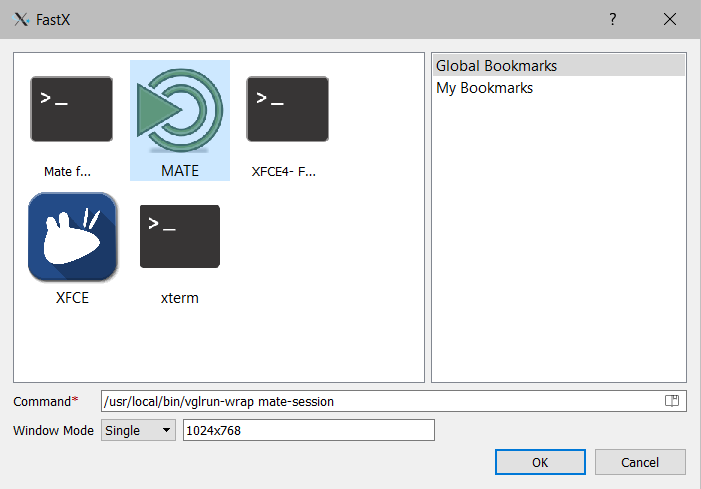

Double-click the new connection in the Connections window; you'll be prompted for your Pitt password:

The window that opens is your **Sessions** window, which works much like the web portal interface:

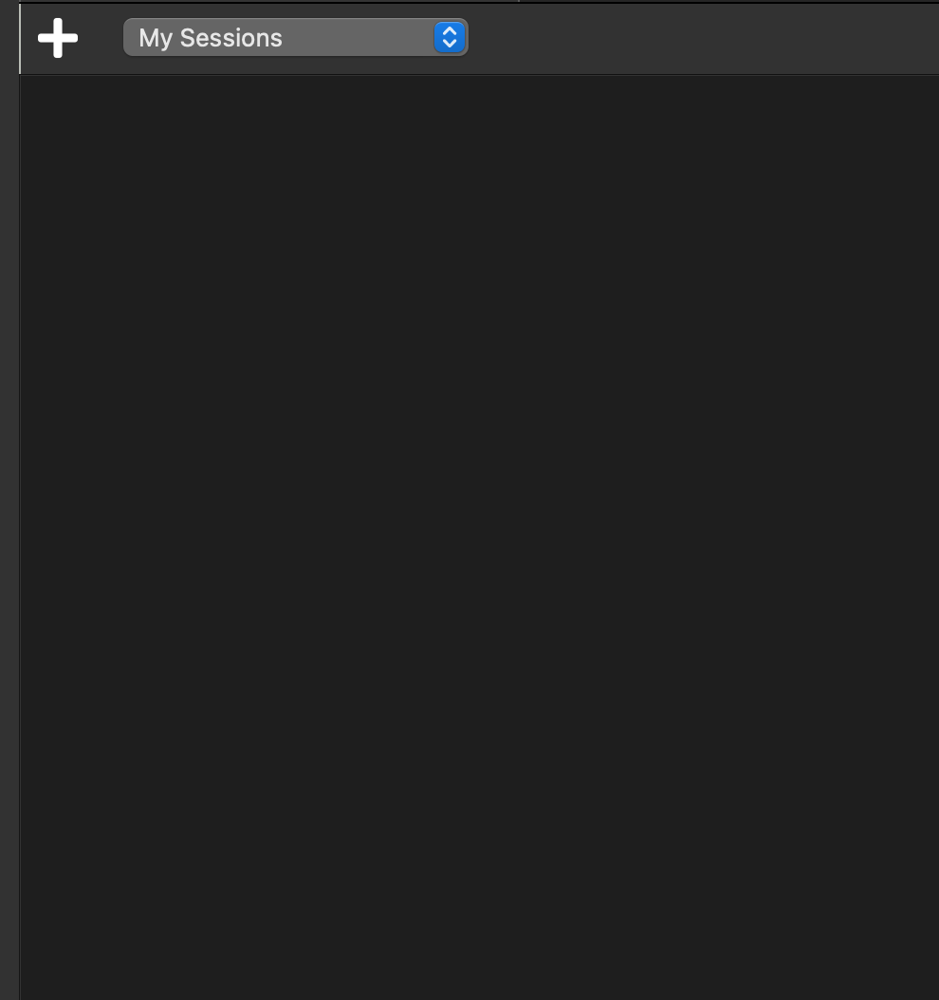

Use the **plus** icon to create a new session, select a desktop environment (MATE is a good default), and click **OK**:

Your session starts, and you can use this machine much like the H2P and HTC login nodes.

## Web portal method

Open [viz.crc.pitt.edu](https://viz.crc.pitt.edu/) in a web browser and log in with your Pitt username and password.
Your username is your Pitt ID, **all lowercase**. The screenshots below walk through accessing and using Viz in the
browser:

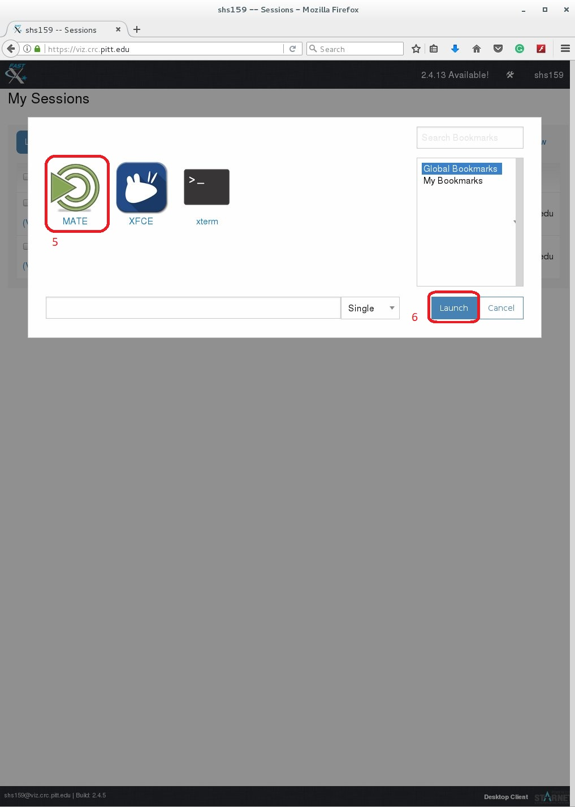

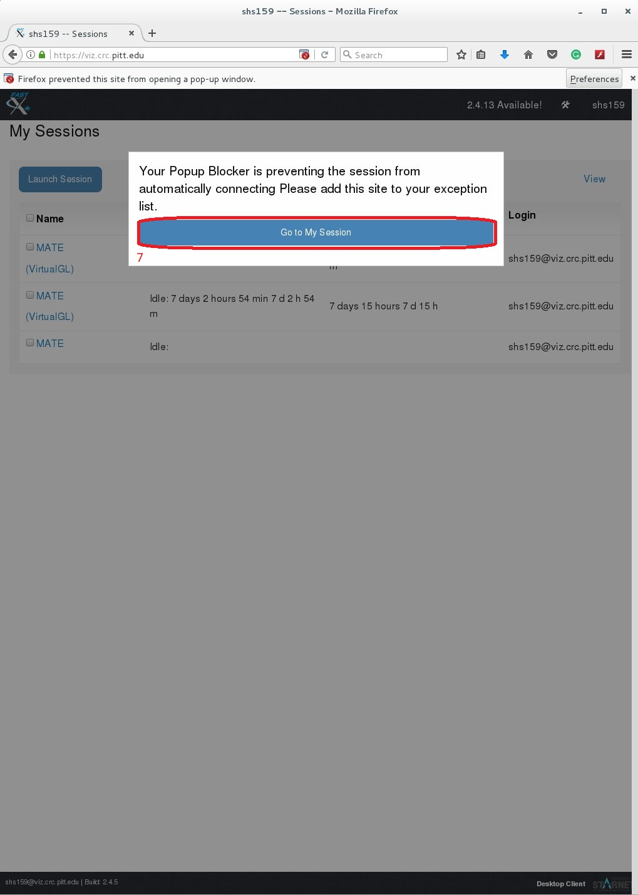

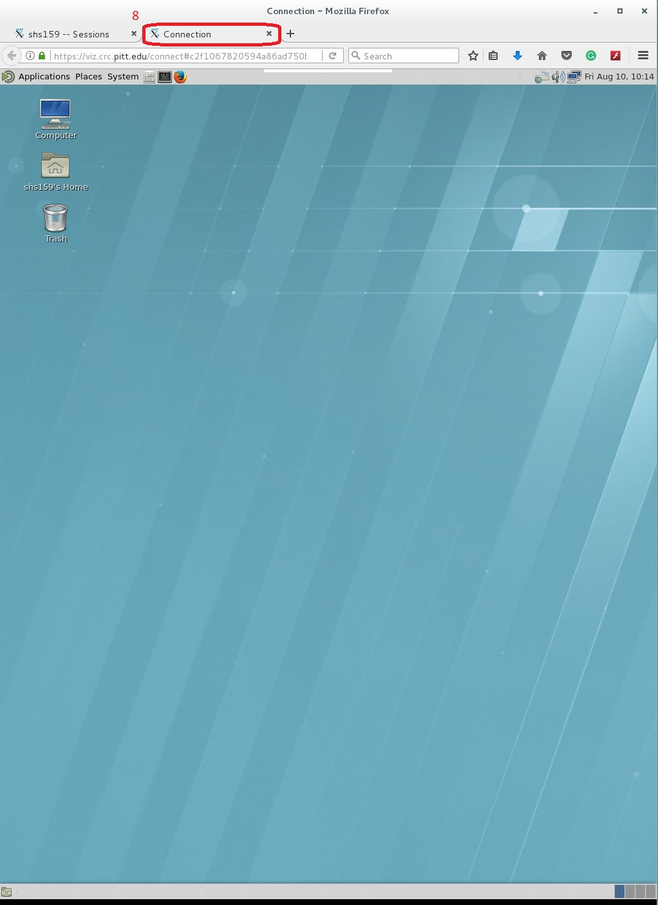

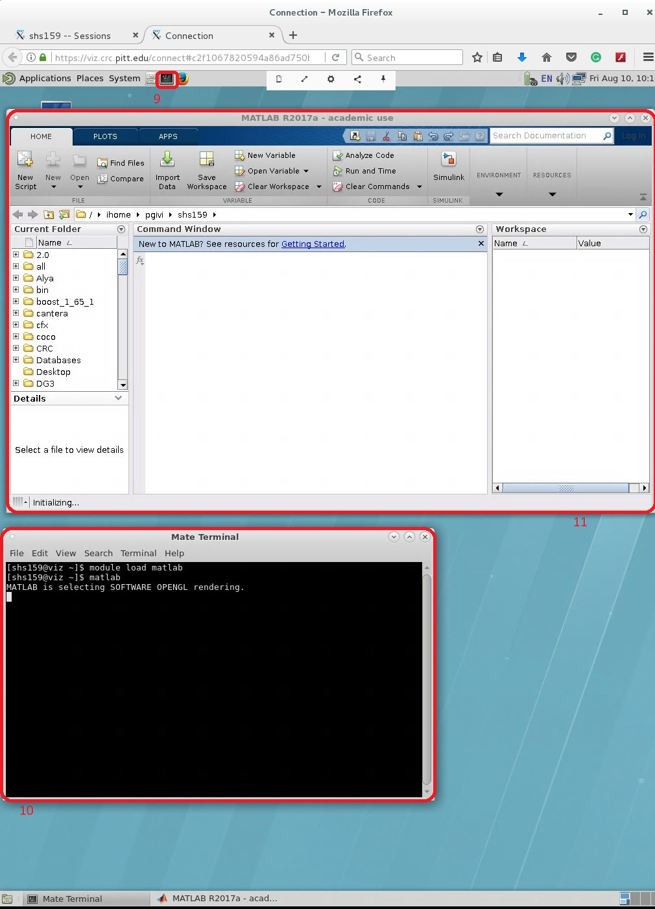

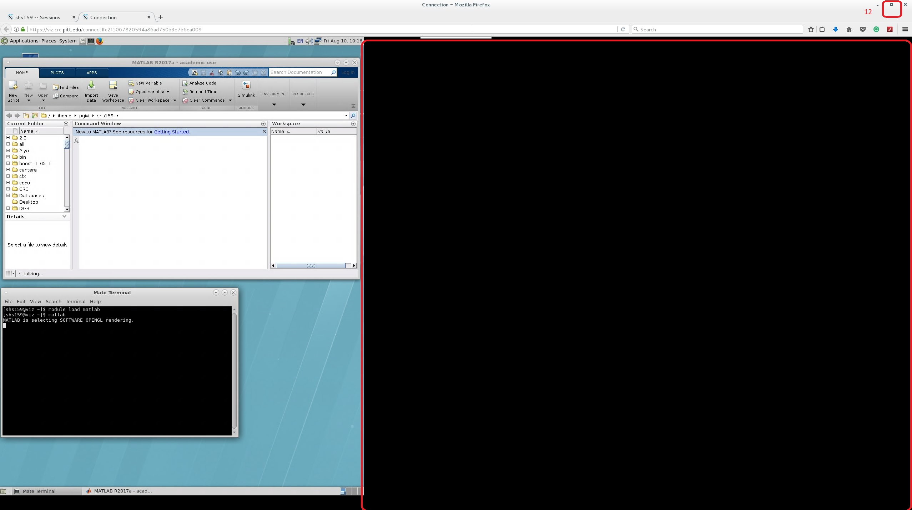

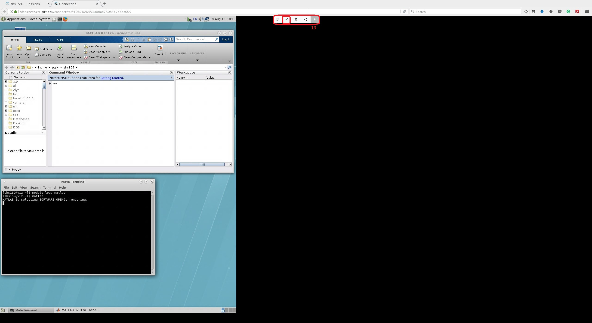

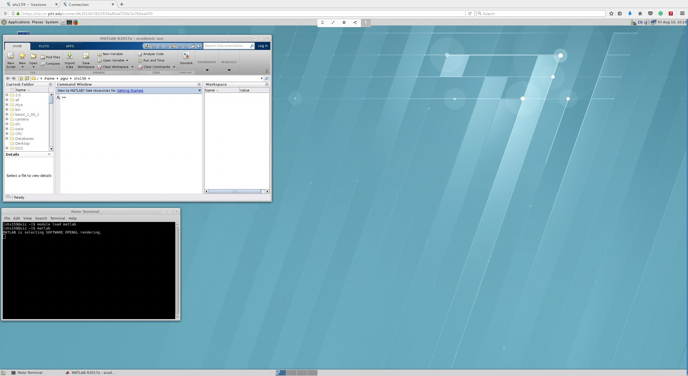

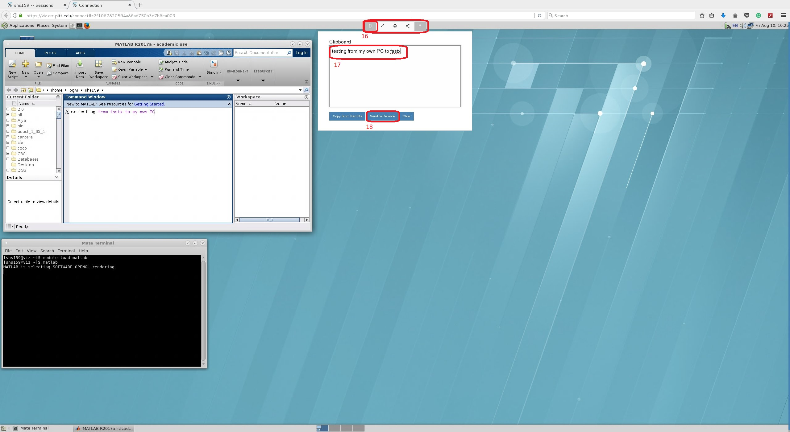

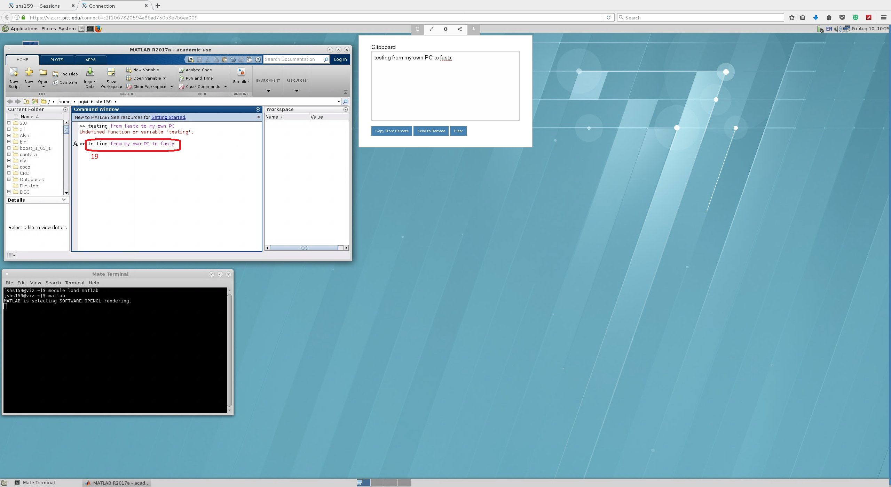

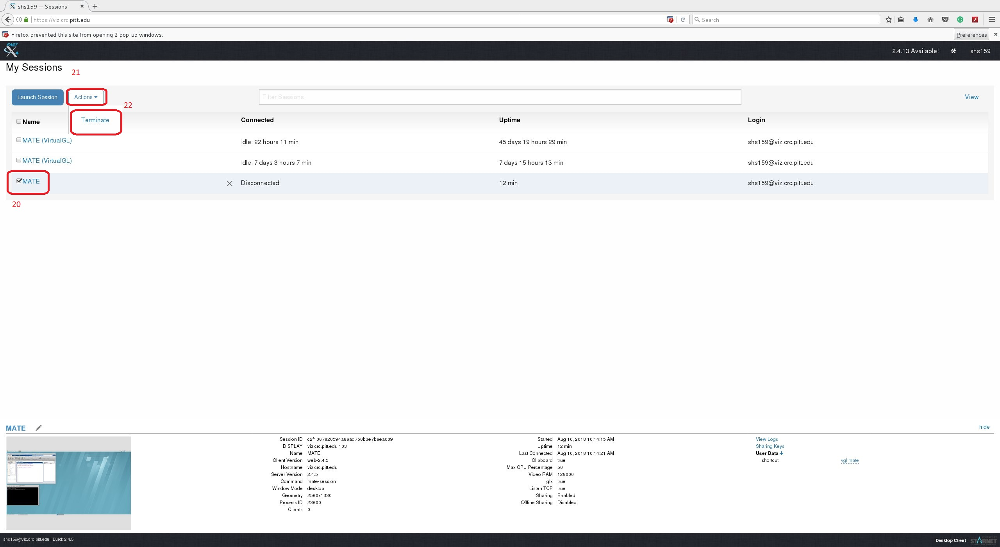

## FAQ

**When I log in via the web portal, I'm prompted for a second password. What do I enter?**

This happens when you type your username (Pitt ID) in uppercase instead of lowercase. Reconnect using all-lowercase
letters in your username.
