# Linux Desktop Visualization (Viz)

The Viz nodes provide a full graphical Linux desktop that you reach through your web
browser using FastX. Use it for GUI applications, visualization, and previewing results,
or as a desktop gateway to the clusters. See the [Viz node hardware](../hardware_profiles/viz.md)
for specifications.

!!! note "Connect to the VPN first"
    Like the other CRCD resources, Viz is reachable only from the University network. From
    off campus, connect to the [GlobalProtect VPN](https://services.pitt.edu/TDClient/33/Portal/KB/ArticleDet?ID=3426)
    first (see [Step 1](../getting-started/getting-started-step1-account.md)).

## Step 1. Log in to FastX

Point your browser to <https://viz.crc.pitt.edu> and sign in with your Pitt credentials.
Enter your Pitt username (1) in all lowercase and your Pitt password (2), then click
**SSH Login** (3).

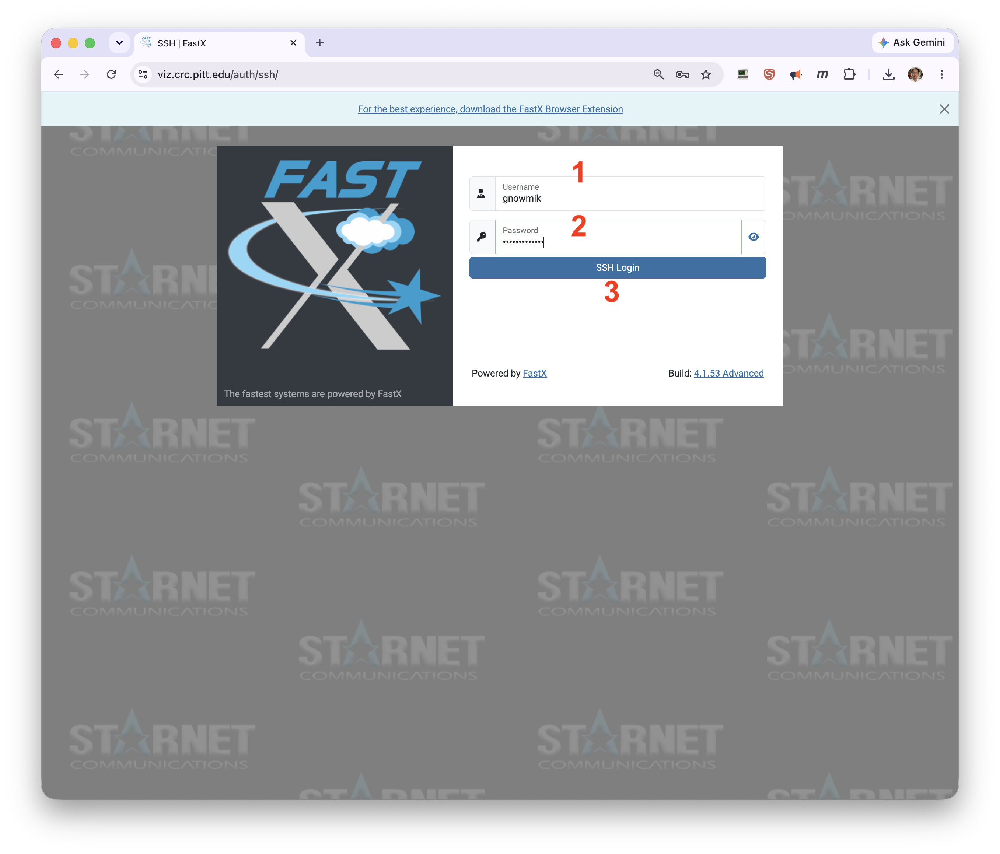

!!! tip "Use all lowercase for your username"
    If you are unexpectedly prompted for a second password, you most likely entered your
    username with capital letters. Reload the page and sign in again using your Pitt
    username in all lowercase.

## Step 2. Launch a desktop session

After logging in you land on the **My Sessions** page. The **Applications** panel on the
left lists the available desktops and terminals — **mate**, **xfce**, and **xterm**. Click
**mate** (a good default desktop) to start a new session.

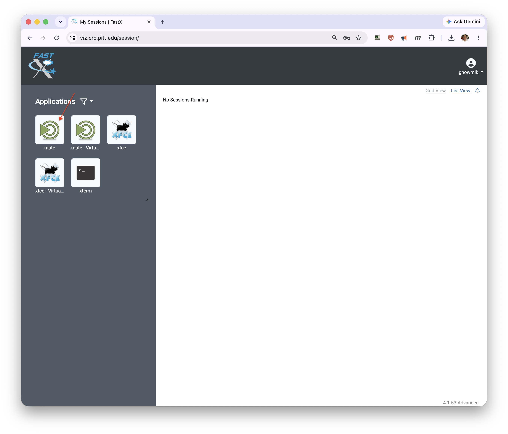

## Step 3. Choose how to connect

FastX asks how you want to open the session. Choose **Browser Client** to run the desktop
in a new browser tab with nothing to install; the **Open in New Tab** option is selected so
the desktop opens in its own tab. The **Desktop Client** is an alternative that generally
handles copy and paste better — download it with the link on this screen if you prefer it.

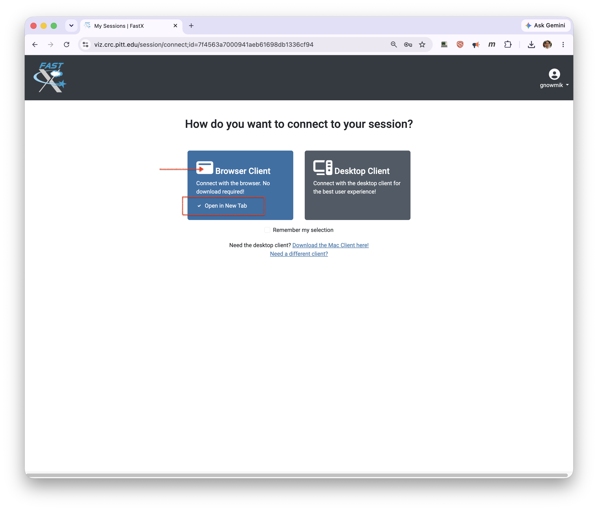

## Step 4. Use the desktop

Your MATE desktop opens in the browser. Use it like any Linux desktop: the **Applications**,
**Places**, and **System** menus are in the top-left, and the desktop icons give you your
home folder, Computer, and Trash.


If the desktop does not fill the window — as below, where the StarNet background shows around
a smaller desktop — use the toolbar on the right edge of the session to fit or resize it.

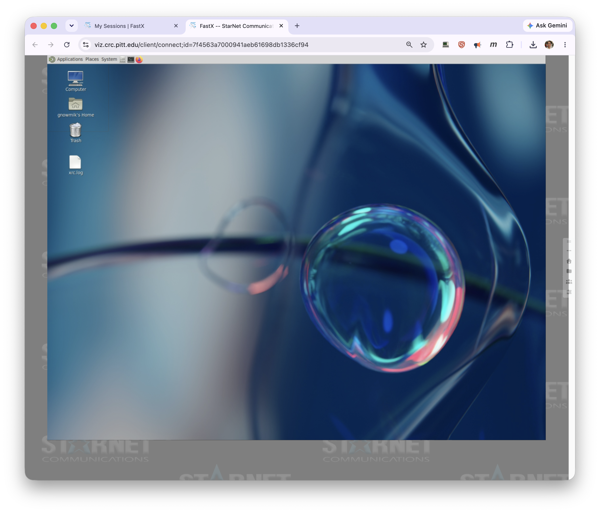

## Step 5. Run an application

Open a terminal from the desktop by clicking the terminal icon in the top menu bar (1),
which starts **Mate Terminal** (2). From there you can load software with the module system
and launch it. For example, to start MATLAB:

```bash
module load matlab
matlab
```

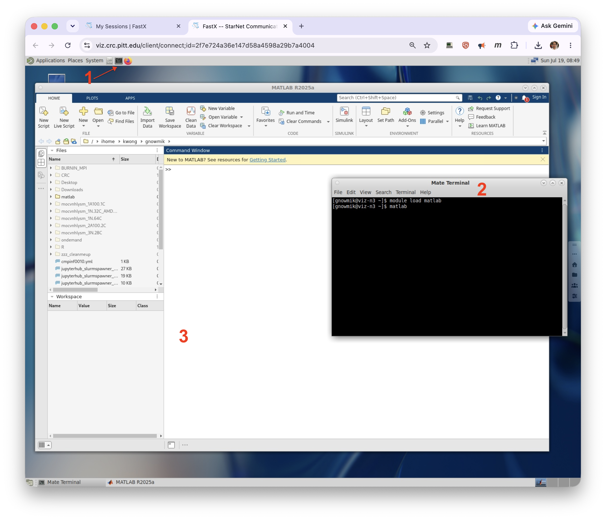

## Step 6. Reconnect or end your session

Your session keeps running on the Viz node even if you close the browser tab, navigate
away, or lose your network connection — you are only *disconnected*, not logged out. To
pick up where you left off, return to <https://viz.crc.pitt.edu>: any running session
appears under **Connected Sessions** on the My Sessions page. Click its thumbnail to
reconnect exactly where you left it — handy for long-running GUI work you come back to over
several sittings.

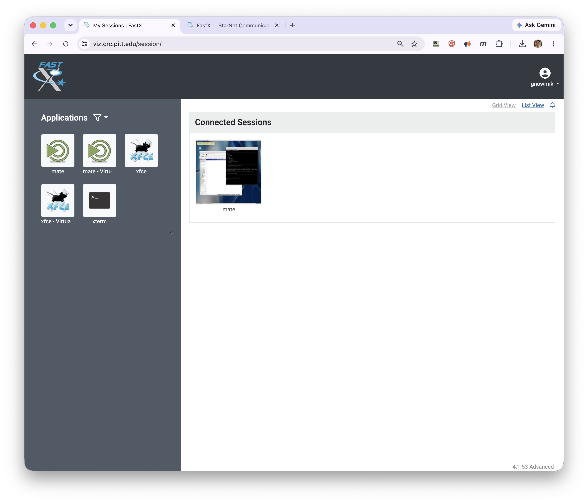

!!! tip "Reconnect or terminate from My Sessions"
    From the **My Sessions** page you can click a **Connected Session** to reconnect, or
    terminate it there without reopening it. Closing the browser tab only disconnects — the
    session (and its resource use) keeps running until you log out or terminate it.

Because a disconnected session keeps consuming resources, **log out** from inside the
desktop when you are truly finished. Click through the sequence below.

=== "1. Save work"

    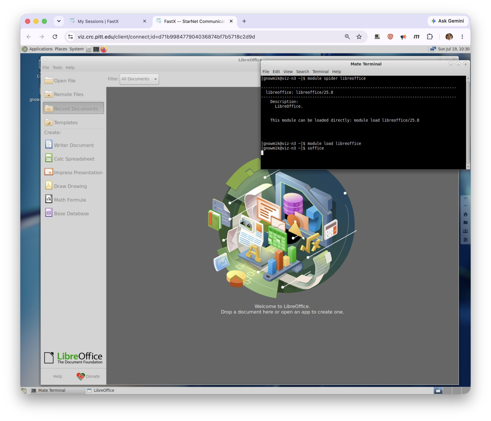

    Save your work and close any open applications — here, LibreOffice, launched with
    `module load libreoffice` then `soffice`.

=== "2. Log out"

    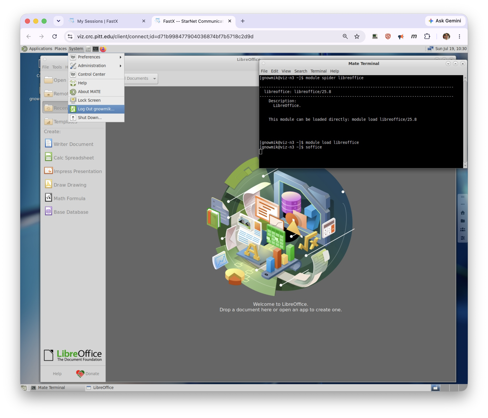

    From the desktop menu bar, open **System** and choose **Log Out gnowmik…**. (The
    **Shut Down…** entry just below does the same thing — it ends your session, not the
    shared Viz node.)

=== "3. Confirm"

    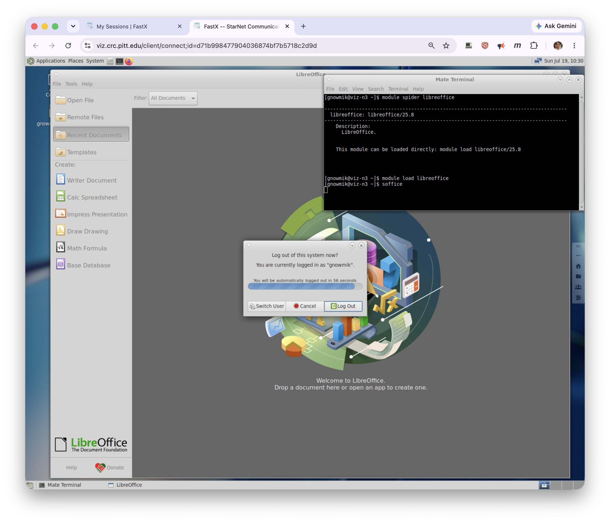

    Click **Log Out** to confirm — or just wait for the short countdown to log you out
    automatically.

=== "4. Disconnected"

    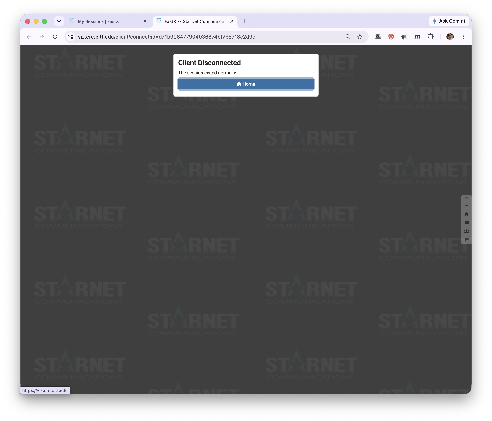

    FastX confirms the session exited normally and its resources are freed. Click **Home**
    to return to My Sessions.

Back on the My Sessions page, **No Sessions Running** confirms the session has fully ended
and its resources are freed — compare with **Connected Sessions** above, where it was still
available to reconnect.

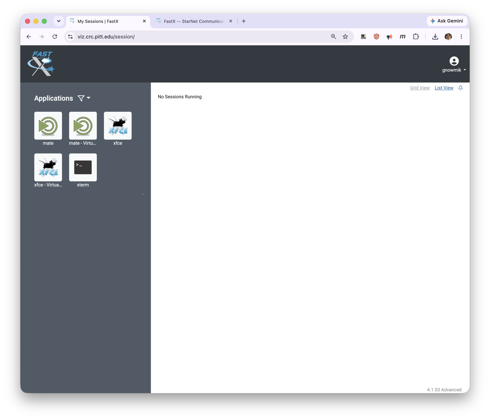

##Definitions##

- **FastX** -- the StarNet remote-desktop software that streams a Linux graphical desktop to your browser or to a local desktop client.
- **MATE / XFCE** -- lightweight Linux desktop environments; either works for a Viz session, and MATE is a good default.
- **session** -- a running desktop or application on a Viz node; sessions persist until you terminate them.
