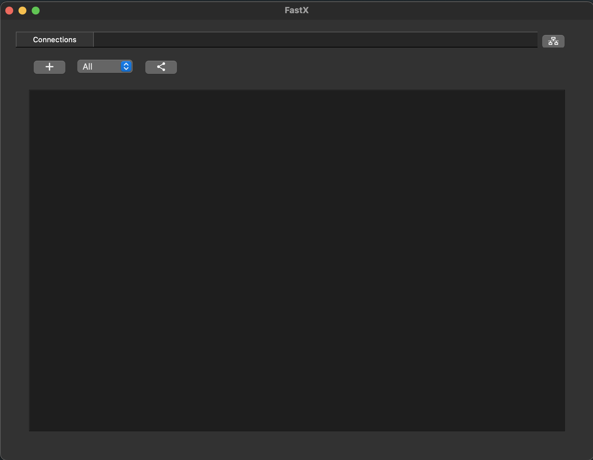
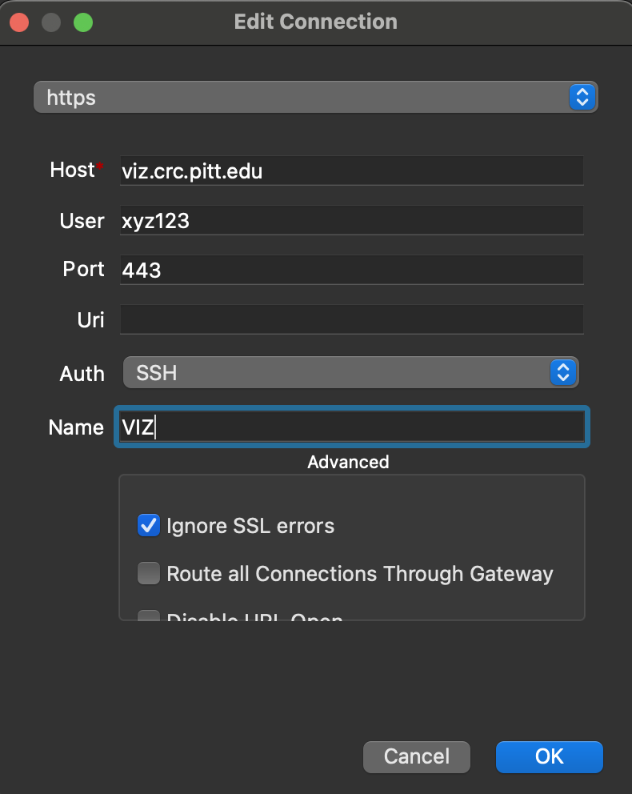
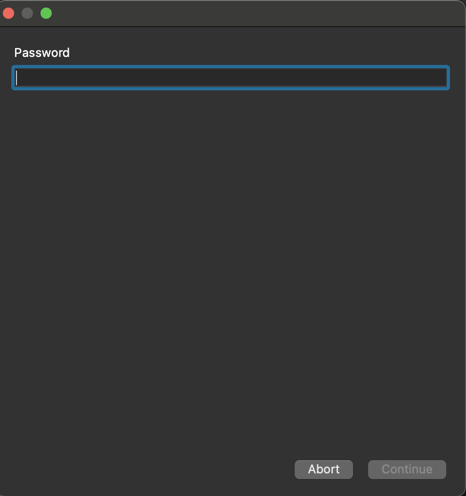
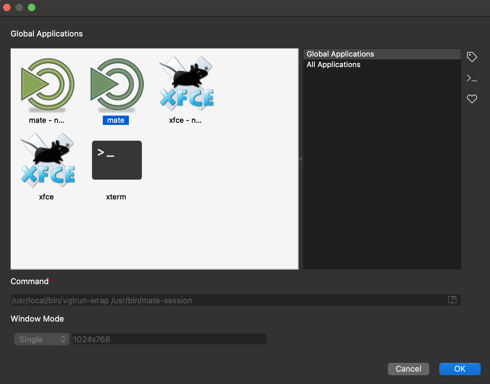
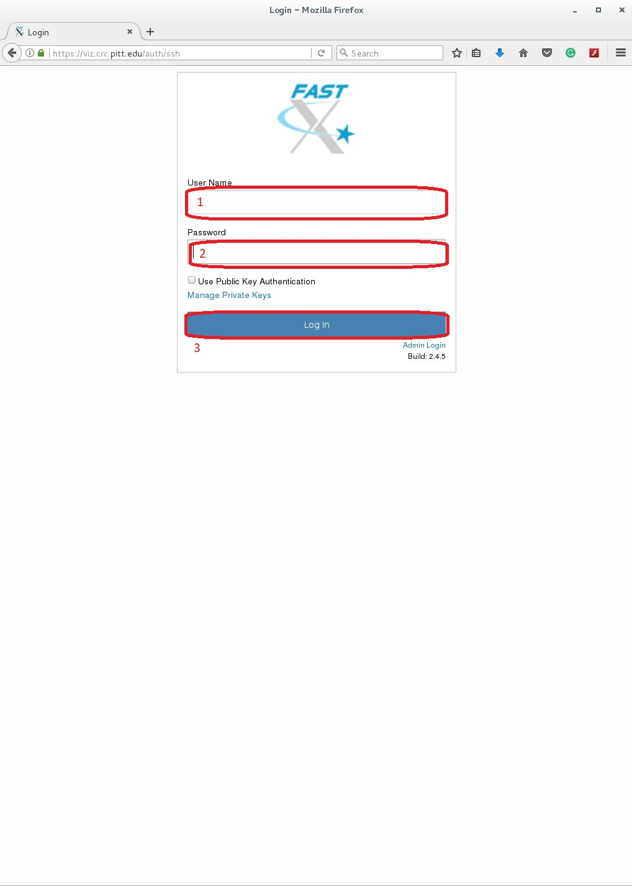
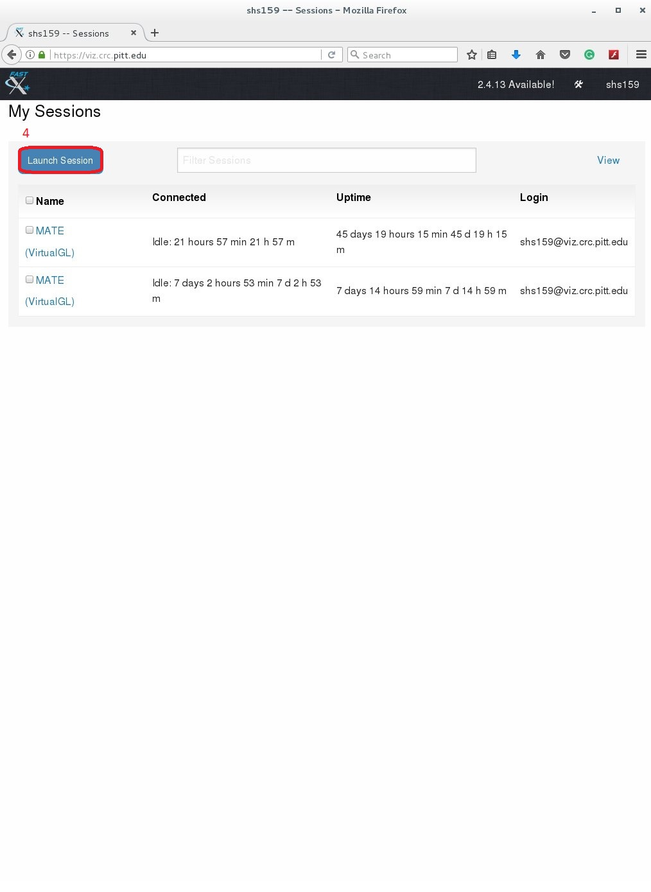

# VIZ Linux Desktop

## Summary

VIZ provides a graphical Linux desktop accessible through your web browser or a desktop client. It functions like a login node with GUI capabilities, and you can also submit jobs to H2P or HTC from VIZ.

[**Log in to VIZ**](https://viz.crc.pitt.edu)

## Prerequisites

- Active [PittNet VPN](https://crc.pitt.edu/user-support/resource-documentation/vpn-and-accessing-clusters) connection

## Desktop Client Method

The FastX desktop client provides better copy/paste functionality than the web browser.

1. [Download the FastX client](https://www.starnet.com/download/fastx-client) and install it
2. Open the client and click the **plus icon** to add a new connection

3. Configure the connection:

| Setting | Value |
|---------|-------|
| Host | `viz.crc.pitt.edu` |
| User | Your Pitt ID (lowercase) |
| Port | 443 |
| Auth | ssh |
| Name | VIZ |

4. Click **OK**, then double-click the connection and enter your Pitt password

5. In the Sessions window, click the **plus icon** to create a new session and select **MATE** as your desktop

Your desktop session will start. Use this environment as you would the H2P/HTC login nodes.

## Web Portal Method

1. Navigate to [https://viz.crc.pitt.edu](https://viz.crc.pitt.edu)
2. Log in with your Pitt username (lowercase) and password

## FAQ

**Q: I am prompted for a second password when logging in via the web portal.**

A: This occurs when you enter your username in uppercase. Re-attempt the connection using all lowercase letters.
