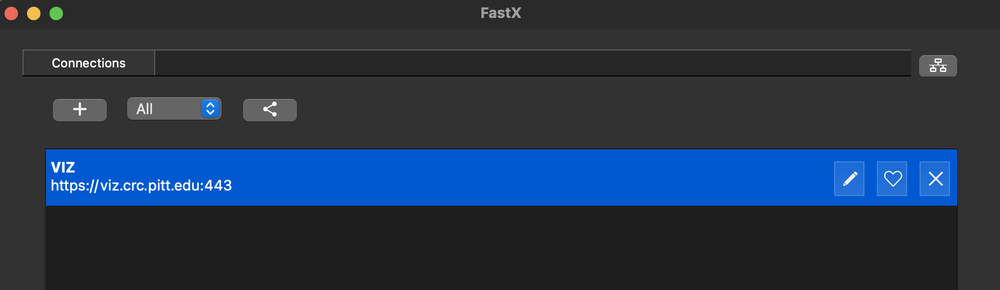

# **VIZ**

## **Summary**

VIZ is a set of nodes with a graphical user interface desktop enabled. In this document, we present all the information
you need about VIZ.

[**Log in to VIZ**](https://viz.crc.pitt.edu)

You can treat this machine as another login node with extra capability to access to GUI interface. You can also submit 
jobs to H2P or HTC using the VIZ interface.

## **Access to VIZ**

Like the other resources we have available, accessing VIZ requires a [connection to the PittNet VPN](https://crc.pitt.edu/user-support/resource-documentation/vpn-and-accessing-clusters).

After connecting to the VPN, VIZ can be accessed either by the web portal, or by the fastx 2 desktop client. The 
benefit of using the desktop client is that copy/paste functionality works significantly better.

## **Desktop Client Method**

[Download the latest fastx client here](https://www.starnet.com/download/fastx-client).

Install to a location accessible to you and run the executable file in the installation directory.

When you run the executable, the window that opens is your Connections window.

Towards the top left corner, use the plus icon to add an **https** connection.

**Host:** viz.crc.pitt.edu

**User:** your Pitt ID, **all lower case**

**Port:** 443

**Auth:** ssh

**Name:** VIZ

Click **OK**.

Double-click the new connection in the Connections window, you will be prompted to provide your Pitt password.

The new window that opens is your Sessions window. This works similarly to the web portal interface.

You can use the **plus icon** to create a new session, select your desktop interface (MATE is a good default), and 
click ok.

Your session will start, and you can use this machine similarly to the login nodes for H2P and HTC.

## **Web Portal Method**

Below are some screenshots on how to access and use VIZ through the web portal.

Open [this page](https://viz.crc.pitt.edu/) in a web browser and login with your Pitt username and password. Your username is your pittID, 
**making sure that all letters are lower case**.

## **FAQs**

Q: When I log in via the web portal, I am prompted for a second password. What do I put here?

A: This is what happens when you enter your username (pitt ID) as all capitals instead of all lower case. You should 
re-attempt the connection using all lower case letters in your username.
