# HuGen / Teach Open OnDemand Portal

## Summary

The Open OnDemand portal at `hugen.crc.pitt.edu` (also reachable as `ondemand.teach.crc.pitt.edu`) is the gateway to the
CRCD Teach cluster for teaching bioinformatics courses. The Department of Human Genetics paid part of the cost of this
node.

## Request an allocation for a course

The course instructor can
[fill out this form](https://services.pitt.edu/TDClient/33/Portal/Requests/TicketRequests/NewForm?ID=KVCW5G08Bfo_&RequestorType=Service)
and attach a spreadsheet listing each student from the class roster who needs access, with their **Name** and **Pitt
email** (`<username>@pitt.edu`, no aliased emails).

Your course's user-group name and Slurm allocation follow the format `SUBJECTNUMBER-YEAR(f/s)`, where `f`/`s` denotes
fall or spring semester. We allocate **100,000 SUs** on the Teach cluster and **5 TB** of group-shared storage per
course, active for **one term (4 months)**. We provide the Slurm allocation name and storage location when we reply to
your ticket. The examples below use `hugen2071-2024f` as the allocation name and `/ix1/hugen2071-2024f` as the storage
location.

!!! warning "The 5 TB storage allocation expires"
    Course storage has an expiration date, and we delete the 5 TB allocation at the end of the term without further
    discussion with instructors or students. Move anything you want to keep before the term ends.

Based on the spreadsheet, we create the Linux group (e.g. `hugen2071-2024f`) and add the students, instructor, and TAs
to it. A user can belong to multiple Linux groups — running `id <username>` shows your `gid=<primary group>`, and
`hugen2071-2024f` may not be your primary group.

`/ix1/hugen2071-2024f` is owned by the instructor and the `hugen2071-2024f` group. Its default permission is `770`, so
group members have write access to the folder.

We also create the Slurm account `hugen2071-2024f` and add the students, instructor, and TAs to it, with 100,000 SUs on
the Teach cluster. A user can be associated with multiple Slurm accounts; run `sacctmgr list user <username>` to check
your default.

## Logging in

The portal is available at:

- <https://hugen.crc.pitt.edu>
- <https://ondemand.teach.crc.pitt.edu>

The portal server is firewalled within PittNet, so you must be connected to the
[VPN](https://services.pitt.edu/TDClient/33/Portal/KB/ArticleDet?ID=3426) (Pitt IT's GlobalProtect) or directly
connected to PittNet via Ethernet.

Once connected, you can run commands directly on the server and submit batch jobs to the Teach cluster. Click
**Clusters → \_teach Shell Access** to open a Linux shell.

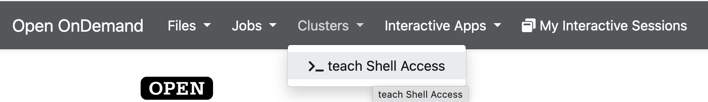

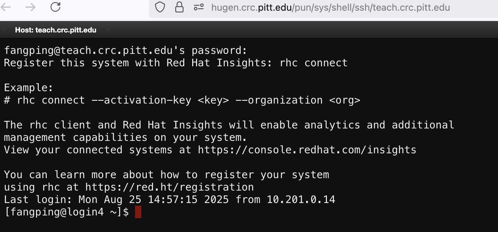

You'll land on the Teach login node, `teach.crc.pitt.edu` (also `login4.crc.pitt.edu`). All CRCD software is available
through this terminal and our Lmod software provisioning system — see
[Application Environment](../applications/application-environment.md).

[Lmod](https://www.tacc.utexas.edu/research-development/tacc-projects/lmod) provides optimized builds of commonly used
software through modular environment commands. No modules are loaded by default when you log in. You can use this system
to teach your course, and you can also create conda environments and install your own tools.

The instructor can create a folder under the course storage to hold conda environments:

```
[fangping@login4 ~]$ cd /ix1/hugen2071-2024f
[fangping@login4 hugen2071-2024f]$ mkdir software
```

We use Slurm as the workload manager. To spend the course's SUs, pass `--account=hugen2071-2024f` so the job is charged
to the course account. We recommend the instructor provide Slurm job templates.

## Using R

See [R and RStudio](../applications/r+rstudio.md) for full details. We provide multiple R modules — run `module spider r`
to list them and `module spider r/<version>` to see how to load one. For example, the latest `r/4.5.0`:

```
[fangping@login4 ~]$ srun --account=hugen2071-2024f --pty bash
srun: job 14646 queued and waiting for resources
srun: job 14646 has been allocated resources
[fangping@teach-cpu-n0 ~]$ module load r/4.5.0
[fangping@teach-cpu-n0 ~]$ R
R version 4.5.0 (2025-04-11) -- "How About a Twenty-Six"
...
>
```

The command `srun --account=hugen2071-2024f --pty bash` requests a single core for 1 hour on the Teach cluster, charged
to the `hugen2071-2024f` allocation. Add Slurm arguments to change the request — see
[Slurm Batch Jobs](../slurm/batch-jobs.md).

Each R module includes many preinstalled R and Bioconductor packages; for `r/4.5.0` they live in
`/software/rhel9/manual/install/r/4.5.0/lib64/R/library`. In the R console, load a library to check whether it's already
installed.

You can also install your own R packages. R searches your personal library path before the root installation and stops
at the first match — check the path with `.libPaths()`. For `r/4.5.0`, your local packages install under
`~/R/x86_64-pc-linux-gnu-library/4.5`. So that all attendees use the same packages, we recommend the instructor hide
their personal R packages; if your course needs specific packages, submit a help ticket and we'll install them for
everyone.

You can also teach with **RStudio Server** on Open OnDemand. Log in to `hugen.crc.pitt.edu`, then select **Interactive
Apps → RStudio Server 2025**.

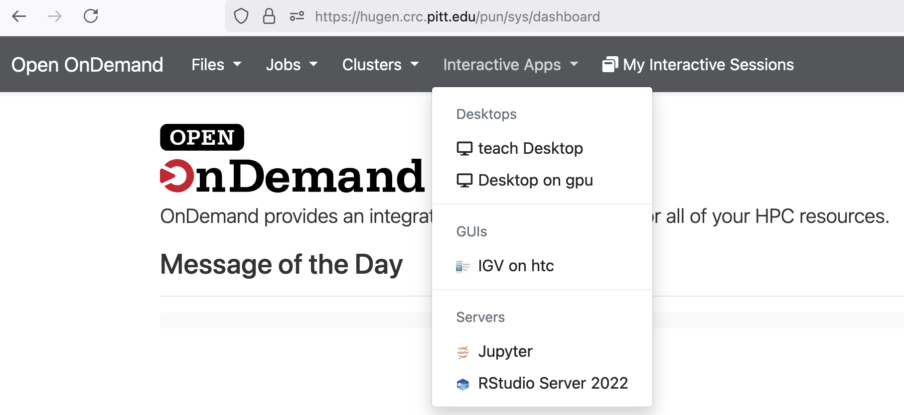

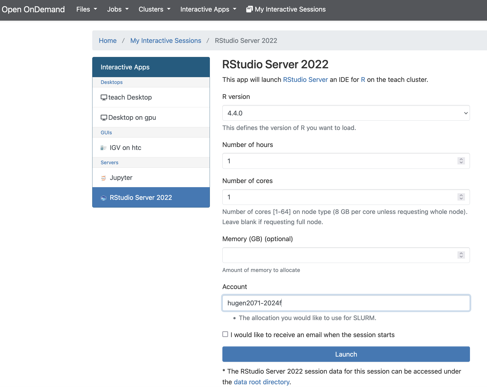

Click **Launch** to start RStudio Server. Slurm submits a batch job requesting 1 core (8 GB memory) for 1 hour, run as
your user, with the SUs charged to `hugen2071-2024f`. (Interactive Apps on `hugen.crc.pitt.edu` are configured to submit
jobs to the Teach cluster automatically.)

By default the R session's working directory is your home directory; use `setwd()` to change it. The instructor can
create a shared `users` folder and make it group-writable:

```
[fangping@login4 ~]$ mkdir -p /ix1/hugen2071-2024f/users
[fangping@login4 ~]$ chmod 770 /ix1/hugen2071-2024f/users
```

Then guide each student to create their own folder under it via **Clusters → \_teach Shell Access**:

```
[fmu@login4 ~]$ mkdir -p /ix1/hugen2071-2024f/users/fmu
[fmu@login4 ~]$ chmod 700 /ix1/hugen2071-2024f/users/fmu
```

You can open an R Markdown file — for example, `pbmc3k_tutorial.Rmd` from an NGS workshop:

```
[fangping@login4 ~]$ cd /ix1/hugen2071-2024f/users/fmu
[fangping@login4 fmu]$ cp <path-to-workshop-materials>/seurat/pbmc3k_tutorial.Rmd .
```

!!! note "Workshop path"
    The workshop materials were previously on the `/bgfs` filesystem, which has been decommissioned. Ask CRCD for the
    current location of these files.

Then use **Open File** in RStudio Server to open `pbmc3k_tutorial.Rmd`, and **Knit to HTML** to generate HTML output.

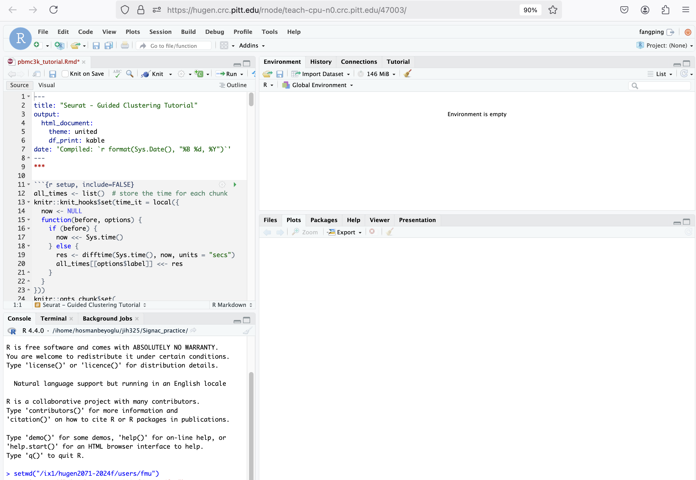

The instructor can also teach students how to submit an R batch job. We recommend providing a job template
(`test.sbatch`):

```bash
#!/bin/bash
#SBATCH --job-name=R_ExampleJob
#SBATCH --account=hugen2071-2024f   # use your course allocation
#SBATCH --nodes=1                   # request a single node
#SBATCH -c 1                        # request 1 core
#SBATCH --time=01:00:00             # 1 hour walltime

module load r/4.5.0

# write the R code in test.R
R CMD BATCH test.R test.txt
# R CMD BATCH test.R   # output goes to test.Rout
```

Submit it with `sbatch test.sbatch`. For advanced topics such as parallel processing or high-throughput jobs, see
[R and RStudio](../applications/r+rstudio.md).

## Using conda and Python

We provide multiple Anaconda Python distributions as modules, which can also be used through the Open OnDemand Jupyter
Notebook/Lab app:

- `python/ondemand-jupyter-python3.9`
- `python/ondemand-jupyter-python3.11`

Each distribution includes thousands of Python packages. Select the module, then run Jupyter through **Interactive Apps
→ Jupyter** on `hugen.crc.pitt.edu` — remember to enter the course Slurm allocation in the **Account** field.

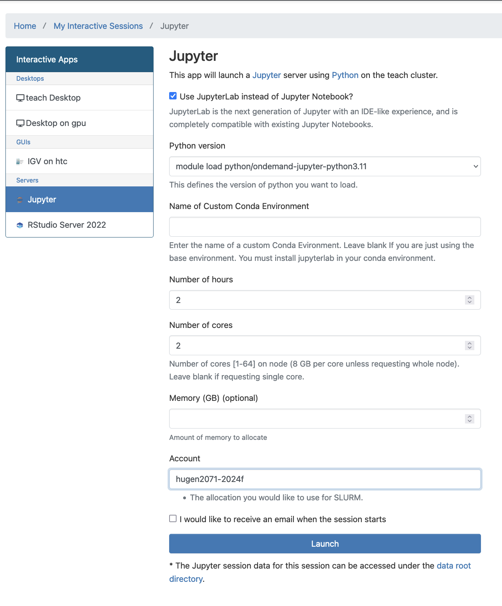

Conda is an open-source package and environment manager. The instructor can create conda environment(s) under the course
storage for all attendees to use:

```
[fangping@login4 ~]$ cd /ix1/hugen2071-2024f/software
[fangping@login4 software]$ module load python/ondemand-jupyter-python3.11
[fangping@login4 software]$ conda create --prefix=/ix1/hugen2071-2024f/software/env python=3.11
...
[fangping@login4 software]$ source activate /ix1/hugen2071-2024f/software/env
(/ix1/hugen2071-2024f/software/env) [fangping@login4 software]$
```

!!! warning "Use `source activate`, not `conda activate`"
    Activate the environment with `source activate <path>`. Do **not** use `conda activate`, which requires
    `conda init` and can break your shell environment on the cluster.

The instructor can then install course-related software into the environment. **Bioconda** provides thousands of
biomedical-research packages through conda ([bioconda.github.io](https://bioconda.github.io/)):

```
(/ix1/hugen2071-2024f/software/env) [fangping@login4 software]$ conda install hisat2
```

To start Jupyter Lab/Notebook with this environment active, enter the environment's path under **Name of Custom Conda
Environment**.

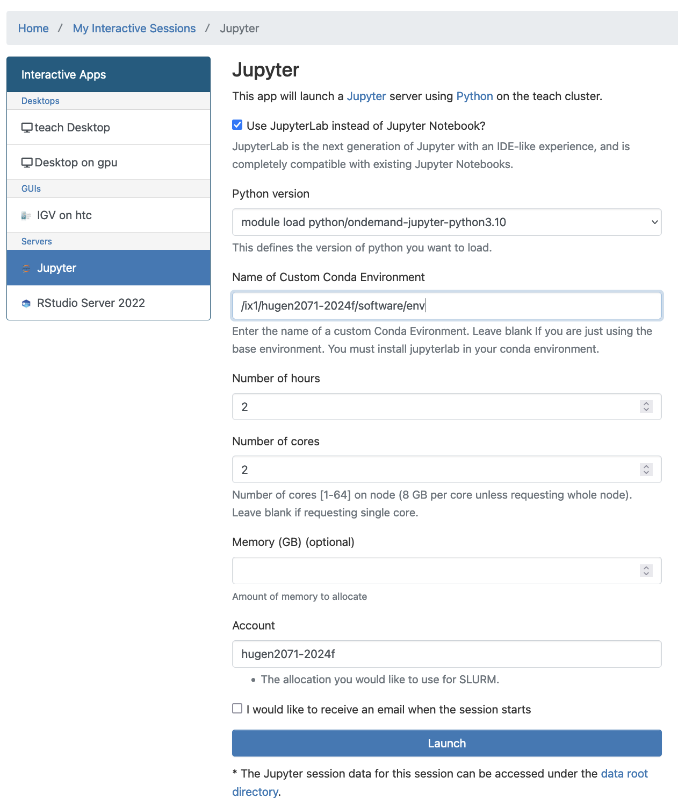

!!! note "\"Failed to connect\" right after launching"
    If you see "Failed to connect to teach-cpu-n??.crc.pitt.edu:?????" when launching Jupyter, the server usually just
    isn't ready yet — wait 1–2 minutes and refresh your browser.

To use the environment's Python packages, import them directly. You can also demonstrate installed tools through a
notebook (see the hisat2 example below).

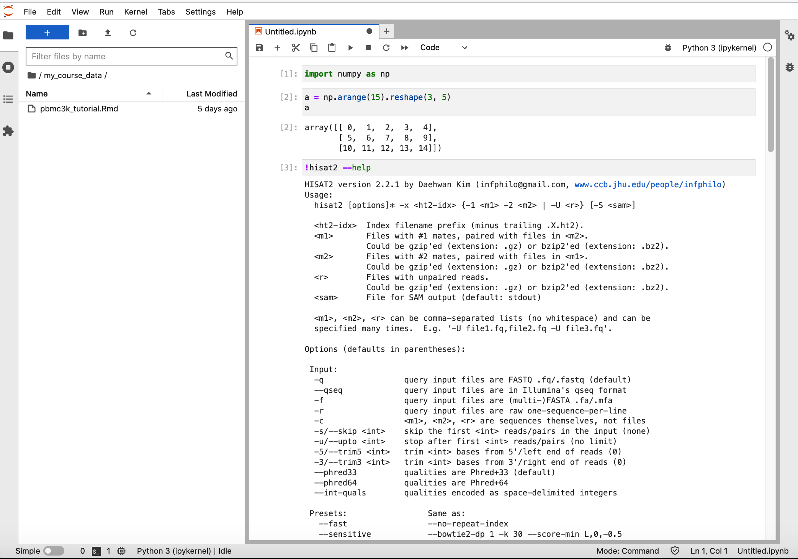

Or run tools from a terminal via **Launcher → Terminal**.

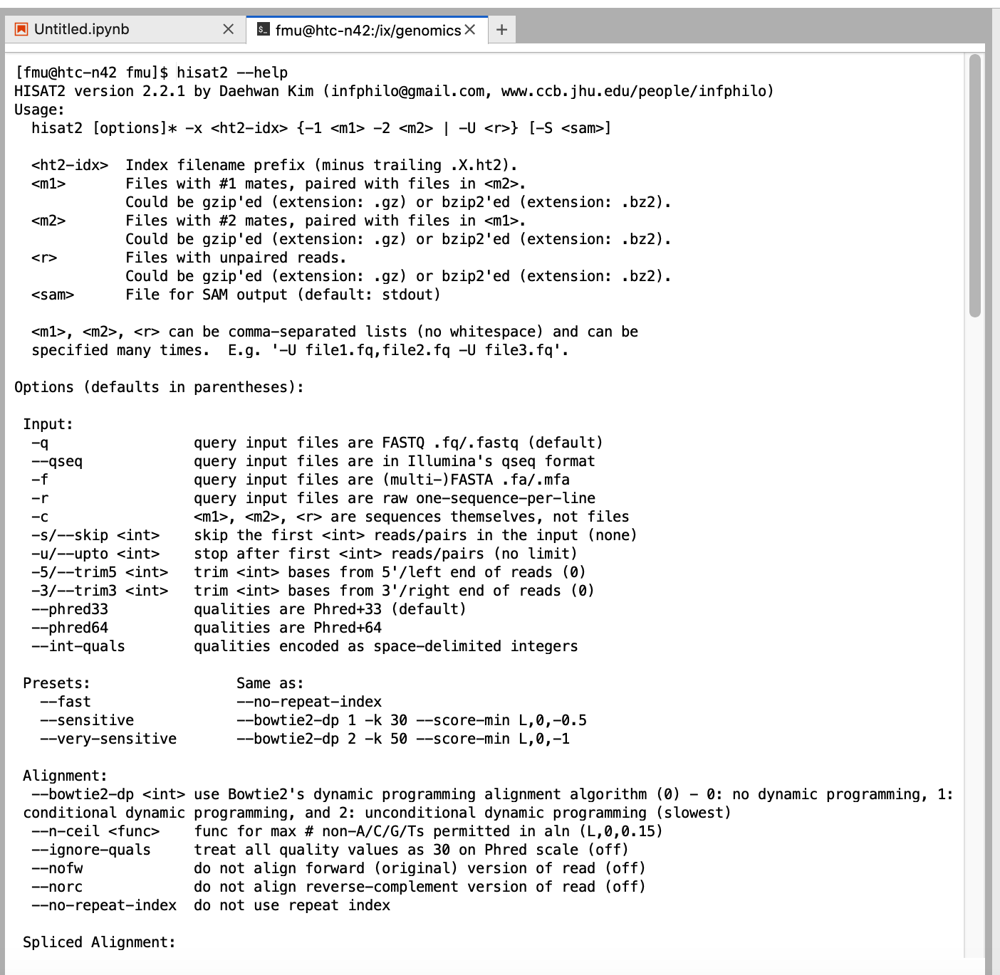

When you start Jupyter Notebook/Lab, the working directory is your home directory. You can use a symbolic link to reach
the course storage. Via **Clusters → \_teach Shell Access**:

```
[fmu@login4 ~]$ mkdir -p /ix1/hugen2071-2024f/users/fmu           # create a folder
[fmu@login4 ~]$ chmod 700 /ix1/hugen2071-2024f/users/fmu          # set permissions
[fmu@login4 ~]$ ln -s /ix1/hugen2071-2024f/users/fmu my_course_data   # symlink into home
```

Each student can then navigate to their own `my_course_data` from Jupyter Lab.

You can also teach students to submit a batch job that uses the conda environment or other CRCD modules. A template
(`test.sbatch`):

```bash
#!/bin/bash
#SBATCH --job-name=ExampleJob
#SBATCH --account=hugen2071-2024f   # use your course allocation
#SBATCH --nodes=1                   # request a single node
#SBATCH -c 1                        # request 1 core
#SBATCH --time=01:00:00             # 1 hour walltime

# use the custom conda environment
module load python/ondemand-jupyter-python3.11
source activate /ix1/hugen2071-2024f/software/env

# or load other modules
# module load hisat2/2.2.1

hisat2 --help   # run your commands
```

Submit it with `sbatch test.sbatch`.

## Open Composer

Open Composer is a web application for generating batch job scripts and submitting jobs to HPC clusters. It simplifies
job submission with status monitoring, job deletion, parameter reuse, and one-click launching of related Open OnDemand
apps.

Click **Jobs → Open Composer**.

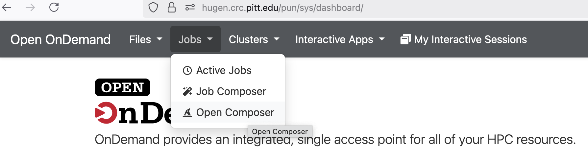

Click **teach**.

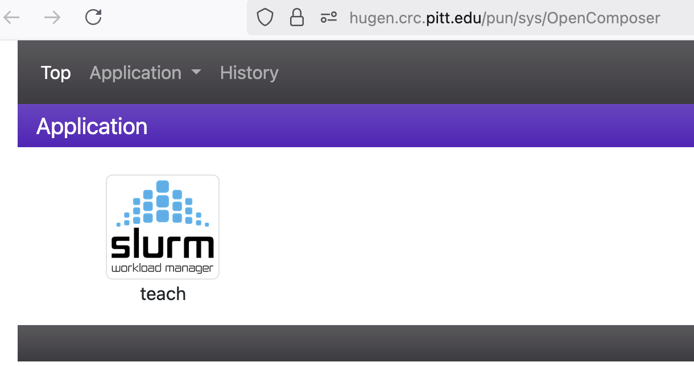

As you fill in the form on the left, a job script is generated in the editable text area on the right. Don't forget to
set the **Script Location** and **Script Name**, and edit the three `<replace with ...>` fields in the text area.

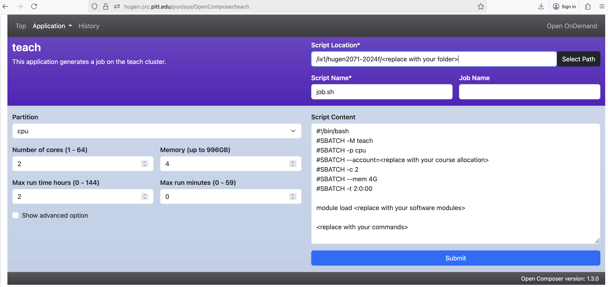

Clicking **Submit** below the text area sends the generated script to the scheduler. Use the history view to manage your
jobs.
