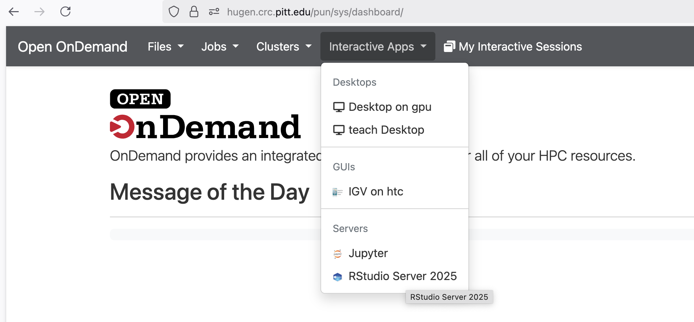
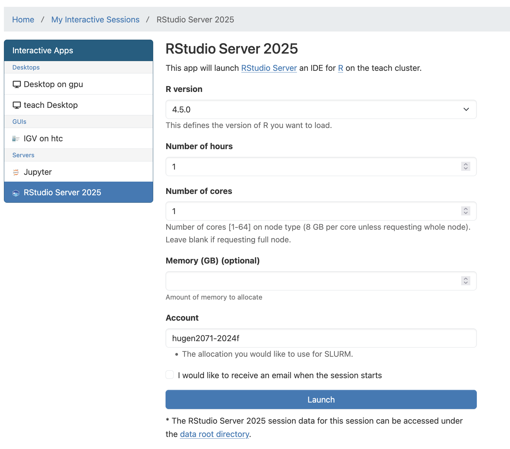

# **hugen or teach Open Ondemand webportal on the teach cluster**

## **Summary**

The hugen.crc.pitt.edu or ondemand.teach.crc.pitt.edu Open Ondemand Web Portal is the gateway to CRCD teach cluster to teach bioinformatics courses. Department of Human Genetics has paid part of the cost of this node. 

## **Request an Allocation for a Course**

The course instructor can <a href="https://services.pitt.edu/TDClient/33/Portal/Requests/TicketRequests/NewForm?ID=KVCW5G08Bfo_&amp;RequestorType=Service">fill out this form</a> and attach a spreadsheet file containing the following information on each of the students from your class roster that will require access to the allocation's resources:

Name, Pitt Email (<a href="mailto:username@pitt.edu">username@pitt.edu</a>, no aliased emails)

The format of your course's user group name and slurm allocation will be SUBJECTNUMBER-YEAR(f/s) where the f/s denotes fall or spring semester. We will allocate 100K Sus on the teach cluster and 5TB group shared storage to your course.<strong> Duration of computing time and storage: active for 1 term ((4 months).</strong> We will provide you the slurm allocation name and the storage location when we reply to your ticket. In the below demonstration, we will use hugen2071-2024f as the slurm allocation name and the storage location is /ix1/hugen2071-2024f. <strong>Note that there is an expiration date for the 5TB storage allocation. We will delete the 5TB storage allocation without discussing with the instructors or students.</strong>

Based on the spreadsheet, we will create the linux group, i.e., hugen2071-2024f. We will add the students, the instructor and the TAs to the linux group. 

Note that a user can be associated with multiple linux groups. Running `id <username>` will show `gid=<primary group>`. hugen2071-2024f may not be your primary linux group.

/ix1/hugen2071-2024f is owned by the instructor and the linux group hugen2071-2024f. The default permission is 770 so that members of the group hugen2071-2024f have written permissions to this folder. 

We will create the slurm account hugen2071-2024f and add the students, the instructor and the TAs to this slurm account. We will allocate 100K Sus on the teach cluster to the slurm account. Note that a user can be associated with multiple slurm accounts. You can use `sacctmgr list user <username>` to check your default slurm account.

## **[Log in to hugen or teach](https://hugen.crc.pitt.edu, https://ondemand.teach.crc.pitt.edu)**

The portal server is firewalled within PittNet and as such [you will need to be on VPN](https://crc.pitt.edu/user-support/resource-documentation/vpn-and-accessing-clusters) or be directly connected to PittNet via Ethernet.

If you are off-campus, the clusters are accessible securely from almost anywhere in the world via the PittNet Virtual Private Network&nbsp;(VPN), which is administered by Pitt IT. The VPN requires certain software to run on your system. We recommend Global Protect.

Once connected, you can run commands directly on the server and submit batch jobs to the CRCD clusters. You can click >_ teach Shell Access under Clusters to get a Linux Shell Access.

You will logon the login node of the teach cluster: teach.crc.pitt.edu or login4.crc.pitt.edu.

All CRCD software can be accessed using this terminal and our LMOD software provisioning system.

<strong><a href="https://crc.pitt.edu/user-support/installed-software/cluster-application-environment">https://crc-pages.pitt.edu/user-manual/applications/application-environment/</a></strong>

<a href="https://www.tacc.utexas.edu/research-development/tacc-projects/lmod" target="_blank">Lmod</a>&nbsp;will be used by cluster administrators to provide optimized builds of commonly used software. Applications are available to users through the&nbsp;<a href="https://www.tacc.utexas.edu/research-development/tacc-projects/lmod" target="_blank">Lmod</a>&nbsp;modular environment commands. There are no default modules loaded when you log in. You can use this system to teach the course. You can also create conda environment and install your own tools.

The instructor can create a folder under the course storage to install conda environments.

<pre>
[fangping@login3 ~]$ cd /ix1/hugen2071-2024f
[fangping@login3 hugen2071-2024f]$ mkdir software</pre>

We are using slurm as workload manager. To use the Sus from the course, you can use --account=hugen2071-2024f to charge resources used by this job to the specified course account. We recommend the instructor to provide slurm job templates.

<h1>Using R</h1>

<strong><a href="https://crc.pitt.edu/r_and_rstudio">https://crc-pages.pitt.edu/user-manual/applications/r%2Brstudio/</a></strong>

We have installed multiple R modules. &nbsp;You can use module spider r to view available modules and module spider r/version to show how to load the module. The latest r/4.5.0 can be loaded as:

<pre>
[fangping@login4 ~]$ srun --account=hugen2071-2024f --pty bash
srun: cpus_per_task: 65534.0
srun: min_cpu: 1.0
srun: job 14646 queued and waiting for resources
srun: job 14646 has been allocated resources
[fangping@teach-cpu-n0 ~]$ module load r/4.5.0
[fangping@teach-cpu-n0 ~]$ R
R version 4.5.0 (2025-04-11) -- "How About a Twenty-Six"
Copyright (C) 2025 The R Foundation for Statistical Computing
Platform: x86_64-pc-linux-gnu
R is free software and comes with ABSOLUTELY NO WARRANTY.
You are welcome to redistribute it under certain conditions.
Type 'license()' or 'licence()' for distribution details.
  Natural language support but running in an English locale
R is a collaborative project with many contributors.
Type 'contributors()' for more information and
'citation()' on how to cite R or R packages in publications.
Type 'demo()' for some demos, 'help()' for on-line help, or
'help.start()' for an HTML browser interface to help.
Type 'q()' to quit R.
&gt;</pre>

`[fangping@login3 ~]$ srun --account=hugen2071-2024f --pty bash` This command will request a single core, 1 hour walltime on teach cluster using hugen2071-2024f allocation. You can add slurm arguments to specify the job. https://crc-pages.pitt.edu/user-manual/slurm/batch-jobs/

Within each R module, various R packages and bioconductor packages have been installed. For the above r/4.4.0, the location of these packages is /software/rhel9/manual/install/r/4.5.0/lib64/R/library. Within the R console, load the library to check whether it is already installed.

You can also install your own R packages. R searches the user’s path for libraries followed by the root installation. R will stop searching when it finds the first instance of the library within the path hierarchy.Use “.libPaths()” to check the searching path. For r/4.5.0, your local R packages will be installed under ~/R/x86_64-pc-linux-gnu-library/4.5. To allow all attendees to use the same R packages, we recommend that the instructor hides his/her local R packages. If you need specific R packages for your course, submit a help ticket, and we will install the package so that all attendees can use the same version.

You can also use RStudio server on Open Ondemand to teach the course. Logon hugen.crc.pitt.edu or teach.crc.pitt.edu, Select Interactive Apps -&gt; RStudio Server 2025

Click Launch to start RStudio server. Slurm will submit a batch job to request 1 core (8 GB memory), 1 hour walltime. The RStudio server will be run by the login user and the rsession will run the specified R version. The SUs will be extracted from the slurm account hugen2071-2024f. Note that Interactive Apps on hugen.crc.pitt.edu have been configured to automatically submit jobs to the teach cluster. 

By default, the working directory of the R session is the home directory. You can use setwd() to change the working directory. For example, you can guide each student to change the working directory as shown above.

The instructor can mkdir a folder /ix1/hugen2071-2024f/users for students and chmod it to be group writable.

<pre>
[fangping@login3 ~]$ mkdir -p /ix1/hugen2071-2024f/users
[fangping@login3 ~]$ chmod 770 /ix1/hugen2071-2024f/users
</pre>

The instructor can guide each student to create his/her own folder under the course storage. Each student can logon hugen.crc.pitt.edu, click Clusters -&gt; &gt;_teach Shell Access

<pre>
[fmu@login3 ~]$ mkdir -p /ix1/hugen2071-2024f/users/fmu
[fmu@login3 ~]$ chmod 700 /ix1/hugen2071-2024f/users/fmu
</pre>

You can open a R markdown file. I have copied pbmc3k_tutorial.Rmd from NGS 2022s workshops.

<pre>
[fangping@login0b ~]$ cd /ix1/hugen2071-2024f/users/fmu
[fangping@login0b fmu]$ cp /bgfs/genomics/workshops/2022s/Overview_of_NGS_data_analysis_using_Pitt_ondemand_and_R/seurat/pbmc3k_tutorial.Rmd .</pre>

Then click Open File from RStudio server and open pbmc3k_tutorial.Rmd. You can Knit to html to generate html output from the R markdown. &nbsp;

The instructor can also teach students how to submit a R batch job. We recommend that the instructors provide a job template (test.sbatch) as follows.

<pre>
#!/bin/bash
#SBATCH --job-name R_ExampleJob
#SBATCH --account=hugen2071-2024f # use your course allocation
#SBATCH --nodes=1  # request a single node
#SBATCH -c 1  # request 1 core
#SBATCH --time=01:00:00  # 1 hour walltime

# load R module
module load r/4.5.0

#the instructors or students can write the R code in test.R

R CMD BATCH test.R test.txt
# R CMD BATCH test.R #output will be directed to test.Rout</pre>

To submit this job, run "sbatch test.sbatch"

The instructor can also teach other advance topics, including parallel processing or high throughput computing jobs. You can refer to https://crc.pitt.edu/r_and_rstudio

<h1><strong>Using conda and python</strong></h1>

We have installed multiple anaconda python as modules and these modules can also be used through Open Ondemand Jupyter notebook/lab.

python/ondemand-jupyter-python3.9

python/ondemand-jupyter-python3.11

Each anaconda python distribution includes more than 6000 python packages.

You can select the corresponding module, and run jupyter notebook/lab using the anaconda python distribution. Logon hugen.crc.pitt.edu, Interactive Apps -&gt; Jupyter. Do not forget to add the course slurm allocation to the account field.

&nbsp;

Conda is an open source package management system and environment management system. The instructor can generate conda environment and use conda as a package manager to install, run and update packages and their dependencies. We recommend that the instructor generate conda environment(s) under the course storage. All course attendees should use this conda environment(s).

<pre>
[fangping@login4 ~]$ cd /ix1/hugen2071-2024f/software
[fangping@login4 software]$ module load python/ondemand-jupyter-python3.11
[fangping@login4 software]$ conda create --prefix=/ix1/hugen2071-2024f/software/env python=3.11
...
[fangping@login4 software]$ source activate /ix1/hugen2071-2024f/software/env
(/ix1/hugen2071-2024f/software/env) [fangping@login4 software]$</pre>

DO NOT activate your environment using “conda activate”

Now the instructor can install software packages related to the course to the conda environment.

<strong>Bioconda</strong> lets you install thousands of software packages related to biomedical research using the conda package manager.

<a href="https://bioconda.github.io/">https://bioconda.github.io/</a>

<a href="https://bioconda.github.io/recipes/hisat2/README.html">https://bioconda.github.io/recipes/hisat2/README.html</a>

<pre>
(/ix1/hugen2071-2024f/software/env) [fangping@login3 software]$ conda install hisat2</pre>

...

To start a Jupyter Lab/notebook with this conda environment activated, you can specify the location of the conda environment under “Name of Custom Conda Environment”.

If you receive this error "Failed to connect to teach-cpu-n??.crc.pitt.edu:?????" when you Lauch the Jupyter. Wait 1-2 minuates, then refresh your browser.

To use the python packages inside this conda environment, you can directly import the python package. To demonstrate the other packages that you have installed in the conda environment, you can run it through jupyter notebook (See the hisat2 example below).

You can also run the other packages through terminal. Launcher -&gt; Terminal

When you start Jupyter Notebook/Lab, the working directory is the home directory. You can use softlink trick to navigate to course storage.

Logon hugen.crc.pitt.edu, click Clusters -&gt; &gt;_teach Shell Access

<pre>
[fmu@login4 ~]$ mkdir -p /ix1/hugen2071-2024f/users/fmu # create a folder
[fmu@login4 ~]$ chmod 700 /ix1/hugen2071-2024f/users/fmu # change the permission
[fmu@login4 ~]$ ln -s /ix1/hugen2071-2024f/users/fmu my_course_data # generate a softlink to home directory
[fmu@login4 ~]$</pre>

Each student can navigate to his/her own my_course_data from Jupyter Lab.

The instructor can also teach students how to submit a batch job using the conda environment or other CRC modules. We recommend that the instructors provide a job template (test.sbatch) as follows.

<pre>
#!/bin/bash
#SBATCH --job-name ExampleJob
#SBATCH --account=hugen2071-2024f # use your course allocation
#SBATCH --nodes=1  # request a single node
#SBATCH -c 1  # request 1 core
#SBATCH --time=01:00:00  # 1 hour walltime

# use the custom conda environment
module load python/ondemand-jupyter-python3.11
source activate /ix1/hugen2071-2024f/software/env

# You can also use other modules
# module load hisat2/2.2.1

hisat2 --help # run your commands</pre>

To submit this job, run "sbatch test.sbatch"

<h1><strong>Open Composer</strong></h1>

Open Composer is a web application to generate batch job scripts and submit batch jobs for HPC clusters. Open Composer is designed to simplify batch job submissions, a core task for HPC cluster users. It offers job management capabilities, including status monitoring and job deletion, promotes parameter reuse, and enables seamless launching of related Open OnDemand applications with a single click.

