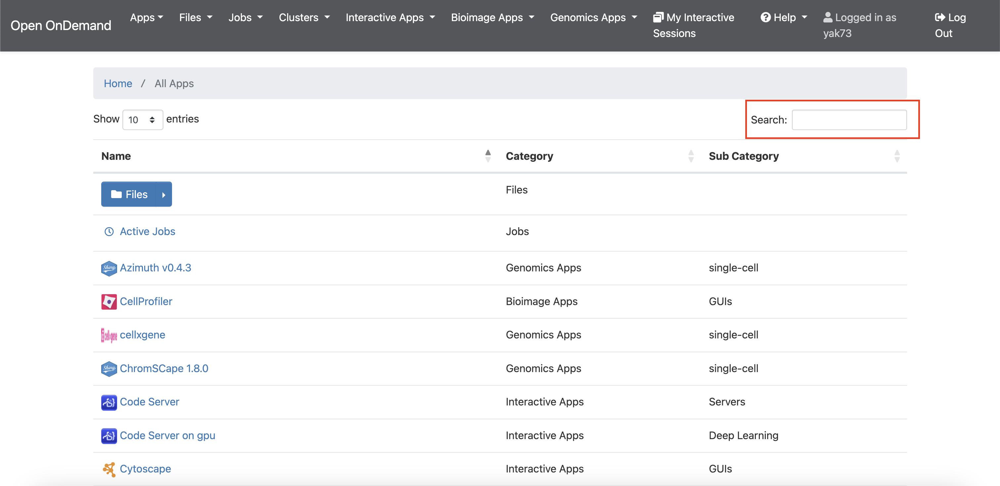
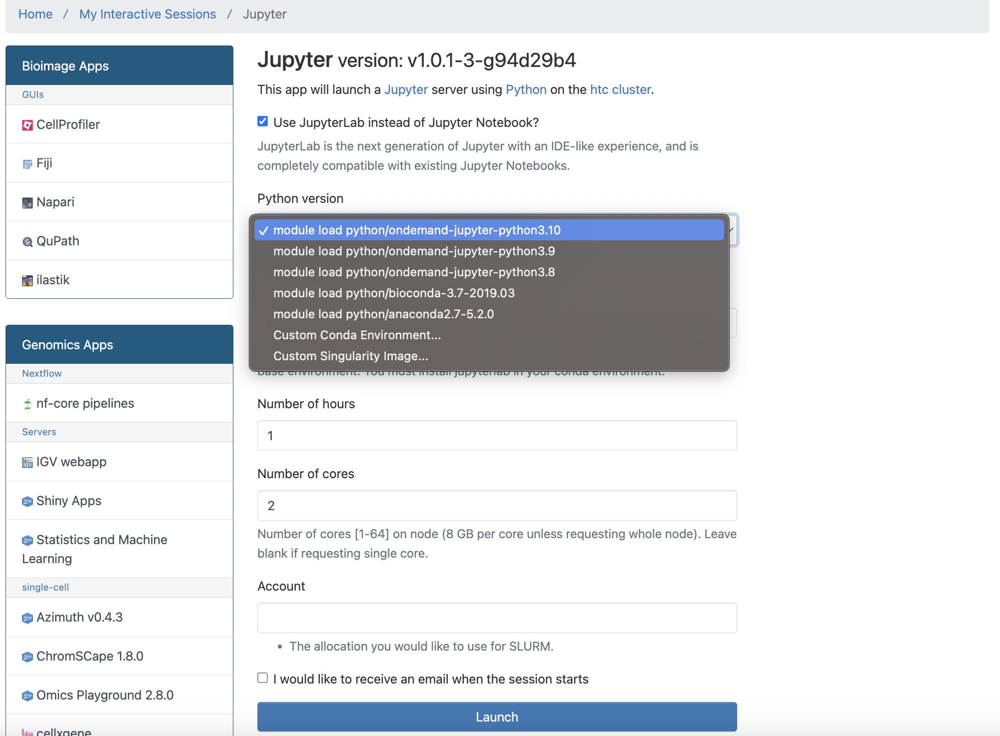
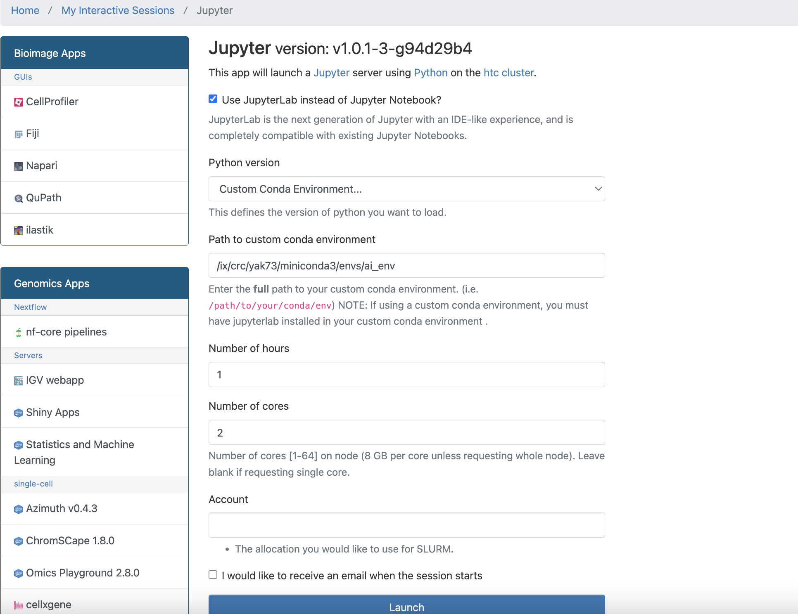
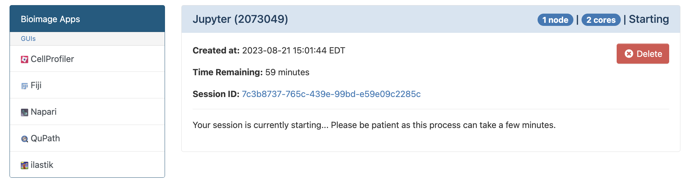
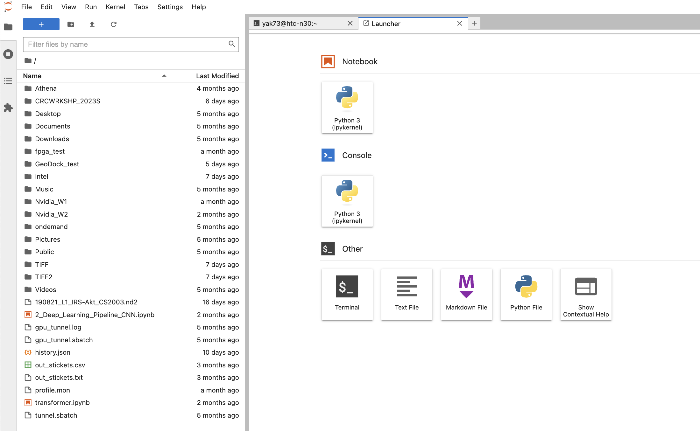
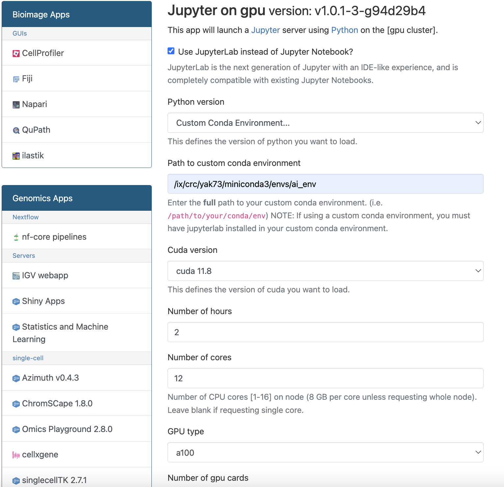
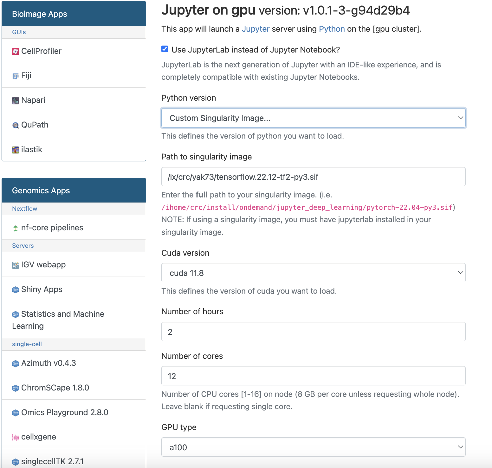
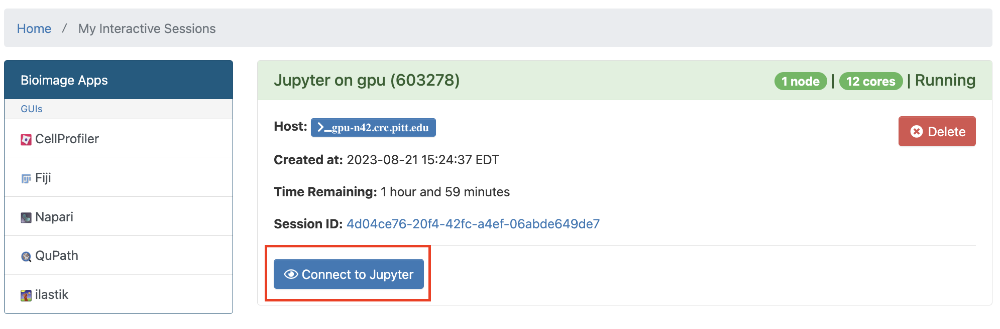

# Jupyter on Ondemand User Guide
The CRC offers Jupyter on OnDemand services to help users run Python notebooks on the different CRC clusters. We are currently offering Jupyter on the following clusters: HTC and GPU. The Jupyter on OnDemand service is available to all users with a CRC account. The Jupyter on OnDemand service is available, among other different applications, through the CRC OnDemand web portal at: [ondemand.htc.crc.pitt.edu](http://ondemand.htc.crc.pitt.edu).

When you visit the OnDemand web portal, you will be prompted to log in with your Pitt account:  
  

Once you log in, you will see the following screen:  
  

Click on the "all available apps" link highlighted in the red box in the previous screen. You will see the following screen that includes all the available applications through OnDemand:  
  

Use the search box to search for "Jupyter", you will see two results for your search as follows:  
  

*   Jupyter: is the portal to launch Jupyter on the HTC cluster.
*   Jupyter on GPU: is the portal to launch Jupyter on the GPU cluster.

Jupyter on HTC
--------------

Click on the Jupyter link, you will see the following screen:  
  

We offer multiple ready-to-use python environments for Jupyter on HTC where you can choose between:

*   Python 3.10
*   Python 3.9
*   Python 3.8
*   Python 3.7
*   Python 2.7

These are all base conda installtions featuring Jupyter Lab integration, enabling users to initiate Jupyter and engage with their notebooks. Furthermore, we provide the option to utilize a personalized conda environment established by the user by simply furnishing the environment's path:  
  

You can also use a singulairty container to run Jupyter on HTC by providing the path to the container as follows:  
  

Once you select the python environment, you can specify the number of hours you want to run Jupyter for. The default is 1 hour. You can also specify the number of cores you want to use. The default is 1 core. You can also specify the account from which the SUs will be withdrawn if you are affiliated with multiple groups/accounts.

Once you choose the appropriate environment and click on the "Launch" button, you will see the following screen:  
  

Wait until requested resources are allocated and you should see the following screen:  
  

Press the "Connect to Jupyter" button and you will be directed to the Jupyter-Lab interface where you can browse your home directory for notebooks as follows:  
  

Jupyter on GPU
--------------

Click on the Jupyter on GPU link, you will see the following screen:  
  

We offer multiple ready-to-use deep learning python environments for Jupyter on GPU where you can choose between:

*   PyTorch 2.0.0 on GPU
*   PyTorch 1.11.0 on GPU
*   PyTorch 1.8.1 on GPU + CUDA 11.1.1
*   Tensorflow 2.4.1 on GPU + CUDA 10.1

These are all base conda installstions featuring Jupyter Lab integration and GPU-enabled packages, enabling users to initiate Jupyter and engage with their notebooks. Furthermore, we provide the option to utilize a personalized conda environment established by the user by simply furnishing the environment's path:  
  

You can also use a singulairty container to run Jupyter on GPU by providing the path to the container as follows:  
  

Once you select the python environment, you can specify the CUDA version you want to load with your environment:  
  

We offer multiple ready-to-use deep learning python environments for Jupyter on GPU where you can choose between:

*   A100: 12 cores per GPU card
*   GTX1080: 2 cores per GPU card
*   V100: 6 cores per GPU card
*   A100\_NVLNK: 16 cores per GPU card
*   A100\_multi: 16 cores per GPU card

You can also specify the account from which the SUs will be withdrawn if you are affiliated with multiple groups/accounts.

Once you choose the appropriate environment and parameters and click on the "Launch" button, you will see the following screen:

Wait until requested resources are allocated and you should see the following screen:

Press the "Connect to Jupyter" button and you will be directed to the Jupyter-Lab interface where you can browse your home directory for notebooks as follows:

General notes about using Jupyter on OnDemand:
----------------------------------------------

Please note that IX, ZFS, and BGFS storage locations are not browsable from OnDemand by default and to access such locations you have to create symbolic links to the directories into your home directory as follows:

 ln -s /ix/group/username/dir /ihome/group/username/ix\_dir

You can view the logs of your Jupyter session by clicking on the "My Interactive Sessions" link as follows:  

Which will direct you to a file explorer with your session logs and scripts as follows:  
  

This is useful to debug your session if you are having issues with it and helpful for us to when troubleshooting and solving problems ocuuring with your session if you contact us through submitting a support ticket.

Using custom virtual environments with Jupyter on OnDemand:
-----------------------------------------------------------

Please refer to this [tutorial](../../applications/python/index.md), for a complete guide on managing Python environments on the CRC clusters.

1.  To run Jupyter via OnDemand you multiple options of pre-installed modules that you can load and use; however if you want to use your custom environment, you need to create the environment first through one of the methods mentioned earlier and install your required packages into it.
2.  You must make sure that you install jupyter and jupyterlab packages into your environment so that you can run Jupyter through OnDemand (you can use conda install, mamba install or pip install to install these packages like mentioned earlier in the steps of creating environments).
3.  If you need other modules (from Lmod) to be loaded during your Jupyter on OnDemand session, you have to install a package called jupyterlmod which adds a part to Jupyter’s interface where you can specify the modules you need to load. Please note that this package can only be installed only through pip.

    
    