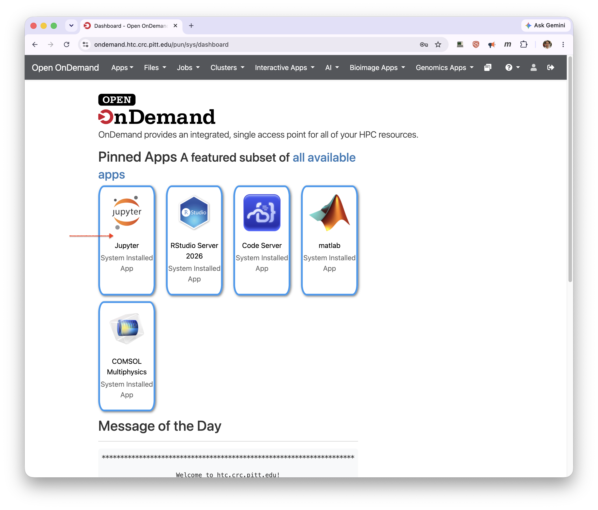
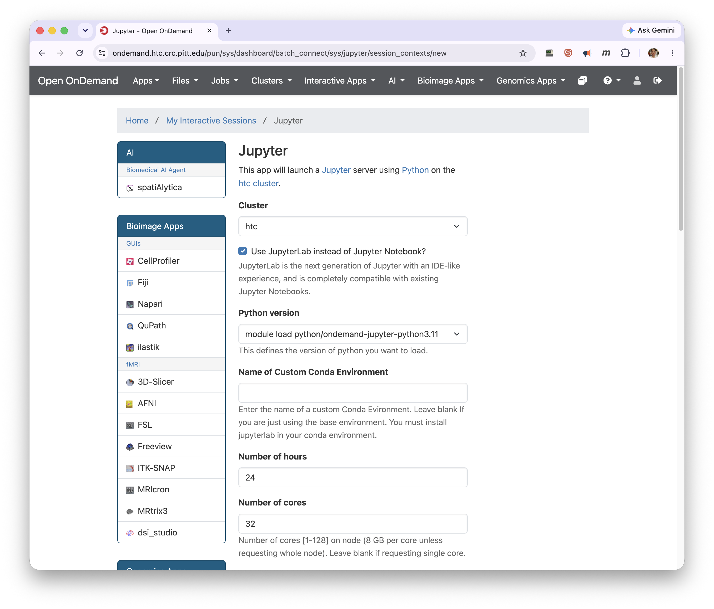
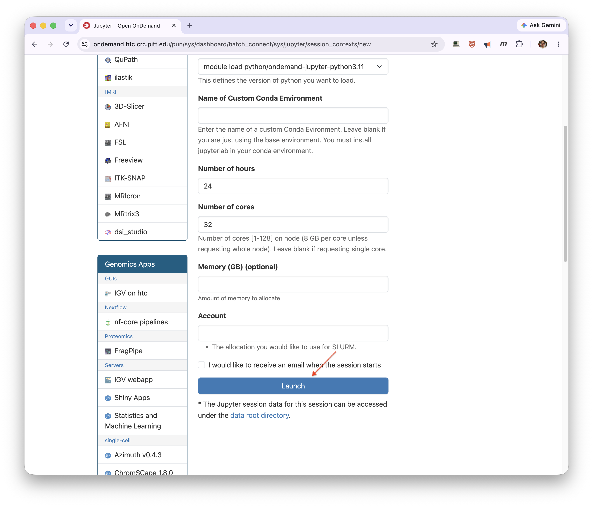
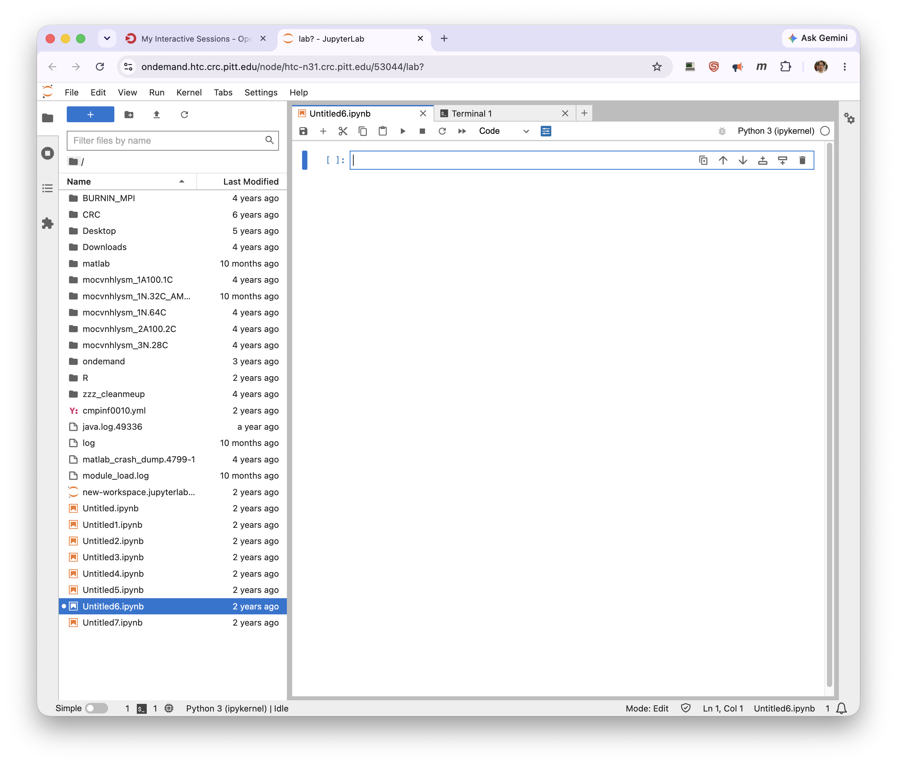
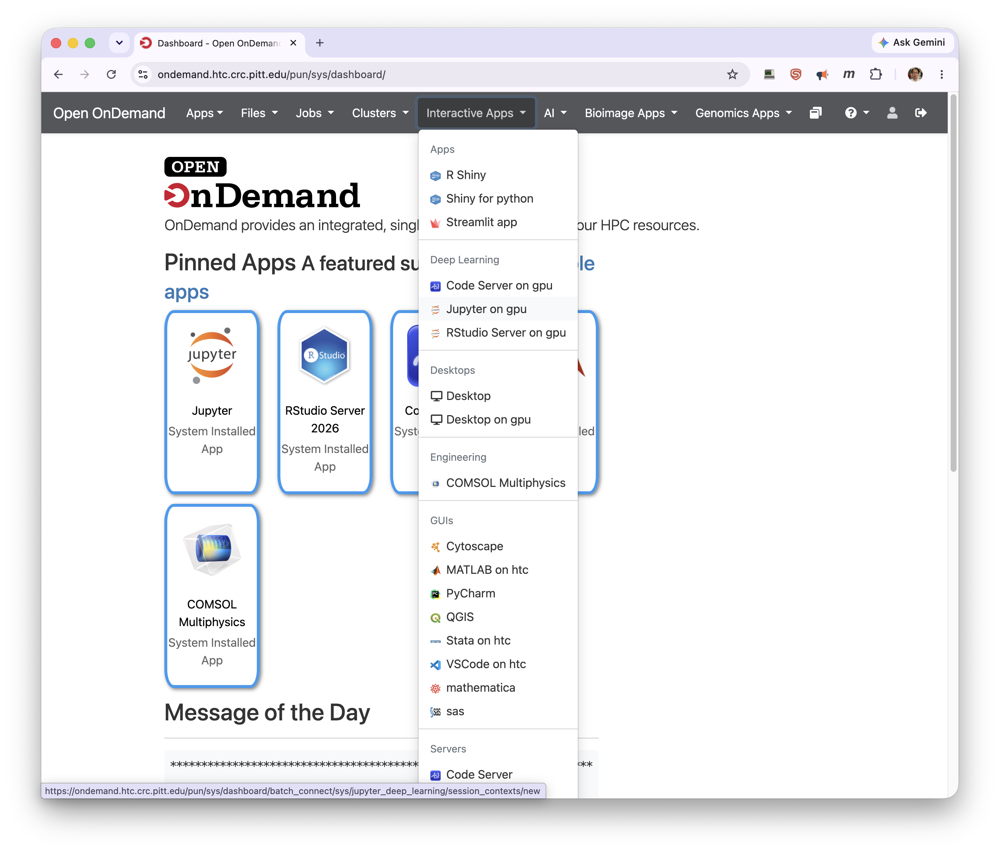
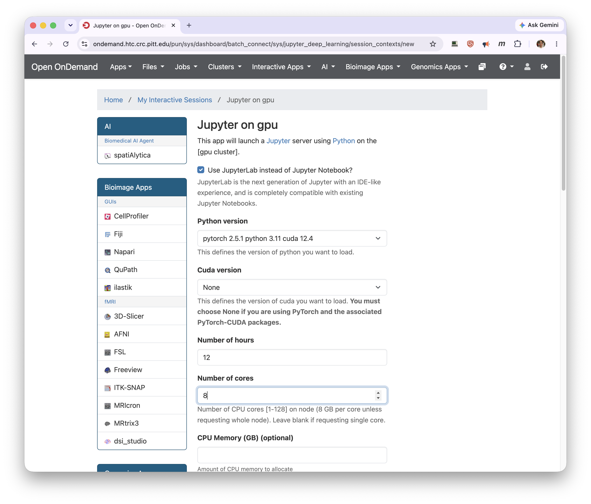
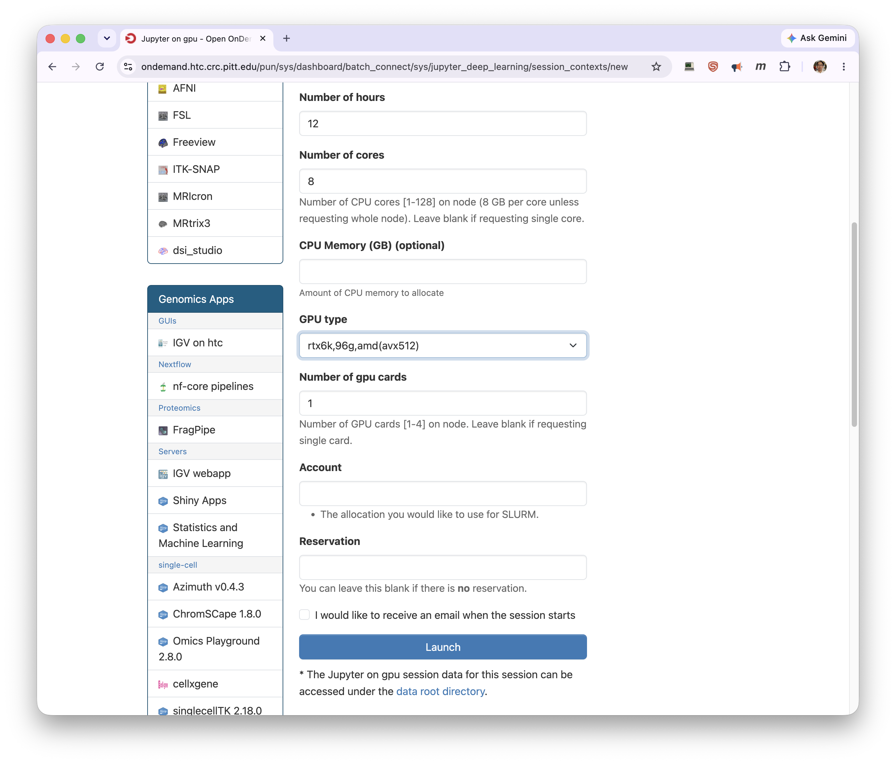
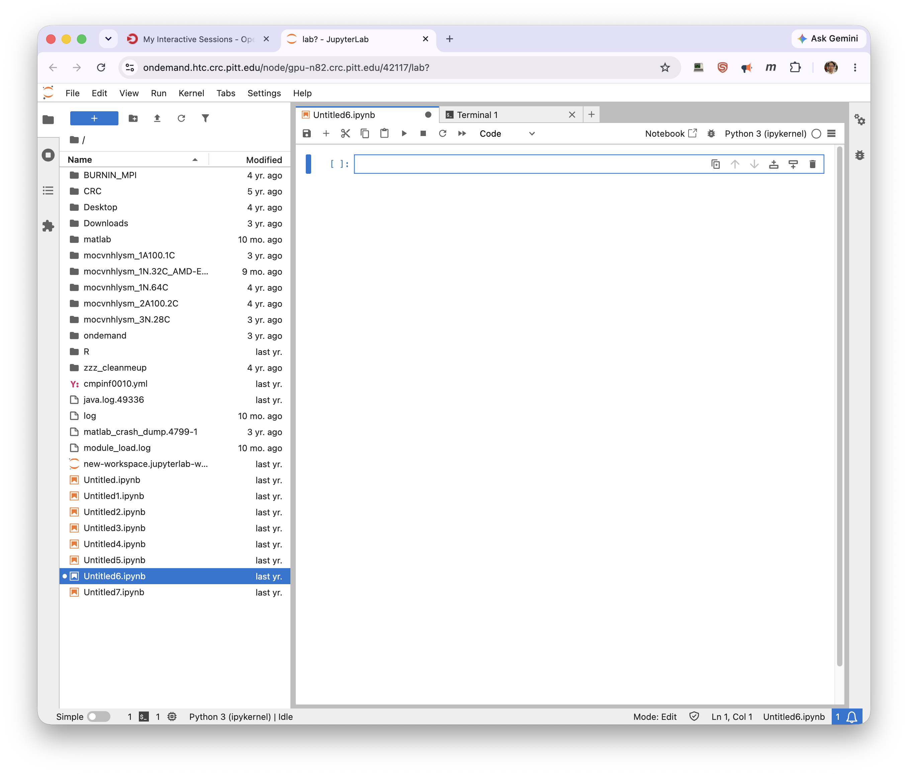

# Jupyter

The **Jupyter** app runs Jupyter Notebook or JupyterLab on a compute node. (This is the Jupyter
app inside Open OnDemand — distinct from the standalone JupyterHub portal at
`jupyter.crc.pitt.edu`.) For the general launch → connect → delete flow, see
[Interactive Apps](index.md).

## Jupyter (CPU)

Launch it from the **Jupyter** tile on the Dashboard, or from **Interactive Apps → Jupyter**.

Set the launch-form fields and click **Launch**:

| Field | What it does |
| ----- | ------------ |
| Cluster | Which cluster the session runs on (for example, `htc`). |
| Use JupyterLab instead of Jupyter Notebook? | Check for the JupyterLab IDE; leave unchecked for the classic Notebook. |
| Python version | The Python module to load (for example, `python/ondemand-jupyter-python3.11`). |
| Name of Custom Conda Environment | Leave blank to use the base environment. Otherwise, give the name (or full path) of a conda environment that already has JupyterLab installed. |
| Number of hours | Wall-time limit for the session. |
| Number of cores | 1–128 cores, roughly 8 GB of memory per core unless you request a whole node. |
| Memory (GB) | Optional explicit memory request. |
| Account | The Slurm allocation to charge; leave blank to use your default. |

When the session is running, **Connect to Jupyter** opens the interface in a new tab.

## Jupyter on GPU

Jupyter on GPU is the same app running on a GPU node. It has no pinned tile — open it from
**Interactive Apps → Jupyter on gpu** (under the **Deep Learning** group).

The form adds GPU-specific fields to the ones above:

| Field | What it does |
| ----- | ------------ |
| Python version | Bundles the framework, Python, and CUDA together — for example, `pytorch 2.5.1 python 3.11 cuda 12.4`. |
| Cuda version | A separate CUDA module to load. Choose **None** if you're using PyTorch with its bundled CUDA packages. |
| GPU type | Which GPU/node type to request (for example, `rtx6k,96g,amd(avx512)`). |
| Number of gpu cards | 1–4 cards on the node. |
| Reservation | Leave blank unless you've been given a reservation. |

