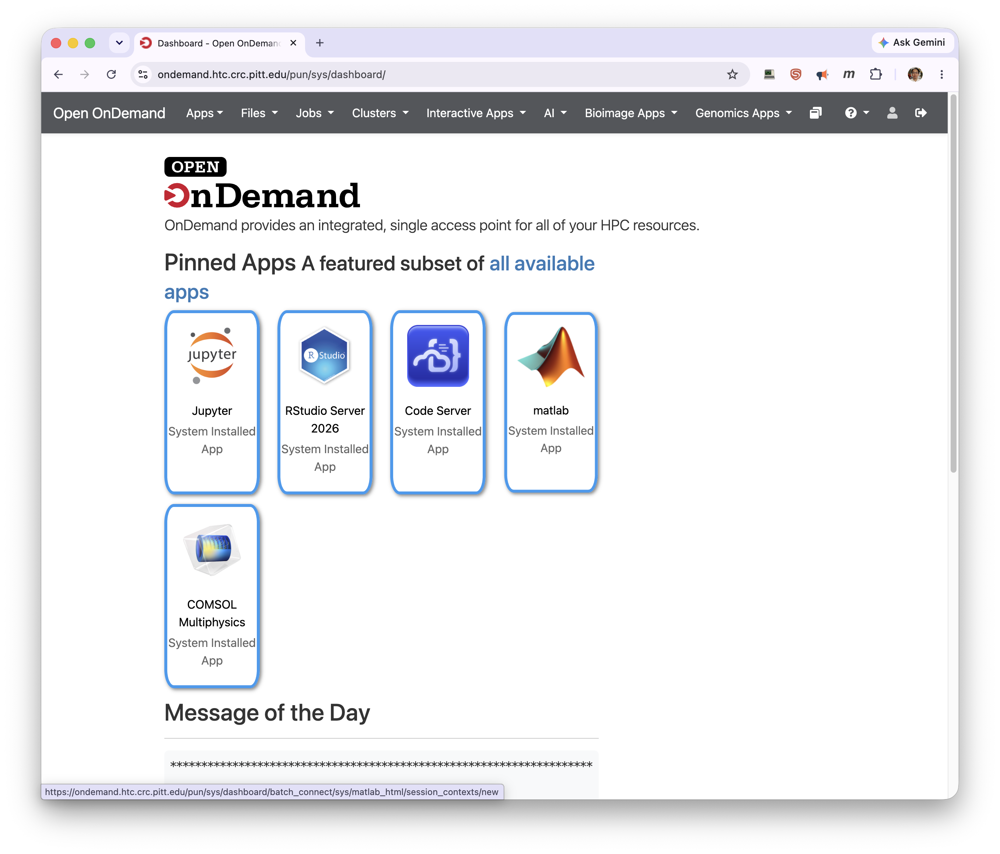
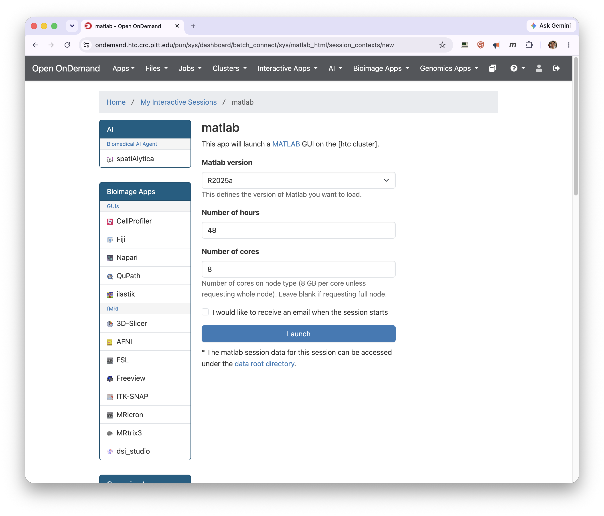
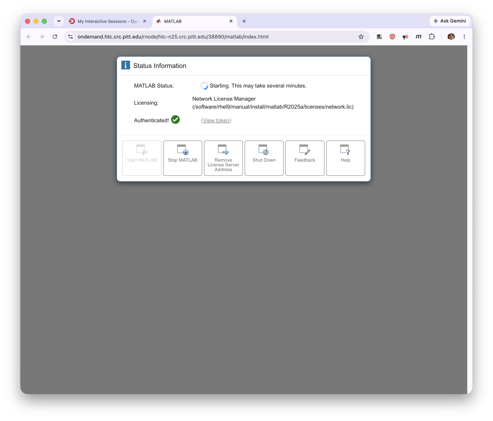
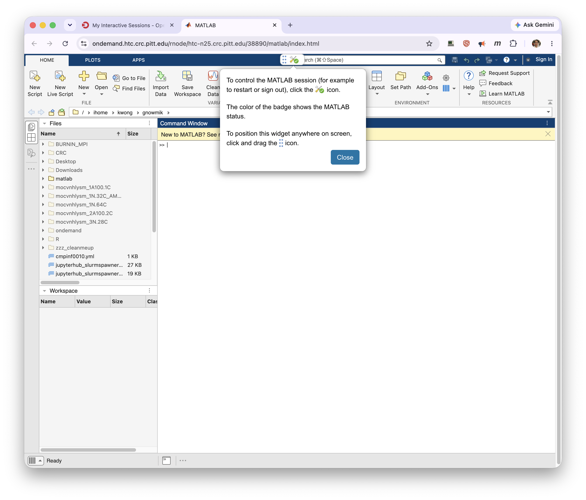

# MATLAB

Two MATLAB apps are offered. Prefer **matlab** (the `matlab-proxy` web app); **MATLAB on htc** is
the older VNC-based version. For the general launch → connect → delete flow, see
[Interactive Apps](index.md).

Launch the web app from the **matlab** tile on the Dashboard.

Its launch form is simpler than the other apps' — just a version, wall time, and cores:

| Field | What it does |
| ----- | ------------ |
| Matlab version | The MATLAB release to load (for example, `R2025a`). |
| Number of hours | Wall-time limit for the session. |
| Number of cores | Cores on the node, roughly 8 GB of memory per core unless you request a whole node. |

When the session is running, click **Connect to Matlab**. MATLAB opens a **Status Information**
panel while it starts, which can take a few minutes. It shows the license source (Pitt's Network
License Manager) and confirms authentication, with controls to start, stop, or shut down the
MATLAB process.

Once MATLAB loads, a small control widget — the badge icon near the top — lets you restart or sign
out of MATLAB, and its color reflects the MATLAB status.

!!! warning "Shutting down MATLAB does not free the node"
    Stopping or shutting down MATLAB from the control widget ends the MATLAB process but not your
    interactive session. To release the node, return to **My Interactive Sessions** and click the
    red **Delete** button.

Other GUI applications — Stata, Mathematica, SAS, Cytoscape, QGIS, and more — launch the same way
from the **Interactive Apps** menu.
