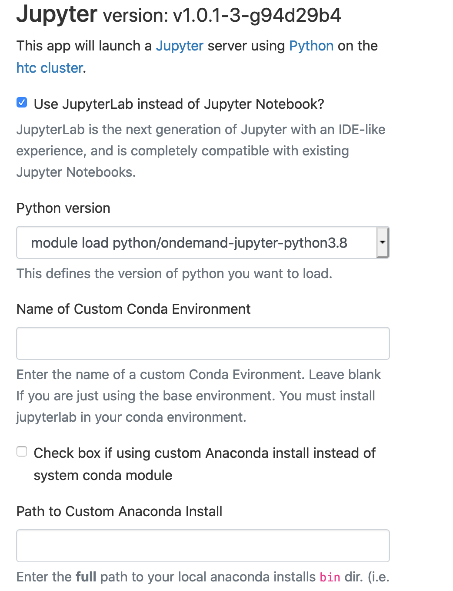
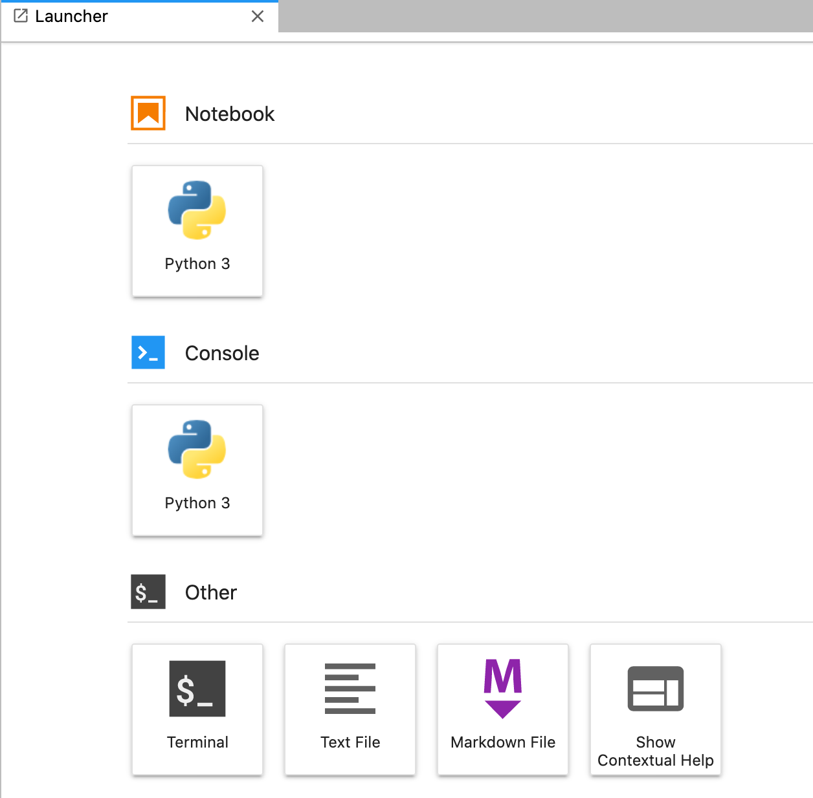
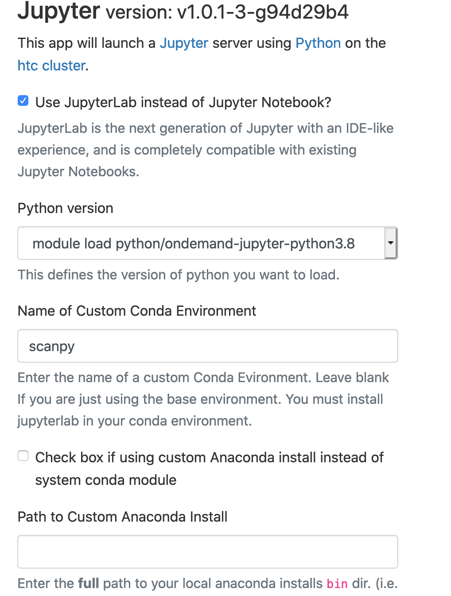
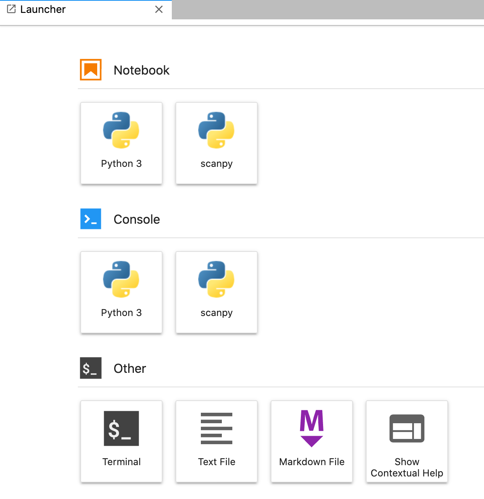
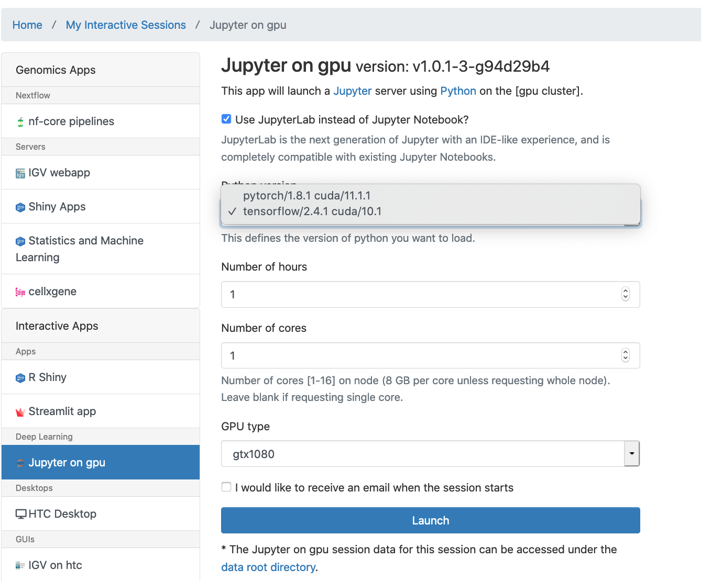
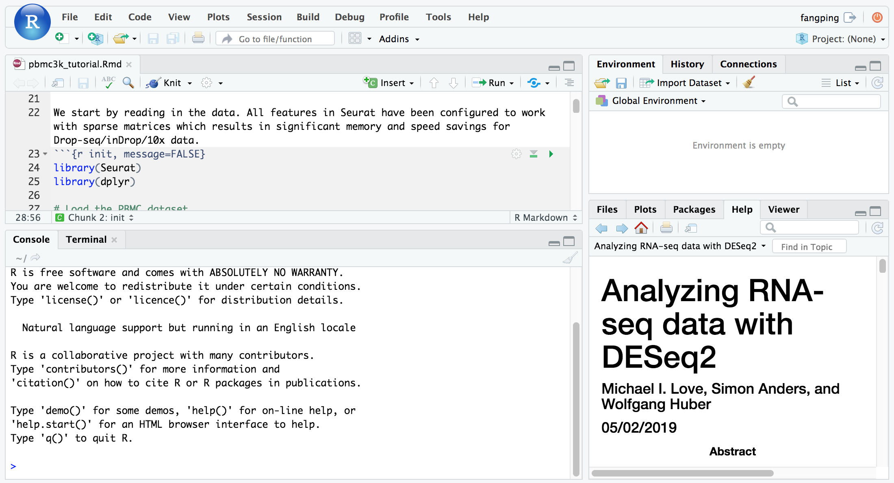
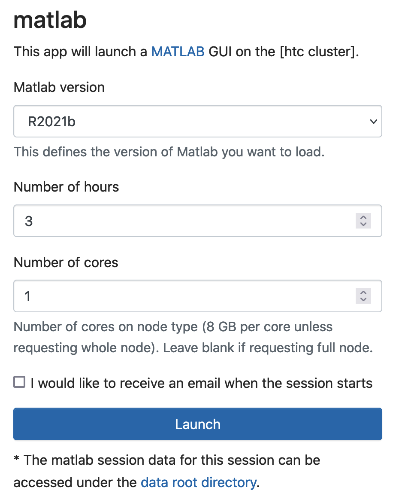
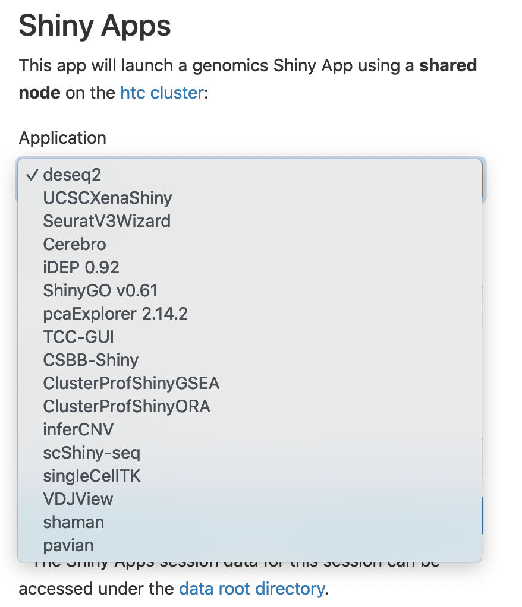

# Open OnDemand
**Summary**
-------

The OnDemand interface allows you to conduct your research on HTC cluster through a web browser.

**[Log in to Open OnDemand](https://ondemand.htc.crc.pitt.edu)**

With OnDemand, users can upload and download files; create, edit, submit and monitor jobs; and run GUI applications (e.g. RStudio Server and Jupyter Notebook), without logging in to the HTC cluster via traditional interfaces.

OnDemand was created by the Ohio Supercomputer Center (OSC). This document provides an outline of how to use OnDemand on the HTC cluster.

For more help, you can view the [extensive documentation for OnDemand](https://www.osc.edu/resources/online_portals/ondemand) created by OSC (including many video tutorials) or submit a [help ticket](https://crc.pitt.edu/tickets).

**Accessing Open OnDemand**
---------------------------

If your computer is not connected to the Pitt network (e.g. you are working from remotely, or you are using Pitt wireless network), or you are working from a laptop that is connected to the UPMC network, make sure you first connect to the [Pitt VPN](/node/5986), so that you can communicate with the CRC resources. Note that there are many different VPN roles. **Only Firewall-SAM-USERS-Pulse role** can connect to CRC clusters.

After ensuring a VPN connection, navigate to [https://ondemand.htc.crc.pitt.edu](https://ondemand.htc.crc.pitt.edu) in your web browser.

**Note**: We recommend to use Chrome or Firefox. Safari and Internet Explorer may work properly for some of the apps in the portal, but are not fully supported.

*   Provide your Pitt username and password.  
*   The OnDemand **Dashboard** window will open.  From this page, you can use the menus across the top of the page to manage files and submit jobs to the HTC cluster.

To end your OnDemand session, choose **Log Out** at the top right of the **Dashboard** window and **close your browser**.

**Managing Files**
------------------

The OnDemand interface provides a visual representation of the cluster file system, allowing you to create, edit or move files.

Click on the **Files** dropdown item from the top menu bar in the **Dashboard** window.  The list that appears shows your directories on CRC file systems. Your home directory is the first item, followed by folders under /bgfs, and /zfs1 directories, they are also listed. 

Choosing one of the file spaces opens the **File Explorer** in a new browser tab.  The files in the selected directory are listed.  No matter which directory you are in, your home directory is displayed in a panel on the left.

There are two sets of buttons in the **File Explorer**. Buttons near the top of the window perform these functions:

**Open in Terminal**

Open a terminal window in a new browser tab

**New File**

Create a new empty file

**New Directory**

Create a new subdirectory

**Upload**

Copy files from your local machine to the cluster

**Download**

Copy the selected file(s) from the cluster to your local machine

**Copy/Move**

Copy or move the selected file(s) to the current directory

**Delete**

Delete the selected file(s)

**Go up Directory (Up Arrow)** 

Navigate to the parent directory

**Change directory**

Provide the absolute path to a new directory to view

**Copy path**

Copy the absolute path to the current directory to the clipboard

**Show Dotfiles**

Toggles the display of hidden files

**Show Owner/Mode**

Toggles the display of owner and permission settings

**Filter**

Restrict the display to file/folder names containing some value

If you have files under other directories which are not listed in the dropdown menu, use the **Change Directory** button to navigate to the directory via it's absolute path.

**Shell Access**
----------------

An in-browser terminal prompt with access to the HTC login nodes can be accessed from the **Clusters** dropdown on the top menu of the **Dashboard** window.  In the window that opens, you are logged in as if you used ssh to connect to the HTC cluster.  

**Interactive Apps**
--------------------

Jump to a specific App:

*   [Jupyter Notebook/Labs](#jupyter-notebooklab)
*   [Jupyter Notebook/Labs on GPU](#jupyter-notebooklabs-on-gpu)
*   [Rstudio](#rstudio)
*   [MATLAB](#matlab)
*   [Genomics Apps](#genomics-apps)

> **Note:** **When you click "Connect to \*\*\*\*", and receive “Failed to connect to htc-n\*\*.crc.pitt.edu:<port number>”, do not be panic.** This error means that the web server is not fully ready yet. Wait 1-2 minutes, and refresh your web browser.

### ***Jupyter Notebook/Lab***

Jupyter notebook/Lab allow for interactive code development. You can run Jupyter notebook, and Jupyter Lab, through OnDemand.

Jupyter Notebook inside OnDemand which runs on a cluster compute node using dedicated resources can be launched by choosing menu _Interactive Apps -> Jupyter Notebook_. A job submission screen appears:


Set the job parameters. Unless using numerical libraries like NumPy, which are thread-parallelized, or your jobs require more memory, it is not advisable to choose more than one CPU. Then hit _Launch_ to submit the interactive job. The job gets queued up and when it starts and the Jupyter is provisioned. Click on the _Connect to Jupyter_ button to open a new browser tab with the main Jupyter interface.

****Creating an Environment with the Base Anaconda Installation:****

Use "module load python/ondemand-jupyter-python3.8" to load base ananconda.

  


Select "Terminal"



Generate a Conda environment
```
[fmu@htc-n22 ~]$ echo $PATH
/ihome/crc/install/python/ondemand-jupyter-python3.8/bin:/usr/local/bin:/bin:/usr/bin:/usr/local/sbin:/usr/sbin:/ihome/fmu/fmu/.local/bin:/ihome/fmu/fmu/bin:/ihome/fmu/fmu/.local/bin:/ihome/fmu/fmu/bin
[fmu@htc-n22 ~]$ conda env list
```
****conda environments:****

```
base /ihome/crc/install/python/ondemand-jupyter-python3.8

[fmu@htc-n22 ~]$ conda create -n scanpy python=3.8
Collecting package metadata (current_repodata.json): done
Solving environment: done
...
[fmu@htc-n22 ~]$ source activate scanpy
(scanpy) [fmu@htc-n22 ~]$ pip install 'scanpy\[leiden\]'
...
(scanpy) [fmu@htc-n22 ~]$ conda install -c bioconda samtools
...
(scanpy) [fmu@htc-n22 ~]$ source deactivate scanpy
DeprecationWarning: 'source deactivate' is deprecated. Use 'conda deactivate'.
[fmu@htc-n22 ~]$
```
The conda environment is installed at ~/.conda/envs/scanpy

****Using the Conda Environment with Jupyter Notebook/Lab:****



If you are using another user's conda environment, use the full path as Name of Custom Conda Environment (i.e., /ihome/fmu/fmu/.conda/envs/scanpy)
```
[fmu@htc-n27 ~]$ echo $PATH
/ihome/fmu/fmu/.conda/envs/scanpy/bin:/ihome/crc/install/python/ondemand-jupyter-python3.8/condabin:/ihome/crc/install/python/ondemand-jupyter-python3.8/bin:/usr/local/bin:/bin:/usr/bin:/usr/local/sbin:/usr/sbin:/ihome/fmu/fmu/.local/bin:/ihome/fmu/fmu/bin:/ihome/fmu/fmu/.local/bin:/ihome/fmu/fmu/bin
[fmu@htc-n27 ~]$
```


You can click Terminal and use "conda install <packagename>" to install extra conda packages to your local scanpy conda environment.

****Using a custom Anaconda Install:****
```
[fmu@login0b ~]$ cd /ihome/crc/build/python
[fmu@login0b python]$ bash Miniconda3-py38\_4.9.2-Linux-x86\_64.sh -b -p ~/python\_env/myenv
PREFIX=/ihome/fmu/fmu/python_env/myenv
...
[fmu@login0b python]$ cd ~/python\_env/myenv
[fmu@login0b myenv]$ cd bin
[fmu@login0b bin]$ pwd
/ihome/fmu/fmu/python\_env/myenv/bin
[fmu@login0b bin]$ ./conda install -c conda-forge jupyterlab # jupyterlab will also install notebook
...
[fmu@login0b bin]$ # ./conda install -c conda-forge notebook # install notebook if you do not use jupyterlab
[fmu@login0b bin]$ ./conda install -c conda-forge voila # install voila if you plan to use it
...
```
The full path to this local anaconda installs directory is /ihome/fmu/fmu/python\_env/myenv


```
[fmu@htc-n27 ~]$ echo $PATH
/ihome/fmu/fmu/python\_env/myenv/bin:/usr/local/bin:/bin:/usr/bin:/usr/local/sbin:/usr/sbin:/ihome/fmu/fmu/.local/bin:/ihome/fmu/fmu/bin:/ihome/fmu/fmu/.local/bin:/ihome/fmu/fmu/bin
[fmu@htc-n27 ~]$
```
****ipykernel does not activate the conda environment****

ipykernel is a method to use conda environment with Jupyter Notebook/Lab. Note that ipykernel does not activate conda environment.
```
[fmu@login0b ~]$ module load python/ondemand-jupyter-python3.8
[fmu@login0b ~]$ source activate scanpy
(scanpy) [fmu@login0b ~]$ conda install ipykernel
...
(scanpy) [fmu@login0b ~]$ python -m ipykernel install --user --name scanpy
Installed kernelspec scanpy in /ihome/fmu/fmu/.local/share/jupyter/kernels/scanpy
(scanpy) [fmu@login0b ~]$ source deactivate scanpy
DeprecationWarning: 'source deactivate' is deprecated. Use 'conda deactivate'.
[fmu@login0b ~]$
```
Using the above command, I will now have this conda environment in my Jupyter notebook.



This kernel will successfully launch a kernel out of the scanpy conda environment, but it notably is not activating the environment.


****Generate Personal Modulefiles:****
```
[fmu@login0b ~]$ mkdir modulefiles
[fmu@login0b ~]$ module use ~/modulefiles
[fmu@login0b ~]$ cd modulefiles
[fmu@login0b modulefiles]$ cp /ihome/crc/modules/Core/python/ondemand-jupyter-python3.8.lua myenv.lua
[fmu@login0b modulefiles]$ vi myenv.lua #edit myenv.lua: local package\_root = "/ihome/fmu/fmu/python\_env/myenv"
[fmu@login0b modulefiles]$ module load myenv

[fmu@login0b ~]$ module purge
[fmu@login0b ~]$ module use ~/modulefiles
[fmu@login0b ~]$ module load myenv
[fmu@login0b ~]$ which conda
~/python\_env/myenv/bin/conda
```

Note:

More recent Anaconda distributions will tell you to use the command conda activate instead of source activate to activate your newly created environment. If you use conda activate, you will be prompted to issue the command conda init. Do not do this. When you load one of our Anaconda modules, you have effectively loaded the base conda environment for that Anaconda version. However, conda tries to manage activation of its own base environment by modifying the user's .bashrc file.

Even if you have installed your own local version of Anaconda or miniconda, do not use conda init. When conda init runs, it places commands into your .bashrc file that will stop certain things from working on the system; in particular, it will break the conda activate command itself.

Workaround for the conda init command

The conda init command places code in your .bashrc file that modifies, among other things, the PATH environment variable by prepending it to the path of the base conda environment. This occurs before the default system modules are loaded. Other modules may also have libraries that will hide Anaconda libraries and cause errors.

To work around this in local Anaconda or miniconda installations:

1. Run conda init, and then immediately open .bashrc with a file editor.  
2. Remove the code that was added by conda init and place it in another script file (for example, conda\_init.sh).  
3. After the login process completes, run the code in the script file:
```
source conda\_init.sh
```
4. You should now be able to use conda activate.

Note that ~/.local/bin is also on the default path. When you run "pip install --user <packagename>", the package will be installed under this folder. These libraries may hide other python modules and cause errors. I recommend that you generate a conda enviroment and install your local libraries within the conda environemnt.

Note on Jupyter Interactive Sessions and Python Environments:

If you have Python packages installed under your /ihome .local directory, they may be incompatible with these sessions, causing them to end shortly after they have started. Moving these packages to a virtual environment or conda environment should resolve the issue. See the [debugging output](#Debug Output) of your session to determine which packages are causing problems. 

**Stopping your Jupyter Notebook session:**

In the Dashboard window, click the red **Delete** button.

### ***Jupyter Notebook/Lab on GPU***

This Jupyter notebook/Lab allow for interactive code development on GPU cluster. Currently, it supports tensorflow/2.4.1 and pytorch/1.8.1. This Jupyter notebook/Lab interface is still under development.

Jupyter Notebook inside OnDemand which runs on a GPU cluster compute node using dedicated resources can be launched by choosing menu _Interactive Apps -> Jupyter on gpu_. A job submission screen appears:



Set the job parameters.  Choose tensorflow/2.4.1 or pytorch/1.8.1. Number of cores is the number of cpu cores. Select GPU type. Only one GPU card can be allocated. Then hit _Launch_ to submit the interactive job. The job gets queued up and when it starts and the Jupyter is provisioned. Click on the _Connect to Jupyter_ button to open a new browser tab with the main Jupyter interface.

**Stopping your Jupyter Notebook session**

In the Dashboard window, click the red **Delete** button.

### **RStudio**

RStudio Server runs the RStudio interactive development environment inside of a browser. The OnDemand implementation allows to set up and launch the RStudio Server on a cluster compute node for dedicated resources, which allows to run more compute intensive R programs on the RStudio environment. To start RStudio Server job. 

*   Select **Interactive Apps** > **RStudio Server** from the top menu in the **Dashboard** window.
*   In the screen that opens, specify the R version, time limit.


*   Choose the appropriate number of cores, keeping in mind that R can internally thread parallelize vector based data processing, for which more than one CPU can be utilized.
*   Click the blue **Launch** button to start your RStudio session.  You may have to wait in the queue for resources to be available.
*    When your session starts, click the blue **Connect to RStudio Server** button.  A new window opens with the RStudio interface.  



The R version 3.5.1 loads ```gcc/8.2.0``` and ```r/3.5.1``` module on HTC cluster, and the R version 3.6.0 loads gcc/8.2.0 r/3.6.0 module on HTC cluster. Within each R module, various R packages and bioconductor packages have been installed. Within the R console, load the library to check whether it is already installed. If you need specific R packages, submit a [help ticket](http://crc.pitt.edu/tickets).

You can also install your own R packages. R searches the user’s path for libraries followed by the root installation. R will stop searching when it finds the first instance of the library within the path hierarchy.Use “.libPaths()” to check the searching path.

To install your own packages, Clusters >\_HTC Shell Access

Load the R module, for example, ```module load gcc/8.2.0 r/3.6.0```

Run R, R

Within R environment, install packages: install.packages(“pkg\_name”)

For bioconductor packages, use: BiocManager::install("Bioconductor\_pkg\_name")

**Errors**

RStudio Server use your home directory as the default location for configuration files and project files. Your home directory has 75 GB quota. There are typically two causes for filling up the home. The first is when you write large project files to home. The second is when large sessions timeout and RStudio Server automatically writes sessions to home. The default RStudio user state directory is ~/.local/share/rstudio or ~/.rstudio (legacy RStudio server). You can go to ~/.local/share/rstudio/sessions to delete unused sessions.

All of the application state managed explicitly by RStudio is stored within the ~/.local/share/rstudio. When you decided to change R versions, I recommended that you get rid of ~/.local/share/rstudio folder (e.g., run “rm -rf ~/.local/share/rstudio”). This folder will be regenerated using new R version.

R Studio Server interface is single-cpu (single thread) process, which means it can’t do two things at once. If you ask it to, sometimes one of the operations will timeout. You will receive ‘Status code 502’ message, which is basically a timeout message. Usually this doesn’t cause anything to crash. You just need to wait for the currently-running code to finish executing and try again. One example of when this can happen is if you attempt to save a file whilst a long-running script is running. R Studio has to wait until the script has finished running to attempt to save the file. However, sometimes the wait is too long, causing a timeout. In this case, you just need to wait for the code to finish running, and then press save again.

If you exceed the time limit you requested when setting up your RStudio session, you will see this error: Error: Status code 503 returned. To continue using RStudio, go to Interactive Apps > RStudio from the top menu in the **Dashboard** window and start a new session.

**Stopping your RStudio session**

To end your RStudio session, either select **File > Quit Session** or click the red icon in the upper right of your RStudio window.  **NOTE** that this only closes your RStudio session; **it does not close your interactive HTC session**. You are still consuming CPU hours on the HTC cluster. 

**To end your interactive HTC session,** return to the Dashboard window and click the red Delete button. 

**GUI Apps through VNC**
------------------------

Open ondemand supports several GUI applications through VNC. So far, we have implemented the MATLAB, Stata and IGV applications.

To begin a MATLAB session, click on "Interactive Apps" and then "MATLAB on htc". You will need to choose the "MATLAB version", "Number of hours" and "Number of cores". Click "Launch" and then when your session is ready click "Launch MATLAB". 

### **MATLAB**

matlab-proxy is a Python® package which enables you to launch MATLAB® and access it from a web browser.

To begin a MATLAB session, click on "Interactive Apps" and then "MATLAB" (**not the "MATLAB on htc"**). You will need to choose the "MATLAB version", "Number of hours" and "Number of cores".



Click "Launch" and then when your session is ready, click "Connect to MATLAB".


Note that this MATLAB is a web application. The MATLAB Proxy is under active development.

### **Genomics Apps**

I have deployed multiple web-based genomics applications through open ondemand. They are under Genomic Apps.  

[nf-core pipelines](https://crc.pitt.edu/nf-core): This is a web application to launch nf-core pipelines to the HTC cluster.

[IGV webapp](https://crc.pitt.edu/genome_browser): This is the IGV\_web genome browser application based on igv.js.

Shiny Apps: I have deployed multiple Shiny genomics web applications.

Statistics and Machine Learning: This is shiny Radiant application.

cellxgene: This is cellxgene interactive explorer for single-cell transcriptomics data.

To begin a Shiny App session, click on "Genomics Apps" and then "Shiny Apps". You will need to choose the "Application", "Number of hours" and "Number of cores".



I have chosen singlecellTK. Click "Launch", and then when your session is ready, click "Connect to Shiny".


Note: When you click "Connect to \*\*\*\*", and receive “Failed to connect to htc-n\*\*.crc.pitt.edu:<port number>”, do not be panic. This error means that the web server is not fully ready yet. Wait 1-2 minutes, and refresh your web browser.


**FAQ**
-------

Q: I am unable to log in to on demand, I recieve "Internal Server Error" and something about there not being any space left on the device. How do I fix this?

A: Ondemand instances create some files in your home directory when they start, and if that location has reached it's quota of 75 GB, you will recieve an error. The easiest way to fix this is to ssh into a login node and remove some files from your home directory, either deleting them or moving them to your groups enterprise storage (iX, bgfs, zfs). [You can also do this with one of the file transfer tools.](https://crc.pitt.edu/managingdata) 

Q: My session closes shortly after starting, with "Completed" as the job state, and with no other message besides "For debugging purposes, this card will be retained for X more days". How can I find out what's going wrong?

A: The best starting point is to click the link after "Session ID:" and then click the output.log file in that location. This file will contain information about errors that occured during the session. Sometimes the issues is something you can fix yourself, and other times it is due to the configuration of the app. If there are errors in this file but it is unclear how you should proceed, please submit a help ticket, providing either the output file contents or the session ID.

[Back to top](#BackToTop)