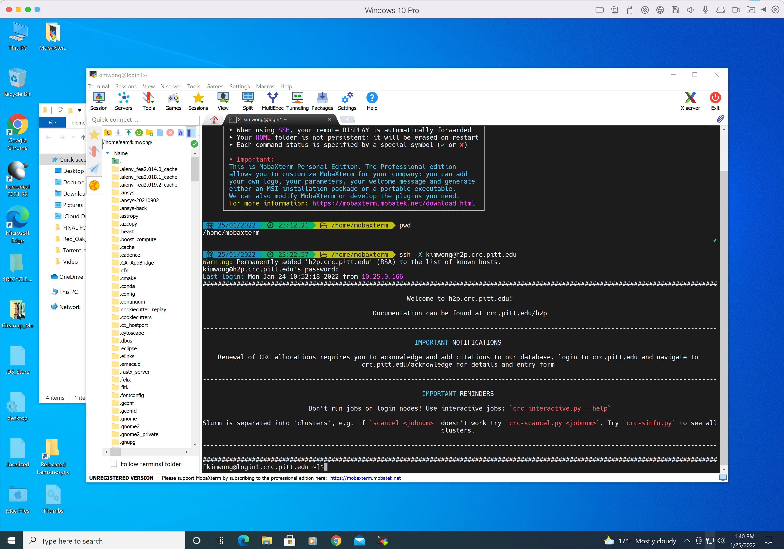

# SSH Connection using a terminal

SSH ([**Secure Shell**](https://en.wikipedia.org/wiki/Secure_Shell)) is a network protocol that allows for secure access 
to a computer over an unsecured network. This is the protocol for connecting to the CRC login nodes.

Clients running Windows can use [**MobaXterm**](https://mobaxterm.mobatek.net/) or [**PuTTY**](https://www.putty.org/) to 
access a terminal emulator. Clients running MacOS can use the built-in Terminal app (in Applications/Utilities) or 
[**iTerm2**](https://iterm2.com/).

To render graphics from the remote session, you will also need an X server on your client. MobaXterm comes bundled with 
an X server. For MacOS, you will need to install [**XQuartz**](https://www.xquartz.org/).


Here are the connection details:

* **connection protocol:** ssh
* **remote hostname:** h2p.crc.pitt.edu or htc.crc.pitt.edu
* **authentication credentials:** Pitt username (all lowercase) and password


The syntax to connect to the CRC login node from your terminal commandline is

```commandline
ssh -X username@h2p.crc.pitt.edu
```

where username is your Pitt username in lowercase and the answer to the prompt is the corresponding password. The -X option 
enables X forwarding for applications that generate a GUI such as xclock. If you encounter success, this is what your 
MobaXterm will look like



If you encounter success, this is what your MacOS client session will look like


<ins>**Definitions**</ins>

*   **terminal emulator** -- a software program that provides a text-based interface to the system, allowing users to type 
commands into a shell prompt to run programs and to manage files without a graphical user interface (GUI)
*   **Linux shell** -- a text-based user-interface that interprets user commands and scripts. CRC supports `bash` and `csh`, with
 `bash` being the default
*   **Linux commandline** -- this is the shell prompt line where your cursor is highlighted and where you input commands to the
 remote host


